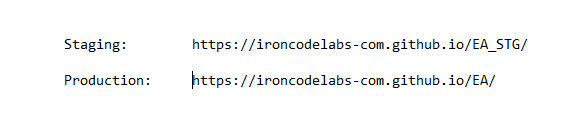

# Iron Code Labs 

Main web site: **[From Legacy Lock-in to AI Velocity](https://ironcodelabs.com/)**

This repo GitHub link: github.com/ironcodelabs-com/EA_STG/

## GH Pages Links

- This is [Staging Site](https://ironcodelabs-com.github.io/EA_STG/)
- [Published Site](https://ironcodelabs-com.github.io/EA)

<b>Explanations</b>

- What is `github.io`?
  - `github.io` is the domain for **GitHub Pages**, a service that automatically turns code stored in a GitHub repository into a live, functional website. In your specific links, it acts as the "host" that tells the internet to look inside the `ironcodelabs-com` account to find the files for the **EA** and **EA_STG** projects.
- What is `https:`?
  - The `https:` at the start of a web address means the connection (aka `link`) is private and protected by **encryption**, essentially turning web site data into a secret code that only you and the website can read. This keeps your personal information, like passwords or login details, safe from hackers who might try to "eavesdrop" on your internet activity.
- ## Staging vs. Production
  - **Staging** is a private "rough draft" version of the website where developers test new features to make sure nothing breaks. **Production** is the final, live version that is actually "on air" and ready for the public to use.

  

---

>[!NOTE]
> Unless otherwise declared &copy; by dbj@dbj.org  | CC BY SA 4.0 
