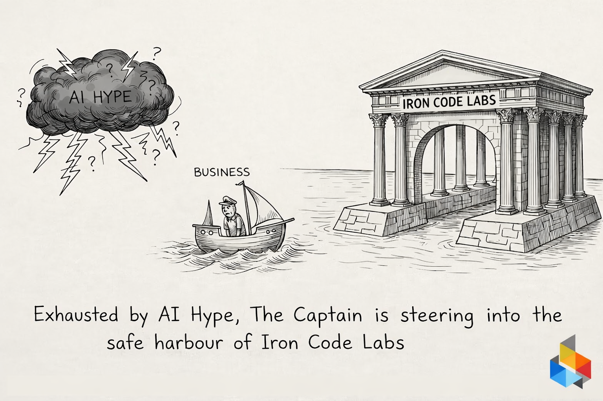

# Safe Harbour for the Business

**Exhausted by AI Hype? Time to Dock.**

Over the last two years, many organizations rushed into AI adoption driven by noise, vendor pressure, and competitive anxiety. The result?

• Pilots without production paths
• Models without governance
• Costs without measurable ROI
• “Innovation” disconnected from product strategy

At **IRON CODE LABS**, we work with companies that are tired of experimentation theater and want structural recovery.

Our approach is not LLM-first. It is architecture-first.

We use **TOGAF ACMM** to objectively assess enterprise architecture maturity and determine whether the organization is structurally capable of sustaining AI. If maturity is insufficient, we raise it deliberately — before introducing additional complexity.

Then we apply **ICL ADM** (our simplified TOGAF ADM) to:

* Clarify business capabilities
* Align AI initiatives with measurable value streams
* Define governance boundaries
* Produce architecture artifacts that are usable — not decorative

The outcome is concrete material for the **Product stage**, where real product design and delivery decisions occur. AI becomes a capability embedded in product strategy — not a detached experiment.

AI complexity must be earned, not assumed.

If your organization is exhausted by hype and ready for disciplined AI ROI recovery, it may be time to steer with navigator in front.

