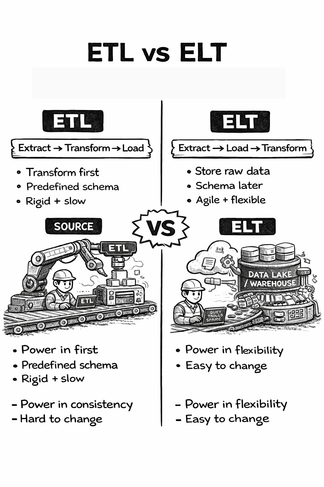

# AI in a Military Context

>[!WARNING]Very long and technical post with a gentle entry, too lure the reader in.

- [AI in a Military Context](#ai-in-a-military-context)
    - [Why ETL appears in the meme](#why-etl-appears-in-the-meme)
- [ETL vs ELT in modern AI architectures](#etl-vs-elt-in-modern-ai-architectures)
  - [1️⃣ ETL (Extract → Transform → Load)](#1️⃣-etl-extract--transform--load)
  - [2️⃣ ELT (Extract → Load → Transform)](#2️⃣-elt-extract--load--transform)
- [Why AI pushes toward ELT](#why-ai-pushes-toward-elt)
  - [In the enterprise / military context](#in-the-enterprise--military-context)
  - [Strategic summary](#strategic-summary)
- [The Iron Code Labs Architecture level — not buzzword level.](#the-iron-code-labs-architecture-level--not-buzzword-level)
- [1️⃣ Conceptual Layer (Why)](#1️⃣-conceptual-layer-why)
  - [Strategic Capability: “AI-Enabled Decisioning”](#strategic-capability-ai-enabled-decisioning)
    - [Core Conceptual Capabilities](#core-conceptual-capabilities)
- [2️⃣ Logical Layer (What)](#2️⃣-logical-layer-what)
  - [Logical AI Platform Model](#logical-ai-platform-model)
    - [A. Data Domain Layer (Data Mesh principle)](#a-data-domain-layer-data-mesh-principle)
    - [B. Data Processing Pattern](#b-data-processing-pattern)
- [3️⃣ Physical Layer (With What)](#3️⃣-physical-layer-with-what)
- [4️⃣ Implementation Layer (How)](#4️⃣-implementation-layer-how)
- [5️⃣ Where MLOps Fits](#5️⃣-where-mlops-fits)
- [6️⃣ Where Data Mesh Fits](#6️⃣-where-data-mesh-fits)
- [7️⃣ Mapping to TOGAF Capability Framing](#7️⃣-mapping-to-togaf-capability-framing)
    - [Business Capability](#business-capability)
    - [Application Capability](#application-capability)
    - [Data Capability](#data-capability)
    - [Technology Capability](#technology-capability)
- [8️⃣ The Brutal Reality (Why the Meme above is Accurate)](#8️⃣-the-brutal-reality-why-the-meme-above-is-accurate)
- [9️⃣ What a Mature AI Enterprise Actually Looks Like](#9️⃣-what-a-mature-ai-enterprise-actually-looks-like)
  - [References](#references)

---

### Why ETL appears in the meme

The joke is unfortunately accurate:

Before AI can do anything meaningful, someone must:

* Fix messy source systems
* Reconcile schemas
* Clean historical data
* Build reliable pipelines

That invisible plumbing work is **ETL**.

In both enterprise and military contexts, the “AI engineer” in the trench is usually fighting:

* Data silos
* Inconsistent schemas
* Legacy systems
* Poor data quality

>[!TIP] Implementing AI is rarely the hard part. Data engineering is.

# ETL vs ELT in modern AI architectures



Somewhat simplified view

## 1️⃣ ETL (Extract → Transform → Load)

**Flow**

```
Source systems → Transform engine → Target warehouse
```

**Transformation happens before storage.**

**Typical legacy stack**

* ETL Legacy tool ([Informatica](#fn-informatica), [SSIS](#fn-ssis), [Talend](#fn-talend))
* Staging server
* Relational data warehouse

**Characteristics**

* Schema defined upfront
* Heavy batch processing
* Centralized transformation logic
* Rigid data models

**Strengths**

* Clean, curated warehouse
* Strong governance
* Predictable outputs

**Weaknesses**

* Slow to adapt
* High upfront modeling cost
* Not friendly to unstructured data
* Scaling transformations is expensive

---

## 2️⃣ ELT (Extract → Load → Transform)

**Flow**

```
Source systems → Data lake/warehouse → Transform inside warehouse
```

**Raw data is loaded first. Transformations happen later.**

**Modern stack**

* Cloud storage ([S3](#fn-s3), [ADLS](#fn-adls), [GCS](#fn-gcs))
* Cloud warehouse ([Snowflake](#fn-snowflake), [BigQuery](#fn-bigquery), [Synapse](#fn-synapse))
* SQL/[dbt](#fn-dbt)/[Spark](#fn-spark) transformations

**Characteristics**

* Store raw data first
* Transform on demand
* Compute and storage decoupled
* Scales horizontally

**Strengths**

* Flexible
* Faster onboarding of new sources
* Supports structured + semi-structured + unstructured
* Better for ML experimentation

**Weaknesses**

* Can become a “data swamp”
  * Aka Legacy  or stale data
* Governance must be engineered deliberately
* Requires strong metadata discipline

---

# Why AI pushes toward ELT

Modern AI systems need:

* Raw historical data
* Logs
* Event streams
* Text, images, signals
* Iterative feature engineering

If you fully transform before storing (classic ETL), you:

* Lose raw signals
* Freeze business logic too early
* Limit ML experimentation

ELT keeps:

* **Bronze**: raw data
* **Silver**: cleaned data
* **Gold**: business-ready aggregates

This layered data architecture is common in AI-driven organizations.

---

## In the enterprise / military context

The “AI engineer in the trench” is usually:

* Building ingestion pipelines
* Managing schema evolution
* Cleaning raw operational data
* Creating reproducible feature pipelines
* Fighting version drift

AI models sit on top of:

* Data contracts
* Observability
* Pipeline reliability
* Lineage

Without that foundation, “AI into production” fails.

---

## Strategic summary

* ETL = control first, flexibility later
* ELT = flexibility first, control engineered afterward
* AI programs almost always evolve toward ELT + lakehouse patterns

# The Iron Code Labs Architecture level — not buzzword level.

We’ll connect:

* ELT / lakehouse
* MLOps
* Data Mesh
* TOGAF capability structure
* Your 4-layer taxonomy (Conceptual → Logical → Physical → Implementation)

---

# 1️⃣ Conceptual Layer (Why)

## Strategic Capability: “AI-Enabled Decisioning”

At conceptual level, ICL are not building pipelines.

ICL are enabling:

* Operational superiority
* Predictive decision support
* Automation of cognitive tasks
* Faster OODA loops (military framing)
* Product intelligence (enterprise framing)

Here, “AI” is a **business capability**, not a technology.

### Core Conceptual Capabilities

1. Data as a Strategic Asset
2. Model-Driven Operations
3. Continuous Learning Systems
4. AI Governance & Risk Control

This aligns directly with [TOGAF](#fn-togaf)'s capability-based planning approach.

---

# 2️⃣ Logical Layer (What)

Now we define **logical architecture components**.

## Logical AI Platform Model

### A. Data Domain Layer ([Data Mesh](#fn-datamesh) principle)

Instead of central IT owning all data:

* Each domain owns its data product
* Clear data contracts
* Observable pipelines
* Federated governance

Logical Components:

* Domain Data Products
* Data Contracts
* Metadata Catalog
* Feature Store
* Model Registry
* Experiment Tracking
* CI/CD for ML

---

### B. Data Processing Pattern

Here ELT dominates.

Logical pipeline:

```
Sources → Raw (Bronze) → Cleaned (Silver) → Curated (Gold)
                                 ↓
                           Feature Engineering
                                 ↓
                               Model
                                 ↓
                          Deployment Endpoint
```

>[!IMPORTANT] This is the integration point:
ELT feeds MLOps.

---

# 3️⃣ Physical Layer (With What)

Now we map logical components to technology stacks.

Example (Azure-oriented):

| Logical Component | Physical Realization                 |
| ----------------- | ------------------------------------ |
| Raw Storage       | [ADLS Gen2](#fn-adls) |
| Transform Engine  | [Spark](#fn-spark) / [Synapse](#fn-synapse) / [Databricks](#fn-databricks) |
| Feature Store     | [Databricks FS](#fn-databricks) / [Feast](#fn-feast) |
| Model Training    | [Azure ML](#fn-azureml) |
| Model Registry    | [Azure ML Registry](#fn-azureml) |
| CI/CD             | [Azure DevOps](#fn-azuredevops) |
| Serving           | [AKS](#fn-aks) / Managed Endpoints |
| Monitoring        | [Application Insights](#fn-appinsights) + ML monitoring |

>[!IMPORTANT]This is where ELT becomes concrete.
Raw first. Transform later. Train continuously.

---

# 4️⃣ Implementation Layer (How)

Now we define:

* Code repositories
* Deployment scripts
* Versioning
* IaC ([Terraform](#fn-terraform)/[Bicep](#fn-bicep))
* Data quality tests
* Pipeline observability

>[!IMPORTANT]**This is where most AI programs collapse.**
> Because:
>
> AI maturity ≠ model quality
> 
> AI maturity = operational reliability of pipelines

---

# 5️⃣ Where MLOps Fits

MLOps is not “DevOps for ML.”

It is:

> Operationalization of probabilistic systems under continuous data drift.

Core MLOps capabilities:

1. Reproducible training
2. Dataset versioning
3. Feature lineage
4. Model registry
5. Deployment automation
6. Drift detection
7. Feedback loops

>[!IMPORTANT]Without ELT-style architecture, MLOps cannot function.

---

# 6️⃣ Where Data Mesh Fits

Data Mesh solves:

* Central bottleneck
* Poor domain ownership
* Weak accountability

In AI context:

AI fails when data is:

* Owned by no one
* Poorly defined
* Politically controlled

Data Mesh enforces:

* Domain responsibility
* Product thinking
* Federated governance

That maps very well to a mature TOGAF capability-based enterprise.

---

# 7️⃣ Mapping to TOGAF Capability Framing

>[!IMPORTANT]Now the important part.

In TOGAF terms, AI readiness requires capability uplift in:

### Business Capability

* Data-driven decision making

### Application Capability

* AI platform services
* Model lifecycle services

### Data Capability

* Data product ownership
* Metadata management
* Data quality governance

### Technology Capability

* Elastic compute
* Distributed storage
* Secure ML serving

If ACMM was raised to M3 (as ICL requires):

We are now able to:

* Define architecture standards
* Enforce governance
* Establish reusable building blocks

>[!IMPORTANT]AI delivery becomes feasible only at this maturity level

---

# 8️⃣ The Brutal Reality (Why the Meme above is Accurate)

Most organizations:

* Announce AI strategy (Conceptual)
* Buy tools (Physical)
* Skip logical design
* Ignore data ownership
* Underinvest in implementation discipline

Result:

One “AI engineer in the trench”
fighting:

* Broken schemas
* Undefined ownership
* No metadata
* No reproducibility

---

# 9️⃣ What a Mature AI Enterprise Actually Looks Like

It has:

* Clear domain data products
* ELT lakehouse backbone
* Automated feature pipelines
* Full MLOps lifecycle
* Drift monitoring
* Governance integrated with EA

>[!IMPORTANT]That is not “innovation.”. That is disciplined architecture.

---

If you want next, we can:

1. Define a minimal AI capability baseline required before first production deployment
2. Design an AI Capability Map aligned with your 4-top-level taxonomy
3. Define an EA roadmap from ACMM M3 → AI-operational maturity

---

## References

1. <a id="fn-informatica"></a>**Informatica** — enterprise data integration and management platform. [informatica.com](https://www.informatica.com/)
2. <a id="fn-ssis"></a>**SSIS** — SQL Server Integration Services, Microsoft ETL tool within SQL Server. [learn.microsoft.com](https://learn.microsoft.com/en-us/sql/integration-services/sql-server-integration-services)
3. <a id="fn-talend"></a>**Talend** — open-source data integration platform. [talend.com](https://www.talend.com/)
4. <a id="fn-s3"></a>**S3** — Amazon Simple Storage Service, AWS object storage. [aws.amazon.com/s3](https://aws.amazon.com/s3/)
5. <a id="fn-adls"></a>**ADLS** — Azure Data Lake Storage, Microsoft's scalable data lake storage. [azure.microsoft.com](https://azure.microsoft.com/en-us/products/storage/data-lake-storage)
6. <a id="fn-gcs"></a>**GCS** — Google Cloud Storage, Google's object storage service. [cloud.google.com/storage](https://cloud.google.com/storage)
7. <a id="fn-snowflake"></a>**Snowflake** — cloud-native data warehouse platform. [snowflake.com](https://www.snowflake.com/)
8. <a id="fn-bigquery"></a>**BigQuery** — Google's serverless data warehouse. [cloud.google.com/bigquery](https://cloud.google.com/bigquery)
9. <a id="fn-synapse"></a>**Synapse** — Azure Synapse Analytics, Microsoft's integrated analytics service. [azure.microsoft.com](https://azure.microsoft.com/en-us/products/synapse-analytics)
10. <a id="fn-dbt"></a>**dbt** — data build tool, SQL-based transformation framework. [getdbt.com](https://www.getdbt.com/)
11. <a id="fn-spark"></a>**Spark** — Apache Spark, distributed data processing engine. [spark.apache.org](https://spark.apache.org/)
12. <a id="fn-databricks"></a>**Databricks** — unified analytics platform built on Spark. [databricks.com](https://www.databricks.com/)
13. <a id="fn-feast"></a>**Feast** — open-source feature store for ML. [feast.dev](https://feast.dev/)
14. <a id="fn-azureml"></a>**Azure ML** — Azure Machine Learning, Microsoft's ML platform. [azure.microsoft.com](https://azure.microsoft.com/en-us/products/machine-learning)
15. <a id="fn-azuredevops"></a>**Azure DevOps** — Microsoft's CI/CD and project management platform. [azure.microsoft.com](https://azure.microsoft.com/en-us/products/devops)
16. <a id="fn-aks"></a>**AKS** — Azure Kubernetes Service, managed Kubernetes on Azure. [azure.microsoft.com](https://azure.microsoft.com/en-us/products/kubernetes-service)
17. <a id="fn-appinsights"></a>**Application Insights** — Azure application performance monitoring. [learn.microsoft.com](https://learn.microsoft.com/en-us/azure/azure-monitor/app/app-insights-overview)
18. <a id="fn-terraform"></a>**Terraform** — HashiCorp's infrastructure-as-code tool. [terraform.io](https://www.terraform.io/)
19. <a id="fn-bicep"></a>**Bicep** — Microsoft's domain-specific language for Azure resource deployment. [learn.microsoft.com](https://learn.microsoft.com/en-us/azure/azure-resource-manager/bicep/overview)
20. <a id="fn-togaf"></a>**TOGAF** — The Open Group Architecture Framework. [opengroup.org/togaf](https://www.opengroup.org/togaf)
21. <a id="fn-datamesh"></a>**Data Mesh** — decentralized data architecture paradigm by Zhamak Dehghani. [datamesh-architecture.com](https://www.datamesh-architecture.com/)
