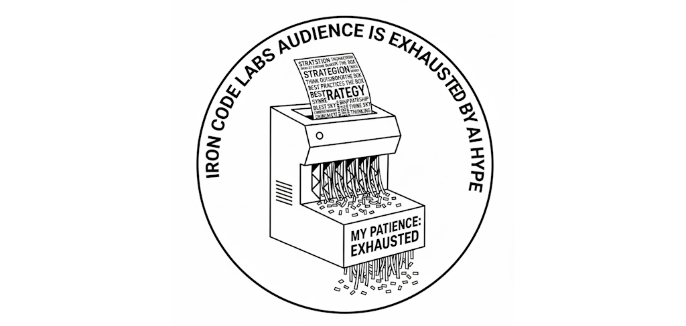

>[!NOTE]
**Internal communication:** For web seo/design, width is what matters. We keep images width 1024px. Conservative width that always works. Read: on all screens.

# Our story 

**2026 Q1**

- Founders are quietly acknowledging their exposure.
- Boards questioning the robustness of their technology strategy.
- Delivery teams shouldering burdens beyond their remit.

What follows is rarely discussed openly 👇

### Organizational failure rarely stems from engineering incompetence

- Failure comes from ambiguous direction.
- Absence of architectural vision.
- Lack of independent vendor assessment.
- No board-level accountability for technology risk.

### When failures occur, the impact is substantial.

- Security breaches.
- Complete platform reconstructions.
- Compliance violations.
- Significant valuation erosion.

### ICL METHOD(tm) succeeds through intentional design.

ICL provides executive-level judgment where AI-fatigued organizations need it most.

- Beyond superficial titles.
- Beyond premature consulting frameworks.
- Beyond engineering teams speculating on strategy.

- Executive clarity.
- Structured governance.
- Measured decision-making under pressure.

This is what leading organizations are procuring today.

If you're navigating platform architecture, vendor dependencies, regulatory requirements, or strategic technology investments…

Connect with us for world-class capability.

Remember: AI is an instrument, not sorcery.

<!--  -->