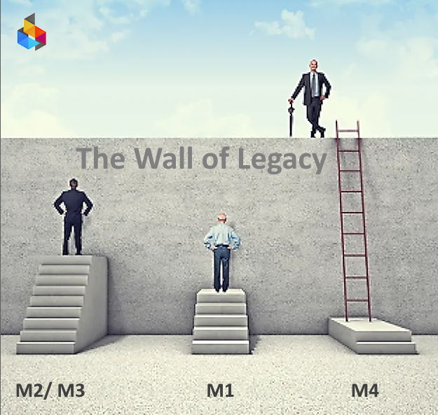

q: Where is the M5 winner? A: On the other side od the wall of Legacy.

&copy; 2026 by Iron Code Labs Ltd | CC BY SA 4.0
# Why CMM Onboarding is Iron Code Labs' First Step

**Question:** Why does ICL begin with Capability Maturity Model assessment rather than jumping straight into technical delivery?

**Answer:** Because transformation fails without measurrable organizational readiness.

## The Foundation Problem

Most enterprises attempt AI assisted modernization while operating at ad-hoc levels. This creates:

- Misaligned expectations between business and technology
- Inconsistent terminology across stakeholder groups  
- Undefined accountability for architectural decisions
- No repeatable process for evaluating technical risk

#### Architecture-led, AI assisted, delivery requires stable foundations. CMM onboarding establishes those foundations before any work begins.

## The ICL Method

The Iron Code Labs method operates as a bridge with two arches: **Onboarding** and **The Loop**.

CMM assessment forms the first arch — preparing organizations for sustainable EA-led transformation.

## Arch 1: ACMM Onboarding

ICL establishes capability maturity foundations using a two-phase approach.

### Phase A: Assessing Current State

ICL Enterprise Architects evaluate organizational maturity using ACMM Levels [M0–M5](cmm.md#levels-and-characteristics). This phase:

- Establishes shared vocabulary through common Organization Technology Landscape Classification
- Identifies capability gaps via ACMM scorecard
- Defines achievable initial target state (typically M2)

**Outcome:** ACMM baseline assessment with EA-guided improvement roadmap

### Phase B: Achieving Defined Maturity (M2)

ICL Enterprise Architects guide, document and implement architecture processes, transitioning organizations from ad-hoc (M1) to defined (M2) operations.

- Implements governance structures with executive engagement
- Deploys architecture-driven communication practices
- Embeds Common Taxonomy as organizational standard

**Outcome:** Organization operating at CMM M2 with documented EA processes

## Why This Matters

Without ACMM foundations:
- Architectural decisions lack organizational support
- Technical debt reduction efforts fail to gain traction  
- Business-technology alignment remains superficial
- Transformation initiatives stall in governance gaps

ACMM onboarding ensures organizations can sustain the improvements ICL delivers.

# The Key: Measurable Organizational Readiness