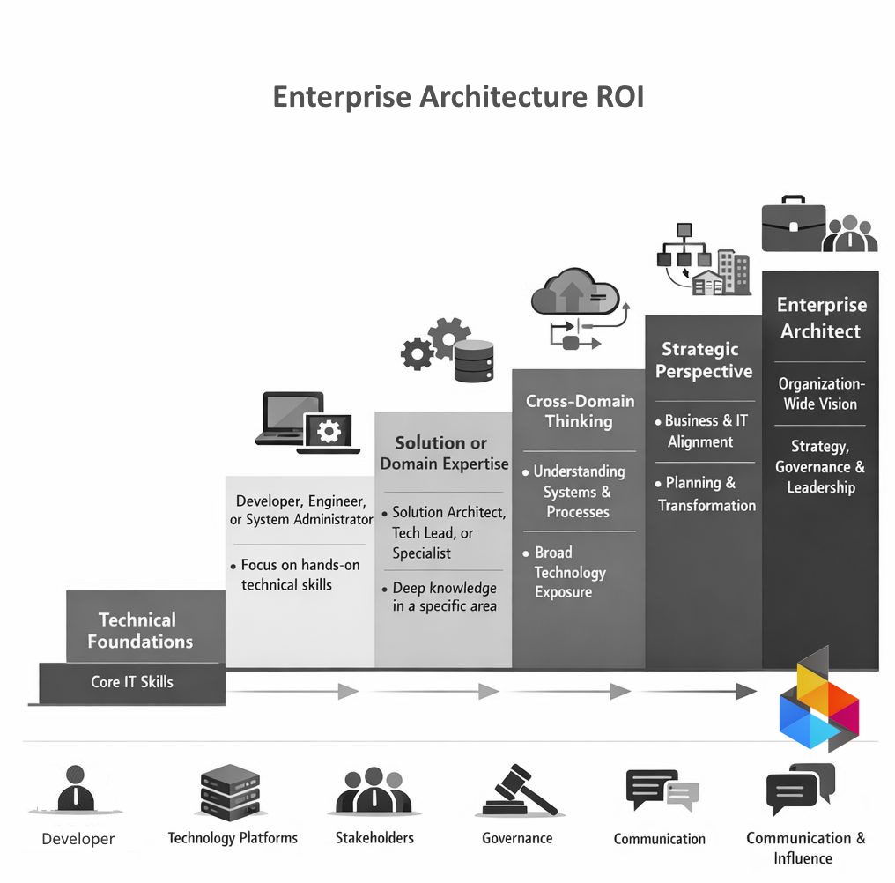

# The Case for Iron Code Labs Enterprise Architecture

>[!TIP]Four angles on the same solution

# ROI / Cost Justification

Enterprise architecture is not a cost center — it is a cost prevention engine. Organizations that engage Iron Code Labs EA practice consistently reduce redundant technology spend, eliminate rework caused by misaligned decisions, and avoid the compounding cost of technical debt accumulated without structural oversight. Every dollar invested in architecture early returns multiples by the time a project reaches delivery. Iron Code Labs brings the rigor to measure that return and make it visible to leadership.

That progression — from core IT skills to organization-wide vision — is exactly what makes an Iron Code Labs engagement feasible: structured thinking that turns architecture into a measurable return. **EA AI ROI.**

# Strategic Alignment

Technology investments only deliver value when they serve the business. Iron Code Labs Enterprise Architecture practice exists to close the gap between IT decisions and business outcomes. We translate organizational strategy into architecture decisions, and architecture decisions into clear direction for delivery teams. The result is a technology portfolio that moves in the same direction as the business — intentionally, not by accident.

That progression — from technical foundations to strategic perspective — is what makes an Iron Code Labs engagement feasible: architecture that earns its place at the business table and drives decisions that matter. **EA AI ROI.**

# Engagement Model

Iron Code Labs operates as a structured, outcome-oriented partner. An engagement begins with an architecture assessment, establishing a current-state baseline and identifying the highest-leverage opportunities. From there, we work in defined phases — each producing tangible deliverables: architecture views, decision records, roadmaps, and governance frameworks. You always know what you are getting, when you are getting it, and how it connects to your broader goals.

That progression — from assessment to governed roadmap — is what makes an Iron Code Labs engagement feasible: a repeatable path from where you are to where architecture needs to take you. **EA AI ROI.**

# Competitive Differentiation

Most EA offerings are either too academic or too narrow. Iron Code Labs combines deep technical credibility with genuine business fluency — the full staircase shown above, not just the bottom steps. We do not hand you a framework and leave. We embed a working architecture practice that your organization can sustain, build on, and point to when justifying every significant technology decision going forward.

That progression — from specialist knowledge to enterprise leadership — is what makes an Iron Code Labs engagement feasible: a partner who has climbed every step and can guide your organization to the top. **EA AI ROI.**

