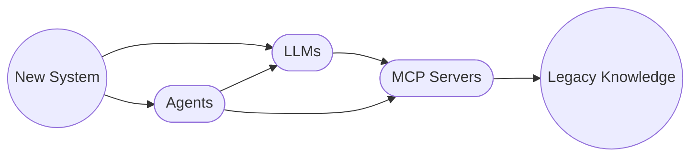
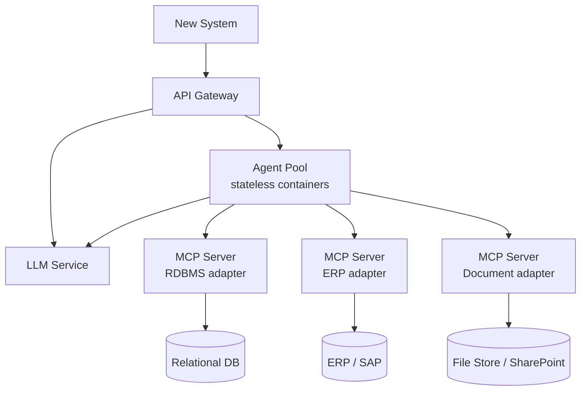

 
<a href="https://ironcodelabs.ai">&copy; Iron Code Labs Ltd</a>

# LLM Integration

- [LLM Integration](#llm-integration)
  - [1. Conceptual Architecture](#1-conceptual-architecture)
  - [2. Conceptual Agents Internals](#2-conceptual-agents-internals)
  - [3. Service Topology](#3-service-topology)
  - [4. Async \& Large Payload Handling](#4-async--large-payload-handling)
  - [5. Stateless Agent \& State Externalisation](#5-stateless-agent--state-externalisation)
  - [6. Discoverability \& API Management](#6-discoverability--api-management)
  - [7. Long-Running Workflows](#7-long-running-workflows)
  - [Key Deployment Principles](#key-deployment-principles)

## 1. Conceptual Architecture

New Systems gain reasoning and tool-use without replacing what exists. LLMs provide the intelligence; Agents orchestrate execution; MCP Servers are the controlled interface to Legacy Knowledge. Each layer has a single responsibility — the boundaries are deliberate.

Legacy knowledge has been decoupled from legacy technology. It is a set of varied physical incarnations of data storages and formats.

>[!IMPORTANT]It is decoupled from the rest of the system by MCP Servers. So it can evolve indepedantly to the time of consolidate data storage.

## 2. Conceptual Agents Internals

See [conceptual_agents.md](conceptual_agents.md).

## 3. Service Topology

The logical pattern (`New System → LLMs / Agents → MCP Servers → Legacy Knowledge`) sits on top of standard distributed systems infrastructure. Nothing built over the last 20+ years is discarded.

API Gateway is the single entry point. Agents and LLMs are independent scaled services behind it. MCP Servers are per-adapter — one per legacy system type.

---

## 4. Async & Large Payload Handling

See [async-large-payload.md](async-large-payload.md).

---

## 5. Stateless Agent & State Externalisation

See [stateless-agent.md](stateless-agent.md).

---

## 6. Discoverability & API Management

See [discoverability-api-management.md](discoverability-api-management.md).

---

## 7. Long-Running Workflows

See [long-running.md](long-running.md).

---

## Key Deployment Principles

- API Gateway is the single ingress — auth, rate limiting, versioning enforced there
- Agents are stateless — horizontally scalable, load balanced, no shared memory
- All workflow state externalised — Redis for session, event store for sagas
- Async by default for any operation beyond simple query — queue-backed, webhook or poll for result
- Large datasets never traverse the Agent layer — result references and direct pagination only
- MCP Servers are stateless adapters — independently deployable, one per legacy system concern
- MCP Tool Registry backed by existing service discovery infrastructure
- LLM service is an independent scaled deployment — failure isolated from Agent operation

---

 
<a href="https://ironcodelabs.ai">&copy; Iron Code Labs Ltd</a>

