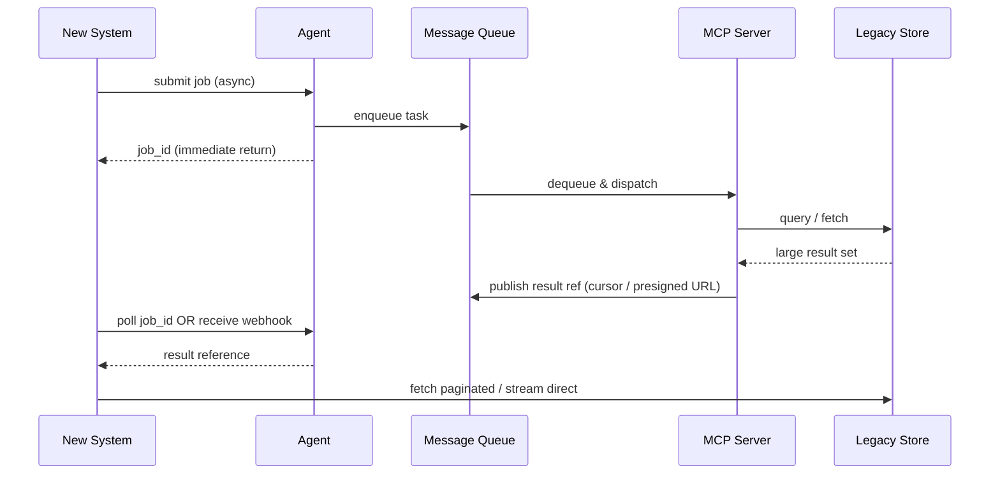

 
<a href="https://ironcodelabs.ai">&copy; Iron Code Labs Ltd</a>

# Async & Large Payload Handling

Large datasets are never passed through the Agent layer. MCP Server returns a **result reference** — cursor token or presigned URL. The consumer fetches directly and paginates.

---

 
<a href="https://ironcodelabs.ai">&copy; Iron Code Labs Ltd</a>

