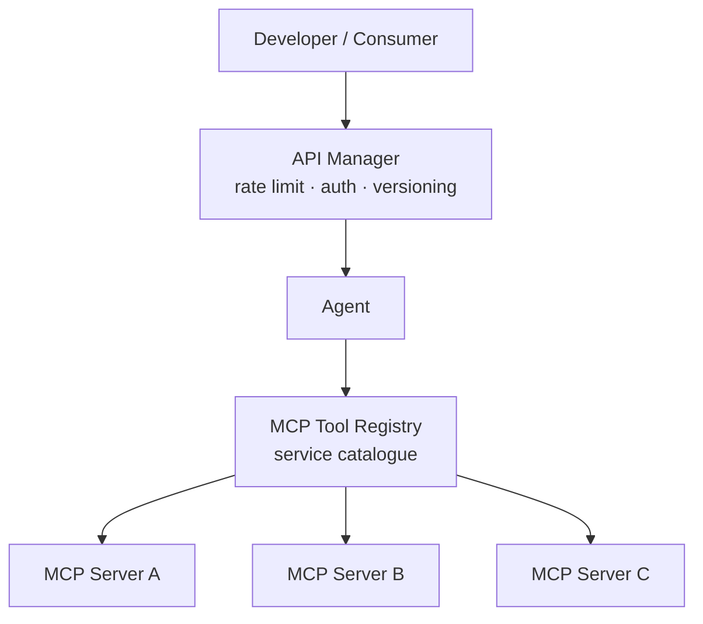

 
<a href="https://ironcodelabs.ai">&copy; Iron Code Labs Ltd</a>

# Discoverability & API Management

The MCP Tool Registry is your existing service catalogue (Consul, AWS Service Discovery, Azure APIM) — MCP protocol does not replace API management infrastructure. Rate limiting, auth, throttling, and versioning are enforced at the API Manager boundary, not inside Agents.

---

 
<a href="https://ironcodelabs.ai">&copy; Iron Code Labs Ltd</a>

