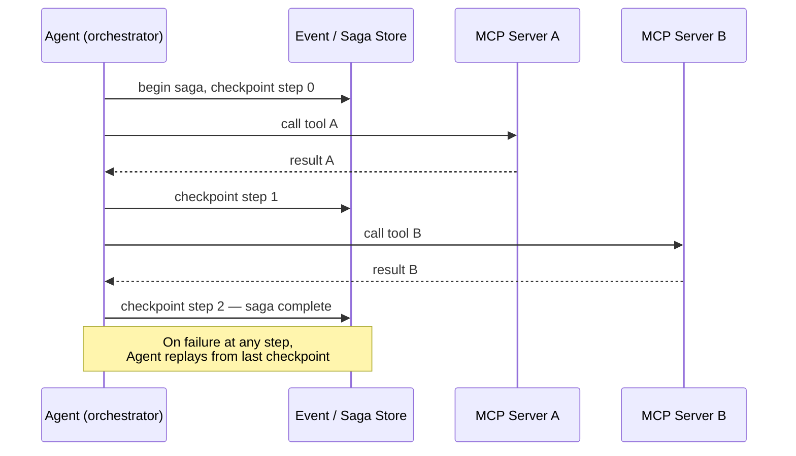
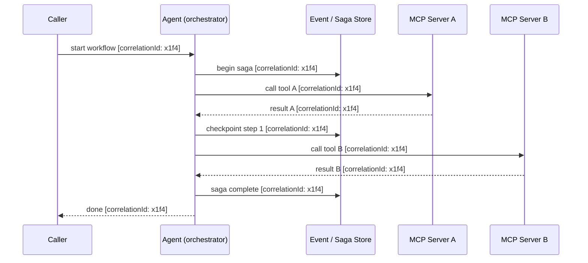

 
<a href="https://ironcodelabs.ai">&copy; Iron Code Labs Ltd</a>

# Long-Running Workflows

AI Agents are distributed systems actors. The same patterns that govern long-running workflows in service-oriented architecture apply without modification — Agents just happen to be the orchestrators.

## Saga Pattern

Long-running Agent workflows use the saga pattern — exactly as in any distributed system. Checkpoints are written to the event store after each successful step. Failure triggers compensating transactions or replay from checkpoint.

---

## Correlation ID Pattern

Every saga instance carries a **correlation ID** minted at creation and propagated unchanged through every step, every tool call, and every checkpoint. MCP servers forward it opaquely. The Agent and the event store are the only components that assign meaning to it — enabling full observability, targeted replay, and a reconstructable audit trail from a single query.

---

 
<a href="https://ironcodelabs.ai">&copy; Iron Code Labs Ltd</a>

