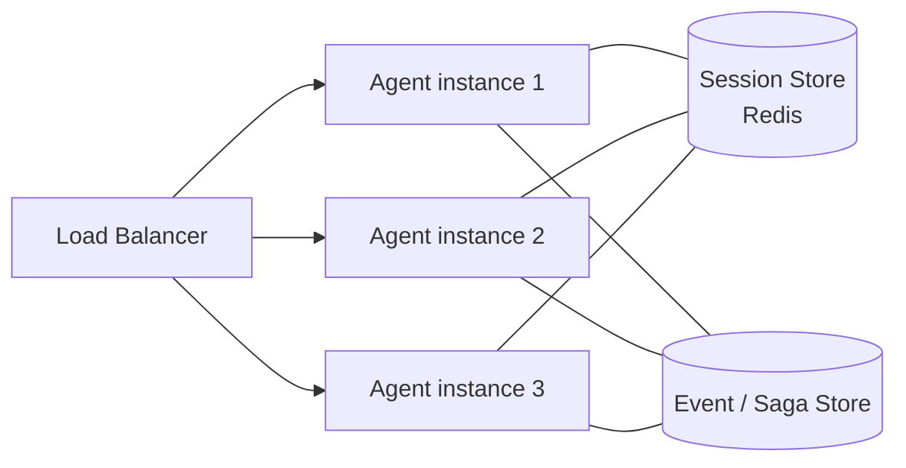

 
<a href="https://ironcodelabs.ai">&copy; Iron Code Labs Ltd</a>

# Stateless Agent & State Externalisation

Agent instances are stateless. All workflow state, session context, and saga checkpoints are externalised. Any instance can handle any request. Scale horizontally without constraint.

---

 
<a href="https://ironcodelabs.ai">&copy; Iron Code Labs Ltd</a>

