# Product Design

## Design Workflow

The correct classical order per Jacobson's OOSE is: use cases first, structural partitioning after. Use cases are purely behavioural — no structure, no domains, no subsystems inside the UC diagram.

#### Jacobson's OOSE methodology (1992)

Ivar Jacobson introduced use cases in *Object-Oriented Software Engineering* (1992). Key points:

- Use cases are **purely behavioural** — they describe interactions between actors and the system, with no structural implication
- The system boundary is a single rectangle; use cases sit inside it as a flat set — **no subsystems inside the UC diagram**
- Structural partitioning comes *after* use case analysis, in the design phase, using Jacobson's **Boundary / Control / Entity** object model
- **Domains as bounded contexts** are a DDD concept (Eric Evans, 2003) — a decade later. Jacobson had no "Domain Map" step

### Correct sequence of deliverables (strict Jacobson)

1. System-level Use Case diagram
2. Per-subsystem Use Case diagram (group by actor / functional area)
3. Per-use-case Robustness diagram (Boundary / Control / Entity objects)
4. Class/Entity model (derived from Entity objects in step 3)
5. Sequence Diagrams (derived from Control objects in step 3)

## Mockup Requirement: Simple Ticketing System

### Context

A small venue operator sells tickets to their own events (concerts, sports, shows). The system manages the full ticket lifecycle from creation to redemption. No third-party integration, no complex pricing — core CRUD only.

### Actors

- **Organizer** — creates and manages events and ticket inventory
- **Buyer** — browses events, purchases tickets
- **Staff** — scans / validates tickets at entry

### Constraints

- Single venue, single currency
- No partial refunds — cancel whole ticket only
- Ticket status: `available → reserved → sold → used / cancelled`
- No user authentication design required at this stage

---

# 1. System-level Use Case Diagram

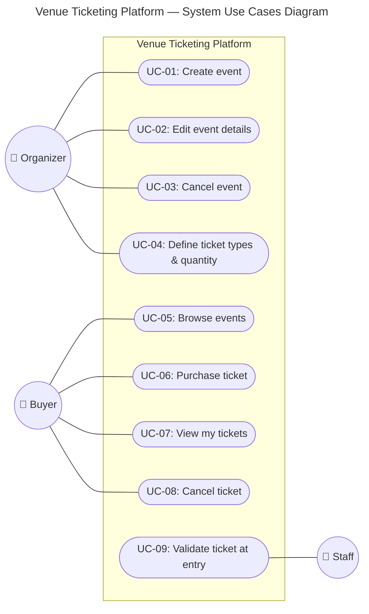

| ID | Actor | Use Case |
|----|-------|----------|
| UC-01 | Organizer | Create event |
| UC-02 | Organizer | Edit event details |
| UC-03 | Organizer | Cancel event |
| UC-04 | Organizer | Define ticket types and quantity |
| UC-05 | Buyer | Browse events |
| UC-06 | Buyer | Purchase ticket |
| UC-07 | Buyer | View my tickets |
| UC-08 | Buyer | Cancel ticket (refund request) |
| UC-09 | Staff | Validate ticket at entry |

---

# 2. Subsystems

Use cases grouped into subsystems by actor and functional area. Subsystems are structural units — not domains (DDD). This is the Jacobson design-phase partition that precedes the BCE robustness analysis.

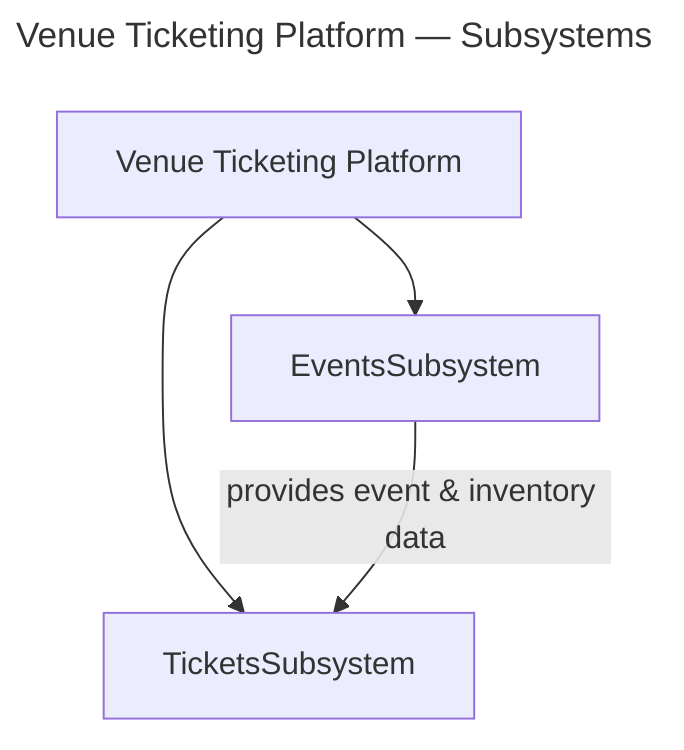

| Subsystem | Use Cases | Responsibility |
|-----------|-----------|----------------|
| EventsSubsystem | UC-01 – UC-05 | Event lifecycle and inventory management |
| TicketsSubsystem | UC-06 – UC-09 | Ticket purchase, ownership, and validation |

---

# 3. Use Case Diagrams per Sub System

## EventsSubsystem

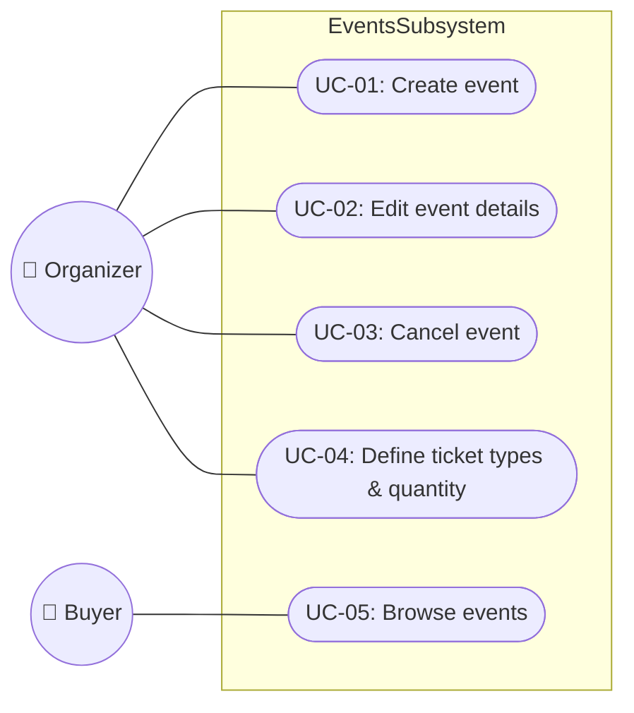

## TicketsSubsystem

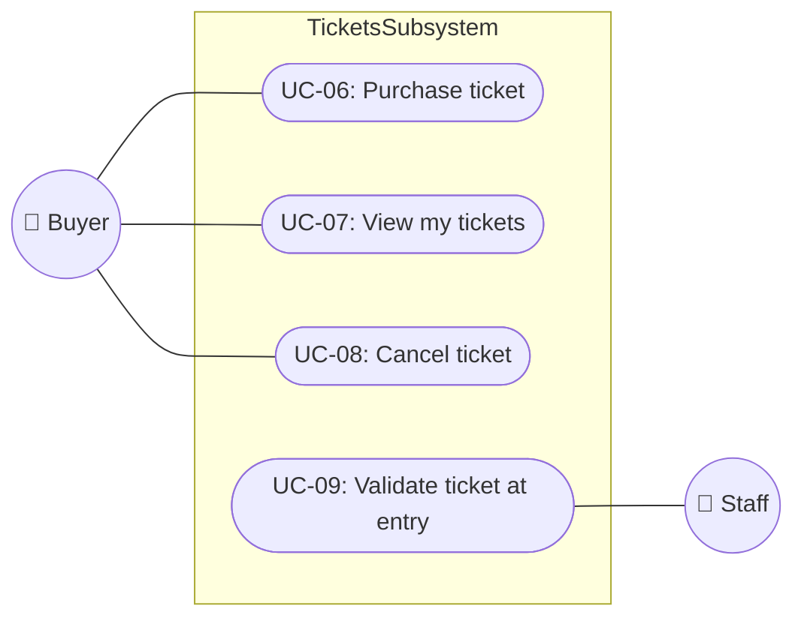

---

# 4. Class / Entity Model per Subsystem

## Events Subsystem

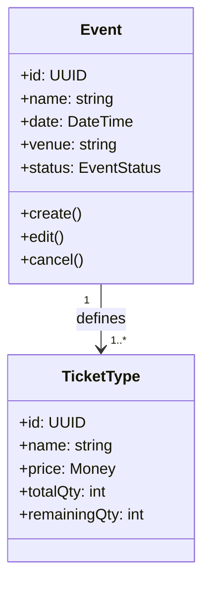

## Tickets Subsystem

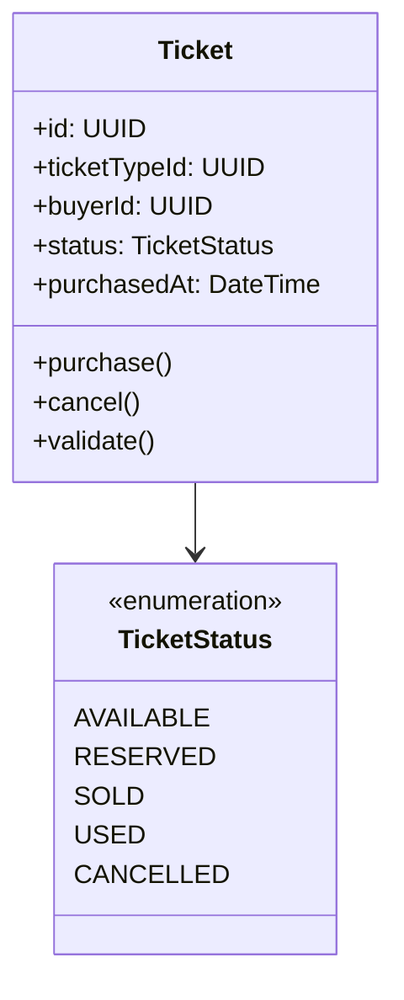

---

# 5. Sequence Diagrams

## UC-06: Purchase Ticket

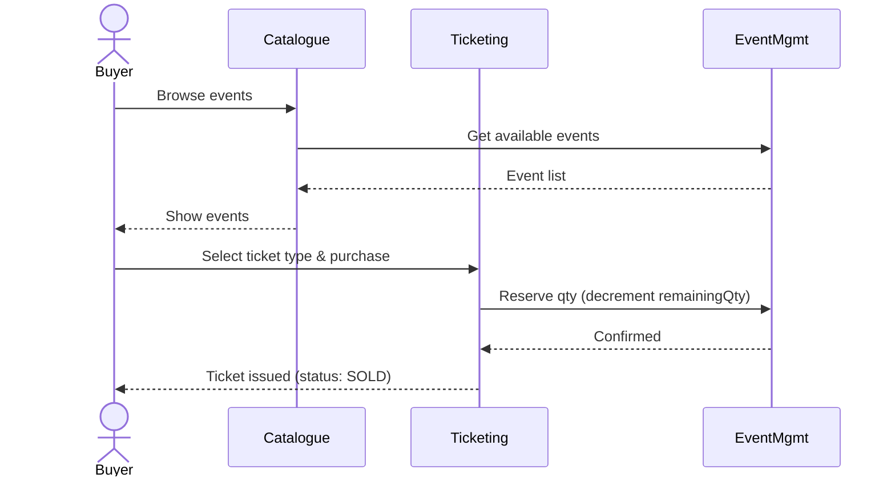

## UC-08: Cancel Ticket

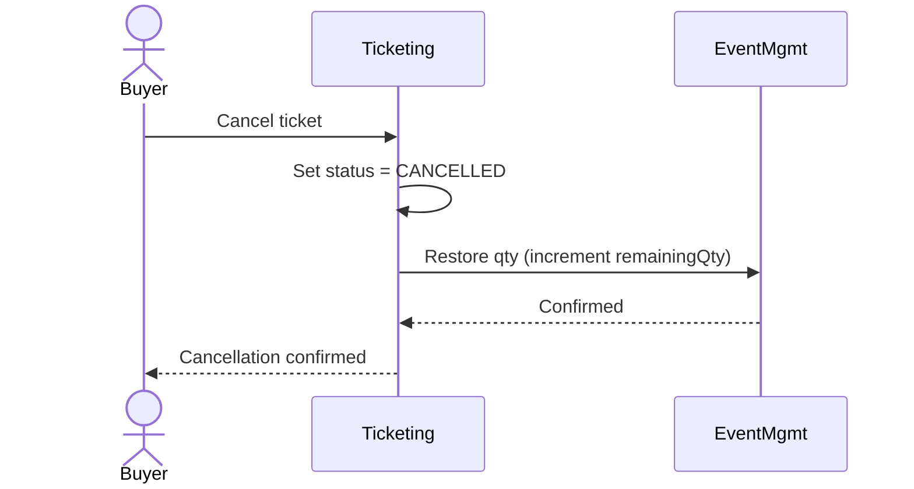

## UC-09: Validate Ticket at Entry

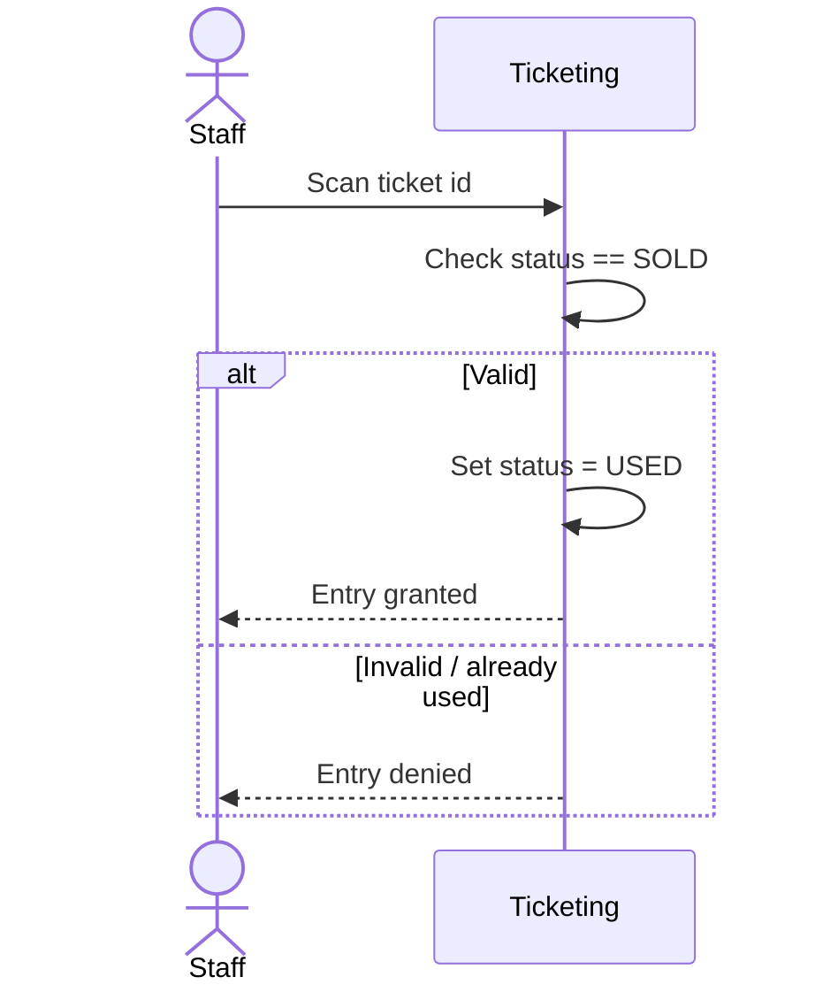

---

# 6. Physical Partitioning — Containers and Modules

One container, two processes, communicating over IPC. Each process owns its modules and its own persistence. The PlatformSubsystem modules are duplicated per process — no shared in-process state.

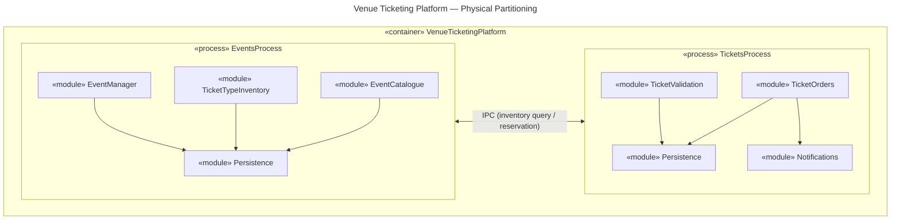

- «executable» → «container» (the host — one machine or deployment unit)
- Two «process» nodes inside it — EventsProcess and TicketsProcess
- Each process has its own Persistence module — no shared DB access across the process boundary
- A single bidirectional IPC arrow between the two processes (inventory query when purchasing a ticket)
- Table organises by process

| Process | Module | Responsibility |
|---------|--------|----------------|
| EventsProcess | EventManager | Create, edit, cancel events |
| EventsProcess | TicketTypeInventory | Define ticket types, track remaining quantity |
| EventsProcess | EventCatalogue | Read-only event listing for buyers |
| EventsProcess | Persistence | EventsProcess data store |
| TicketsProcess | TicketOrders | Purchase and cancel tickets |
| TicketsProcess | TicketValidation | Validate and mark tickets used at entry |
| TicketsProcess | Notifications | Send confirmation / cancellation messages |
| TicketsProcess | Persistence | TicketsProcess data store |

> The two-process split is an internal implementation detail. From the outside — from any actor or external system — the container presents as a single unit with a single interface. The IPC boundary is invisible to callers.

## External View

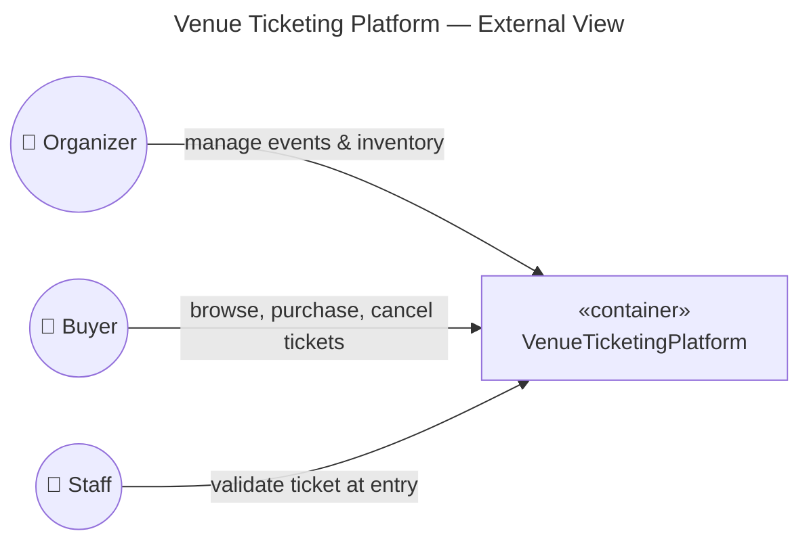

## Frontend

The actors map directly to frontend pages. The frontend is a separate process (or static app) that calls the container's API — it is not part of the container.

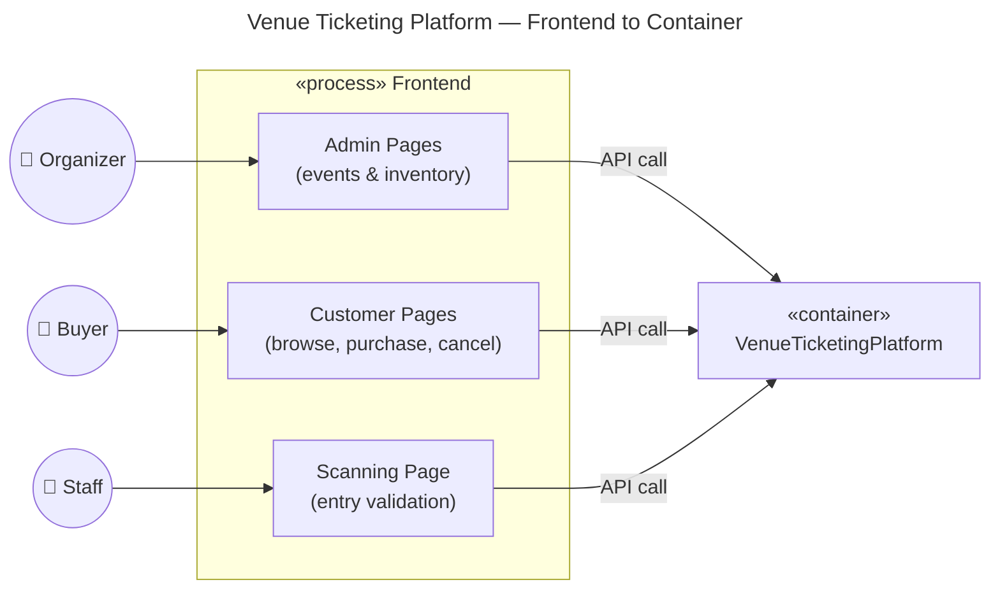
