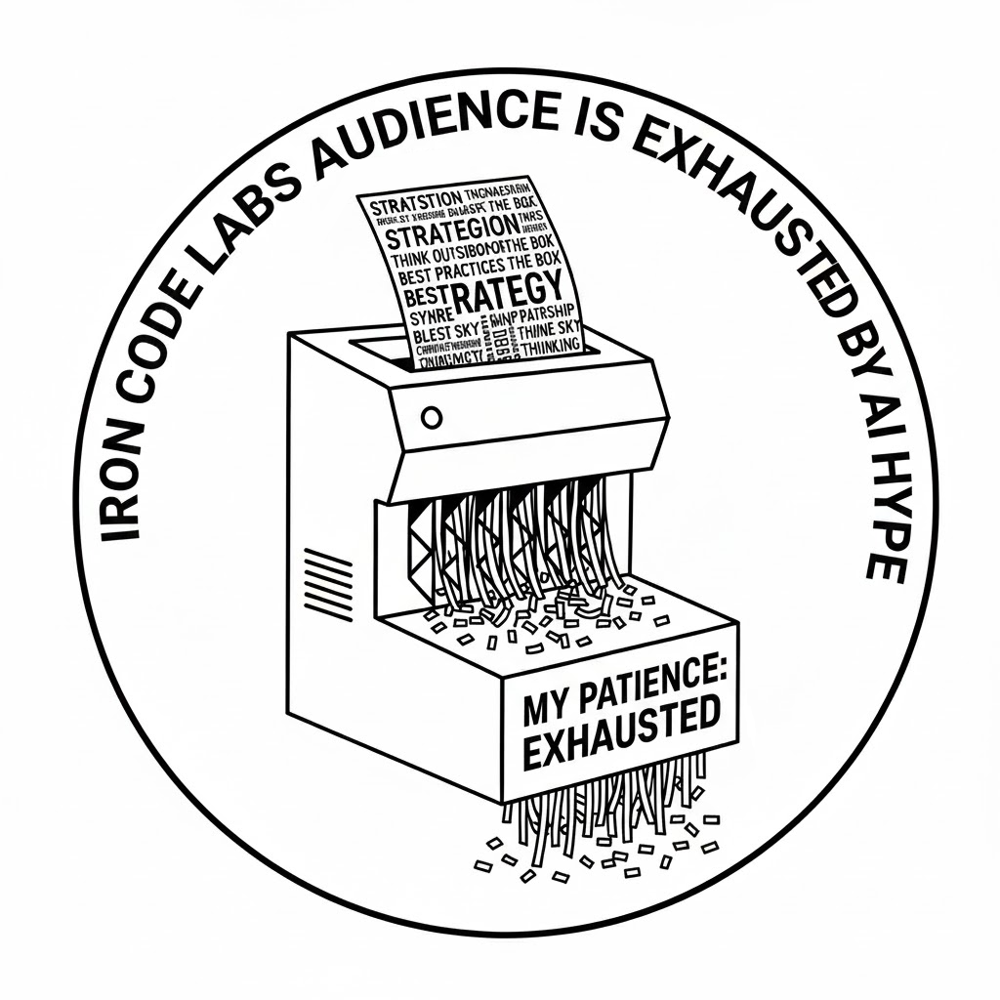

>[!NOTE]
**Internal communication:** For web seo/design, width is what matters. We keep images width 1024px. Conservative width that always works. Read: on all screens.

# Our story 

**2026 Q1**

- We are meeting founders quietly admitting they feel exposed.
- Boards unsure if their tech strategy is actually robust.
- Delivery teams carrying weight that shouldn’t sit on their shoulders.

Following is the bit people don’t say out loud 👇

### Most organisations don’t fail because of bad engineers

- They fail because of unclear direction.
- No architecture north star.
- No independent challenge to vendors.
- No one truly accountable for risk at board level.

### And when something goes wrong, it is never a small thing.

- Data breach.
- Platform rebuild.
- Regulatory issue.
- Nine figure valuation dent.

### ICL METHOD(tm) works because it is deliberate.

ICL brings in judgement at the level that AI exhausted customers actually need.

- Not a vanity title.
- Not a premature consultancy fluff.
- Not Engineering guessing at strategy.

- Senior clarity.
- Defined oversight.
- Calm decision making when it matters.

That is what the best businesses are buying right now.

You are wrestling with platform decisions, vendor risk, regulatory pressure, or long term architecture bets…

Let’s talk if you want to tap into a truly WORLD CLASS. 

And remember this: AI is a tool, not magic.

<!--  -->

