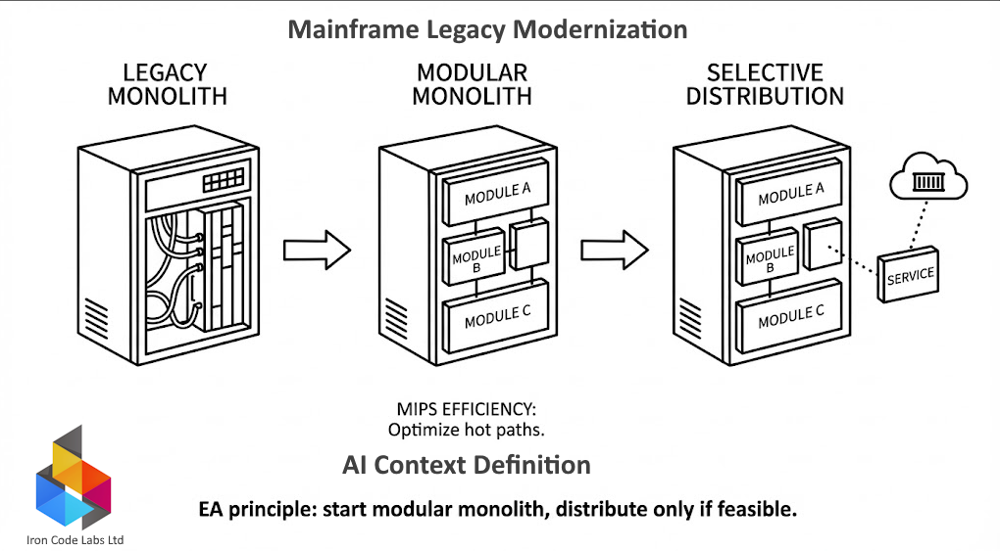

&copy; 2026 by Iron Code Labs Ltd | CC BY SA 4.0

# Modular monoliths are highly suitable for mainframe modernization

**Why they fit mainframes:**

1. **Natural migration path** - mainframe applications are already monolithic; modularizing in-place is less disruptive than immediate distribution
2. **Transaction boundaries** - mainframes excel at ACID transactions within single processes; modular monoliths preserve this strength
3. **Reduced network overhead** - avoids the latency/complexity of distributed calls that kill mainframe performance economics
4. **MIPS efficiency** - in-process module calls consume far fewer MIPS than network hops or message queues

### The evolution path

```bash
Legacy Monolith → Modular Monolith → Selective Distribution
```

- Start: Define bounded contexts within existing codebase
- Refactor: Extract modules with clear interfaces
- Stabilize: Prove the architecture, reduce technical debt
- Optionally: Extract specific modules to containers/services only where distribution adds value

**MIPS impact:**
Modular monoliths let you optimize hot paths and reduce coupling *before* adding distributed system overhead - often achieving 30-60% MIPS reduction without leaving the mainframe.

This aligns with ICL principle: start modular monolith, distribute only if feasible.

**Modular monoliths are highly suitable for mainframe modernization.**

**Why they fit mainframes:**

1. **Natural migration path** - mainframe applications are already monolithic; modularizing in-place is less disruptive than immediate distribution
2. **Transaction boundaries** - mainframes excel at ACID transactions within single processes; modular monoliths preserve this strength
3. **Reduced network overhead** - avoids the latency/complexity of distributed calls that kill mainframe performance economics
4. **MIPS efficiency** - in-process module calls consume far fewer MIPS than network hops or message queues

### The evolution path

```
Legacy Monolith → Modular Monolith → Selective Distribution
```

- Start: Define bounded contexts within existing codebase
- Refactor: Extract modules with clear interfaces
- Stabilize: Prove the architecture, reduce technical debt
- Optionally: Extract specific modules to containers/services only where distribution adds value

### MIPS impact
Modular monoliths let us optimize hot paths and reduce coupling *before* adding distributed system overhead - often achieving 30-60% MIPS reduction without leaving the mainframe.

**ICL EA principle: start modular monolith, distribute only if feasible.**

## AI Context

<details markdown="1" >
<summary>**MIPS** (Million Instructions Per Second) is a measure of computer processing performance - specifically, how many millions of machine-level instructions a CPU can execute per second.

</summary><br/>

**Key points:**

- **Legacy metric** - widely used in mainframe/enterprise computing to measure and bill for CPU consumption
- **Cost driver** - mainframe customers pay based on MIPS consumption; reducing MIPS directly reduces operational costs
- **Why it matters** - inefficient legacy code consumes unnecessary MIPS, driving up costs by 30-60% (your reduction targets)

**AI context:**
When we help customers reduce MIPS by 30-60%, you're cutting their mainframe CPU consumption and therefore their licensing/operational costs - often millions annually for large enterprises.

Modern systems measure performance differently (throughput, latency, cores), but MIPS remains the billing unit in mainframe environments.

</details>