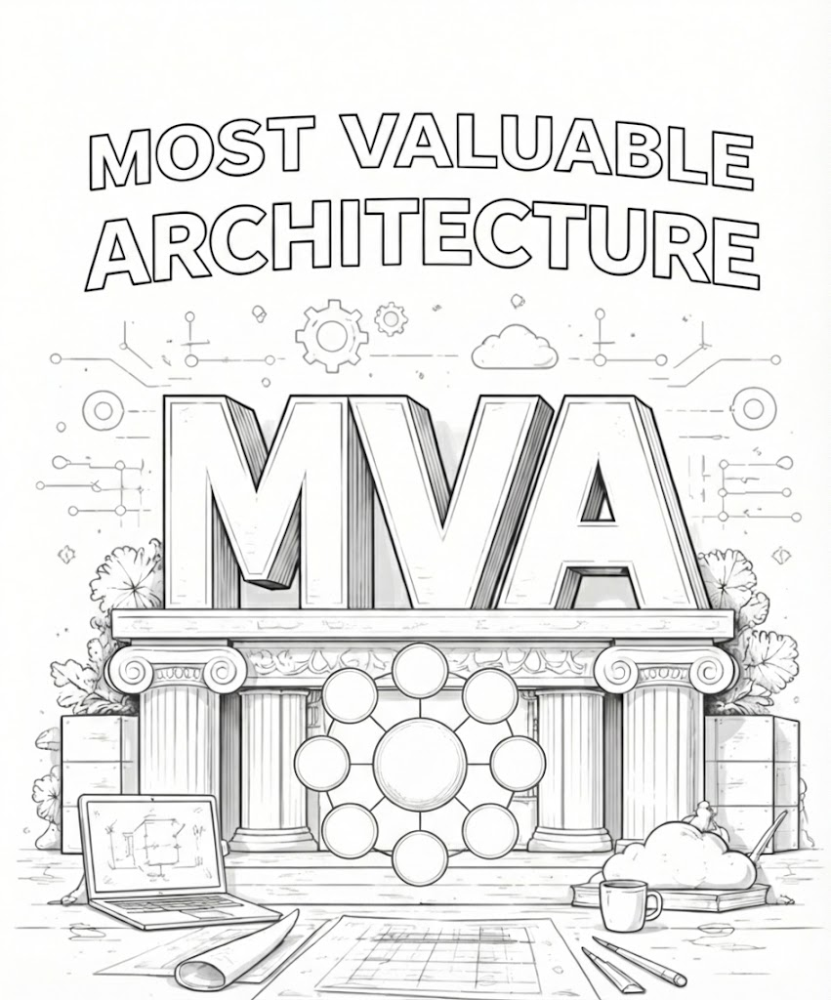

```
CMM --> MVA --> AI --> ROI

Note for the ICL Board:
-----------------------
We do not drop the "ICL Methodology" mantra. MVA fits into the ICL BPT Loop (Business -- Product -- Technology), it is insidre the "B" part. 

We are saying to disciples: before you arrive to MVA inside the "B" part, you can not clearly declare WHAT you want in the "P" part, in a form clear enoguh for the "T" (Technology) to decide HOW it will make it.
```

# 1. Marketing text to go with this image. 

## Audience are companies under heavy technical debt who could not create ROI from AI inititatives.

>[!IMPORTANT] ICL are targeting a crowd that is tired of the AI hype and frustrated by the "tax" they’re paying on legacy systems. They don’t need more "magic" tools; they need a solid blueprint to clear the path.

Here are three options for ICL marketing copy, ranging from provocative to strategic.

---

### Option 1: The Reality Check (Provocative)

**Headline: AI won’t fix a broken foundation.**
**Body:** Stop pouring budget into AI experiments that stall in the pilot phase. Technical debt is the silent killer of ROI. It’s time to move past the "Minimum Viable" mindset and build your **Most Valuable Architecture (MVA)**. Clean the slate, structure your data, and finally see the returns you were promised.

### Option 2: The Strategic Pivot (Professional)

**Headline: Turn Technical Debt into AI Equity.**
**Body:** High complexity shouldn't be the ceiling for your innovation. Our MVA framework provides the structural integrity needed to bypass legacy bottlenecks. By applying a systematic, architectural approach to AI integration, we help you eliminate wasted spend and accelerate time-to-value.

### Option 3: Short & Punchy (Social Media / Web Header)

**Headline: Debt-Free AI Starts with MVA.**
**Body:** If your AI initiatives aren’t delivering, the problem isn’t the model—it’s the architecture. Stop building on sinking sand. Build a **Most Valuable Architecture** and turn your technical debt into a competitive engine.

---

> **A Quick Tip on the Tone:** Since this audience is likely feeling "burnt" by AI costs, using the term **"Most Valuable Architecture"** is a clever play on MVP (Minimum Viable Product). It shifts the conversation from "doing the bare minimum to get by" to "investing in what actually scales."
>

>**MVP** is a well known "AGILE" movement idea. Release ASAP. Don't wait. Later cyclces will spill out the later versions. Time to market is more important than quality. That is why many call MVP: "Fake it until you make it". 

# 2. LinkedIn post and a landing page hero section

Drafts for a LinkedIn post and a Landing Page hero section, tailored to the audience drowning in technical debt and struggling with AI ROI.

---

## 1. The LinkedIn Post


> **ICL Goal:** Engage frustration, name the hidden problem, and introduce the new concept (MVA).

**Post Text:**

Let’s be honest: How many of your AI initiatives have actually left the "pilot" phase?

If the answer is "few to none," you aren’t alone. But the problem likely isn’t the AI model you chose. It’s the foundation you’re trying to build it on.

You cannot layer advanced intelligence on top of decades of technical debt and expect agility. It’s like trying to run a Formula 1 engine on a chassis held together with duct tape.

It’s time to stop chasing "Minimum Viable" patches and start building your **Most Valuable Architecture (MVA)**.

MVA is about clearing the architectural debt that suffocates innovation. It’s the blueprint for turning legacy roadblocks into the scalable foundation required for real AI ROI.

Stop funding experiments. Start building equity.

[Link to Case Study/Landing Page]

#TechnicalDebt #EnterpriseArchitecture #AIstrategy #DigitalTransformation #MVA

---

## 2. The Landing Page (www home page) Hero Section


<!--  -->

> **ICL Goal:** Immediate clarity on the problem and the solution. The visitor should instantly feel, "This gets what I'm going through."

**Headline:**
AI won’t fix a broken foundation.

**Subheadline:**
Your technical debt is actively blocking AI ROI. Stop layering new tech on old problems. Shift to a **Most Valuable Architecture (MVA)** to clear the path for scalable, profitable innovation.

**Primary CTA Button:**
[ Discover the MVA Framework ]

**Secondary (optional) Link:**
*Why your last AI pilot failed >*
