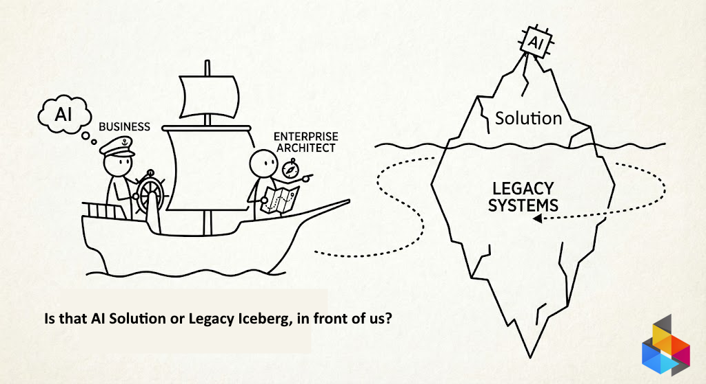

# AI and the Legacy Iceberg

*EA is the Navigator*

By clients own admitions, Enterprise Architecture imposes (what we call)"uncomfortable transparency". The real picture of clients Technology & IT Landscape.  The true picture of an Iceberg, formed after years of operataions.

It becomes clear, by putting the AI Model on top of that iceberg, the legacy will not be solved.

## We navigate clients arround the legacy iceberg

> - We help "[CMM](cmm.md) invigorated" organizations understand and aknowledge the iceberg they have to deal with
> - Just then we build the model of future together, guiding by the [BPT Loop](bpt.md)

After the clients glides on the [BPT loop](bpt.md), and products are well described, organization can proceed to 

## AI-assisted Software Product Development

>**Note** 
>
> Clients Business is made capable and acountable for clean contributions to the product requirements. All Products requirements and contributions are delivered by business roles working with the BA (Business Analyst).
{: note}

What is LLM?

> - AI is conceptual and marketing term
> - LLM is tool eningeered after AI concepts. LLM is AI implementation.
>

## [DORA AI Capabilities Model](kb/dora/dora.md)

We are working together with our clients using LLM tools. After we are alligned on the 2025 DORA Report. 

In short: LLM of your choice is your own assistant. But you are accountable for your output.

> [Please make sure you have downloaded and read the 2025 DORA Report](https://dora.dev/research/2025/dora-report/)
>
Or Take [PDF from this site](kb/dora/2025_dora_ai_capabilities_model.pdf).

>**Note**
The DORA AI report will resonate true for several years. Until further notice. And if it ever comes that notice will be far in the future.
{: note}

---

|  | &nbsp; |
|---|---|
| CC BY SA 4.0 | &copy; dbj@dbj.org |