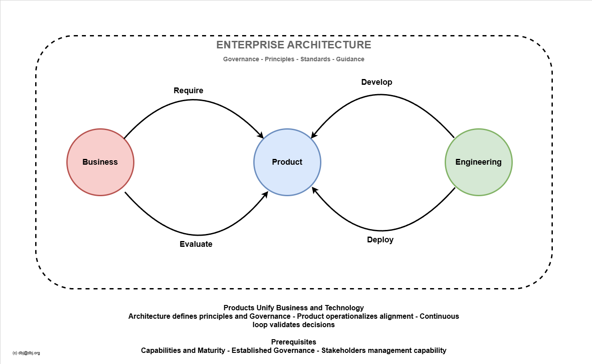

- [The BPT Loop](#the-bpt-loop)
    - [Business Product Technology (BPT)](#business-product-technology-bpt)
  - [Roles, Actors and Jurisdictions](#roles-actors-and-jurisdictions)
  - [Enterprise Architecture role](#enterprise-architecture-role)
  - [This works because:](#this-works-because)
  - [Clarifications](#clarifications)
    - [Various Clarifications](#various-clarifications)

# The BPT Loop
### Business Product Technology (BPT) 

>**Tip**
>
>Continuous Product Centric Cycle
{: tip}

This diagram represents **Enterprise Architecture role as the governing meta-layer** that orchestrates the Business-Product-Technology relationship through continuous cycles (loops).

Iron Code Labs had eveloped delivery focused, operational methodology for CMM-ready organisations. EA is the **governor** — it does not participate in the loop, it governs it.

>The entry ticked to the BPT cycle is the [ACMM Level 3](https://ea.ironcodelabs.com/cmm#levels). 
>That is the precondition to assure smooth cycling and delivery,

Activities are (groups of) messages informing on the intent. They are simple and clean and make possible keeping the 3 BPT parts decoupled, but working as a whole. Again under the central authority of the Enterprise Architecture firmly eastablished in clients organization, as the overarching governing entity.

| Activity Messages Flows | The Intent | Key Actors |
|----------|-------------|------------|
| **Require** | Business declares product needs; EA ensures alignment with strategy | Business, EA |
| **Develop** | Technology builds to product specifications; EA governs coherence | Technology, Product, EA |
| **Deploy** | Product is released into operations; EA validates architecture compliance | Technology, Product, EA |
| **Evaluate** | Measure outcomes against business objectives; feed back into next cycle | Business, Product, EA |

Evaluate feeds back to Business so that next Require can commence— the loop never stops.

## Roles, Actors and Jurisdictions

Different roles and actors work inside different parts of the BPT loop. That fact defines the jurisdiction of each role.

| Roles | Jurisdiction | Activities |
|-------|-------|------------|
| Business Leaders, Clients, Product Owners, BAs | **Business** | declares products, owns outcomes |
| Product Owners, QAs, BAs| **Product** | bridges business needs and technical capabilities (the alignment point) |
| Engineers, Developers, DevOPs| **Technology** | implements products |
| Enterprise Architects | **Organization** | overarching role whose scope is company-wide; governs the meta-layer, guides all transitions without bottlenecking |

BA == Business Analyst
QA == Quality Assurance

> **Note**
> 
> **Key BPT strengths:**
>
> - Product is the natural alignment point between Business and Technology
> - Architecture operates "above" the process, not within it
> - [CMM](cmm.md) prerequisite filters out organizations lacking foundational maturity
> - Continuous loop maps to operational rhythm, not rigid phase gates
{: .note}

## Enterprise Architecture role
- Defines principles that guide all four transitions (Require/Develop/Deploy/Evaluate)
- Ensures Product decisions maintain Business-Technology coherence
- Governs without bottlenecking the cycle
- Measures alignment health through evaluation feedback

## This works because:
- Organizations at sufficient CMM level have implicit governance structures
- Product management becomes the **operational manifestation** of architecture
- The loop tests architecture decisions against reality continuously
- Answer to a difficult question: "Is Business aligned with Technology?", becomes measurable

**In TOGAF terms:** This is Architecture Governance as a productized execution model, not replacing TOGAF ADM but providing the operational CMM based framework EA governs.

> **Product unifies; Loop validates.**
{: .tip}

## Clarifications

>**Important**
Are definition and terms in singular or plural very much depends on the size of the organization. Although it is rare there is a single product, or service. 
{:important}

>**Important**
Segments/parts of the BPT operate on different levels of abstraction as defined by [ICL Taxonomy](https://ea.ironcodelabs.com/taxonomy.html).
{: important}

| BPT Segment | Taxonomy Category |
|-------------|-------------------|
| Business    | Conceptual, Logical
| Product    | Logical, Physical |
| Engineering    | Physical, Implementation |

### Various Clarifications 
Order is irrelevant

1. inside the "Business" segment ICL ADM wheels are rotating. EAch is one project delivering conceptual and logical architectues. 
   1. Depending on the size of the organization or IT Landscape one ore more ADM "Wheels" are creating Conceptual and Logical Level architectures.
2. inside the "Product" segment BA's and PO's create Workflow explaining the steps and action flows, as declared by the business in the "B" stage in the "ADM Wheel". 
   1. ADM wheel can also deliver Logical Architecture with the declared Product in the focus.
3. "Product" in the BPT context is a generic term for actual software products or services. Actual products, integration products, platform products, network services, security services, and so on.
   1. Inside the "Product" segment, usualy there are no Engineering roles.
4. "Technology" segment contains one or more projects operating on the Implementation level (category on the [ICL taxonomy](https://ea.ironcodelabs.com/taxonomy.html))

---
Until further notice &copy; dbj@dbj.org

<!-- Standard Footer -->

 
<a href="https://ironcodelabs.ai">&copy; Iron Code Labs Ltd</a>

