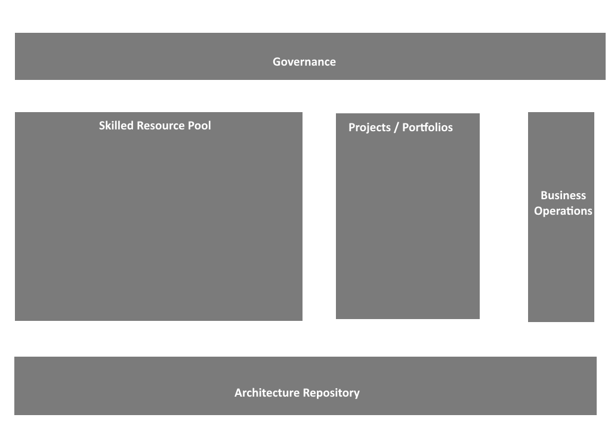

# Iron Code Labs Capability Maturity Model (ICL CMM)

The ICL CMM mirrors the TOGAF CMM — it uses the same maturity scale and the same principle of assessing organizational capability across multiple dimensions. It is not a fork or a replacement. The difference is scope: where TOGAF CMM focuses on the EA practice, the ICL CMM applies to the **whole organization**, using five structural elements that exist in every organization regardless of size, industry, or whether dedicated EA practitioners are present:

- **Governance** — decision-making authority, policies, and oversight
- **Skilled Resource Pool** — the people and competencies available to the organization
- **Projects / Portfolios** — how work is initiated, executed, and delivered
- **Business Operations** — the running business; day-to-day function and continuity
- **Architecture Repository** — the organizational knowledge base; decisions, patterns, principles, and records

Organization Maturity is assessed across these five elements. Each element is scored independently. The overall organization level is the lowest score across all five — a chain is as strong as its weakest link.

---

## Maturity Levels

| Level | Name | Description |
|-------|------|-------------|
| L0 | None | No recognizable structure in this element |
| L1 | Initial | Activity exists but is ad-hoc and person-dependent |
| L2 | Emerging | Processes being defined; inconsistently applied |
| L3 | Defined | Documented, standardized, consistently followed |
| L4 | Managed | Measured, monitored, actively controlled |
| L5 | Optimising | Continuous improvement embedded in normal operation |

> The entry ticket to the ICL BPT methodology is **L3 across all five elements**.

An organization at L3 across all five elements has what the [ICL ADM](kb/icl-adm/index.md) requires to function:

- **Governance** can host an Architecture Board with enforcement authority
- **Skilled Resource Pool** can produce and review architectural deliverables
- **Projects / Portfolios** can run a structured five-step [ICL ADM](kb/icl-adm/index.md) wheel
- **Business Operations** engages with architectural decisions rather than bypassing them
- **Architecture Repository** holds and serves the artifacts each wheel produces

Below L3, one or more of these conditions fails — and the [ICL ADM](kb/icl-adm/index.md) wheel stalls.

---

## Characteristics

Each element has a set of observable characteristics used to assess its maturity level.

### Governance

1. **Decision Authority** — it is clear who makes which decisions and at what level
2. **Policy Existence** — policies exist, are written down, and are known to those affected
3. **Compliance Enforcement** — decisions and policies are actually followed; deviations are addressed
4. **Strategic Linkage** — governance decisions visibly connect to business strategy

### Skilled Resource Pool

1. **Role Clarity** — roles are defined; people know what is expected of them
2. **Competency Awareness** — the organization knows what skills it has and what it lacks
3. **Knowledge Retention** — knowledge is not locked in individuals; it survives turnover
4. **Cross-functional Participation** — people from different functions contribute to shared goals

### Projects / Portfolios

1. **Initiation Process** — projects are started through a defined process, not informally
2. **Scope and Ownership** — each project has clear scope, owner, and success criteria
3. **Portfolio Visibility** — leadership has a current view of all active work and priorities
4. **Delivery Consistency** — projects deliver predictably; outcomes match intent

### Business Operations

1. **Process Documentation** — key operational processes are written down and followed
2. **Business-IT Engagement** — business roles actively engage with technology decisions that affect them
3. **Outcome Measurement** — operations are measured against defined business outcomes
4. **Continuity Awareness** — the organization understands and manages operational risk

### Architecture Repository

1. **Existence** — a repository exists and has a known location
2. **Currency** — content is kept up to date; outdated records are removed or flagged
3. **Accessibility** — the right people can find and use what is in the repository
4. **Decision Traceability** — architectural decisions are recorded with rationale, not just outcomes

---

## Maturity per Element — Reference Table

| Element | L0 | L1 | L2 | L3 | L4 | L5 |
|---|---|---|---|---|---|---|
| Governance | No decisions | Reactive only | Being formalized | Documented and followed | Measured | Self-improving |
| Skilled Resource Pool | No role clarity | Individual heroics | Roles emerging | Defined and stable | Capacity managed | Continuously developed |
| Projects / Portfolios | No process | Projects start informally | Some structure | Consistent initiation and delivery | Portfolio actively managed | Optimised throughput |
| Business Operations | No documentation | Key-person dependent | Processes partially documented | Standardized and followed | Outcomes measured | Continuously optimised |
| Architecture Repository | Does not exist | Ad-hoc notes | Partially maintained | Current and accessible | Audited and governed | Actively curated |

---

## Scoring

Assess each element independently on the L0–L5 scale using the characteristics above as evidence criteria. The **organization's ICL CMM level** is the minimum score across all five elements.

Example: Governance=L4, Skilled Resource Pool=L3, Projects=L3, Business Operations=L2, Architecture Repository=L3 → **Organization level: L2**

This prevents high scores in one area from masking critical gaps elsewhere.

|  | &nbsp; |
|---|---|
| CC BY SA 4.0 | &copy; dbj@dbj.org |