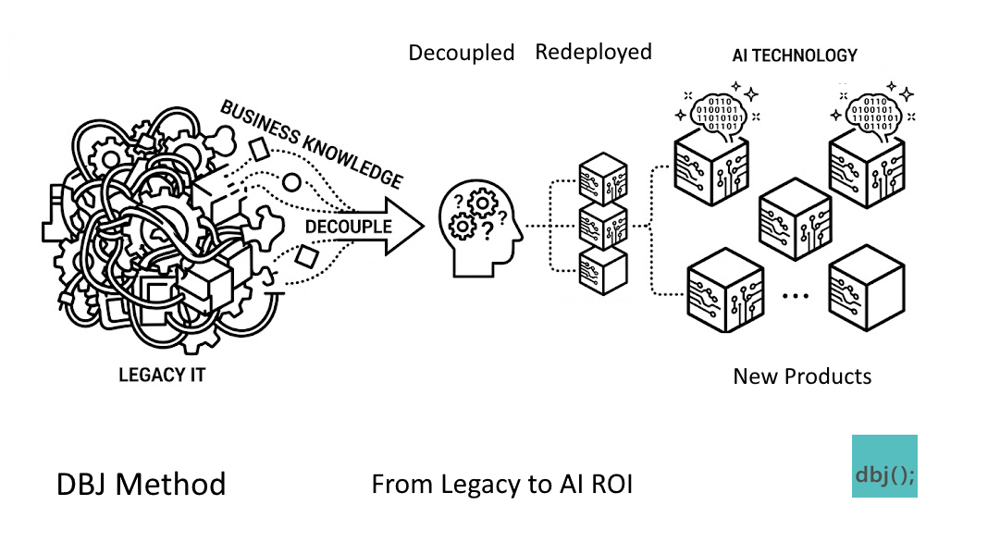

# DBJ Method 

> [!TIP]Bridge to ROI

From Chaos to ROI

**Architecture nature is static. Architecture does not change after the building starts. That annoys the Business. DBJ Method nature is dynamic.**

**DBJ Method uses simplified TOGAF EA artifacats to govern smooth running of the organization.**

**Part of DBJ Method, "BPT" is an endless loop of three segmenta. Business, Product and Technology. Business declares the Products, and Technology is implementing the Products.**

**The guiding principle of DBJ Method is to tailor the TOGAF artifacts, into the framework for feasible organisation running method.**

**This Method also exists to facilitate safe journey from legacy to AI enabled organizaton**

> General [AI Guidance](ai.md)
{: note}

## Method Adoption  

DBJ Method is based on [TOGAF](https://www.opengroup.org/togaf). DBJ Method is a runtime flow keeping the organisation running in a feasible fashion. Repeatedly raising the AI Readines level.

## The DBJ Method, engagement has two stages:

- [On-boarding](#on-boarding)
- [Business, Product, Technology Loop](#business-product-technology-loop)

## On-boarding

In this step DBJ prepares clients for architecture-led delivery by putting them on firm (DBJ simplified) [capability maturity foundations](cmm.md#diagram).

### The [Maturity Levels](cmm.md#levels)

DBJ Method Practitioners are leading their client's current organisational maturity to the (DBJ) ACMM Levels [L0–L5](cmm.md#levels-and-characteristics). In this step DBJ Method Practitioners:

- Establishes a common vocabulary: the [Taxonomy](taxonomy.md) — the shared language of the organisation's information space
- Classify capability gaps using the ACMM scorecard
- Set a realistic target level (typically L3)

<!-- Potential deliverable: ACMM baseline assessment + DBJ Method improvement roadmap -->

### Raising the Client Organisation to CMM Level [L3](cmm.md#levels)

DBJ Method defines and documents architecture processes — moving the organisation from ad-hoc (L1) to defined (L3). By using this Method, DBJ Method Practitioners:

- Establish a governance structures and secure senior management involvement
- Analyze and document architecture-driven communication practices across the organisation
- Anchor the DBJ Method [shared lexicon](taxonomy.md) as a durable client organisational asset — the structural mesh holding the information space together

For full detail on the  DBJ Method maturity model see [DBJ CMM](cmm.md).

## [Business, Product, Technology](bpt.md) Loop

**Continuous operational cycle**

Once on-boarded to maturity [Level 3](cmm.md#levels) (or above), the client organisation enters the **BPT Loop** — a continuous cycle of three clearly decoupled segments: **Business**, **Product** and **Technology**, connected by constan flow of organization events. 

BPT Method delivery-focused operational methodology is creating AI-ready organisations. 

BPT Loop is using deliverables from projects based on [DBJ ADM "Wheel"](kb/icl-adm/index.md). These deliverales are organized into three repositories infroming the three BPT segments.

### Key BPT strengths

* Decoupling of responsilities on the organizatio level delivers faster development
* Product is the natural alignment point between Business and Technology
* Client Enteprise Architecture operates “above” the process, not within it
* CMM level 3+ prerequisite provides foundational maturity
* Continuous loop maps to operational rhythm, not rigid phase gates
* ADM "Wheel's" and B,P or T segements depend on each other but they oprate indepedently of each other. 

DBJ Method provides to the customer organization, the bridge over which users of the method cross from the chaos of Legacy to the feasibility of AI.

The future Clients future Architecture takes the natural position: it does not participate in the loop — it governs it.

---

|  
|---|
| &copy; dbj@dbj.org \| CC BY SA 4.0 
