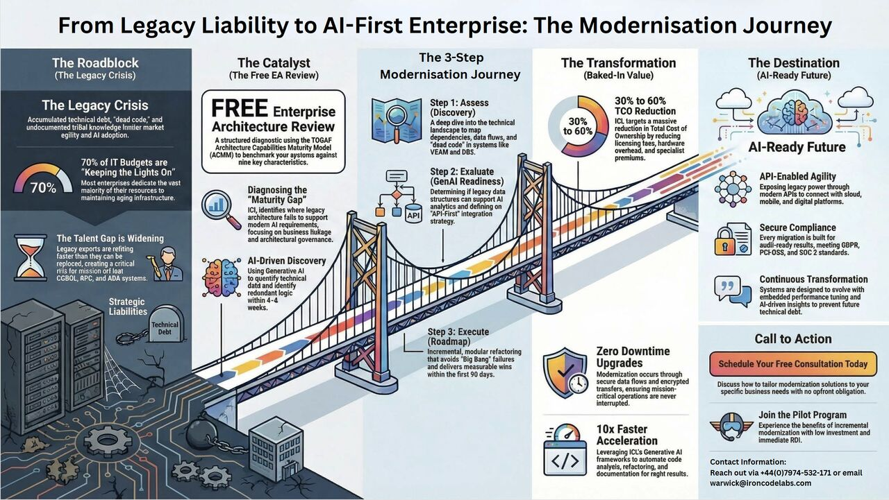
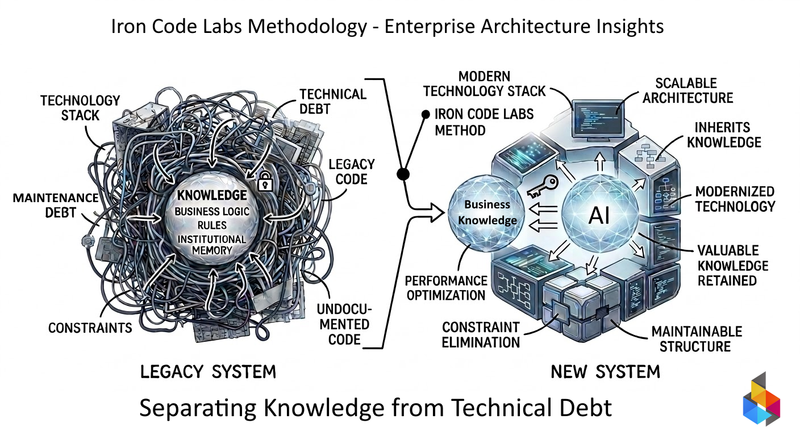
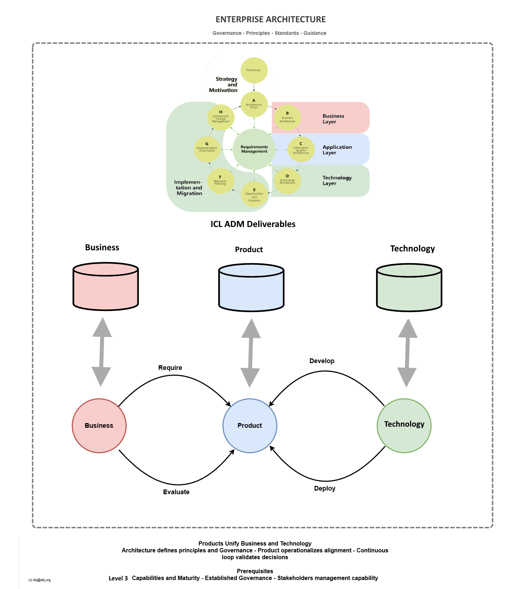

*Back to [IRONCODELABS.COM](https://ironcodelabs.com)*

>The underlying idea of ICL Method is to tailor the TOGAF artifacts, into the framework for feasible business management method.
{: .note}

>This Method also exists to facilitate safe journey of an legacy enterprise to AI enabled organizaton
>
> General [AI Guidance](ai.md)
{: note}

# Iron Code Labs Enterprise Management Method 

ICL enables clients with a Method based on [TOGAF](https://www.opengroup.org/togaf). ICL Method is a framework keeping the organisation running in a feasible fashion and repeatedly raising the AI ROI level.

<!--  -->

<!--  -->

<!-- 
The outcome of the Iron Code Labs Engagement -->

## The Iron Code Labs (ICL) Method has two stages:

- [On-boarding](#on-boarding)
- [Business, Product, Technology Loop](#business-product-technology-loop)

## On-boarding

In this step ICL Method prepares clients for architecture-led delivery by putting them on firm [capability maturity foundations](cmm.md#diagram).

### Preparing for the [Maturity Levels](cmm.md#levels)

ICL Method leads the assessment of the client's current organisational maturity levels using the ACMM Levels [L0–L5](cmm.md#levels-and-characteristics) nomenclature. In this step ICL Method:

- Establishes a common vocabulary: the [Taxonomy](taxonomy.md) — the shared language of the organisation's information space
- Classifies capability gaps using the ACMM scorecard
- Sets a realistic target level (typically L3)

Potential deliverable: ACMM baseline assessment + ICL Method improvement roadmap

### Raising the Organisation to CMM Level [L3](cmm.md#levels)

ICL Method defines and documents architecture processes — moving the organisation from ad-hoc (L1) to defined (L3).

- Establishes governance structures and secures senior management involvement
- Analyzes and documents architecture-driven communication practices across the organisation
- Anchors the [shared lexicon](taxonomy.md) as a durable organisational asset — the structural mesh holding the information space together

Potential Deliverable: Documented processes and organisation operating at CMM level [L3](cmm.md#levels) 

For full detail on the organization maturity model see the [ICL CMM](cmm.md).

## [Business, Product, Technology](bpt.md) Loop

**Continuous company-wide operational cycle**

Once on-boarded to maturity [Level 3](cmm.md#levels) (or above), the client organisation enters the **BPT Loop** — a continuous cycle of three clearly decoupled parts: **Business**, **Product** and **Technology**. This is Iron Code Labs' delivery-focused operational methodology for AI-ready organisations. 

BPT Loop is using deliverables from projects based on [ICL ADM "Wheel"](kb/icl-adm/index.md). These deliverales are organized into three repositories following the BPT segments,

### Key BPT strengths

* Decoupling of responsilities on the organizatio level delivers faster development
* Product is the natural alignment point between Business and Technology
* Enteprise Architecture operates “above” the process, not within it
* CMM prerequisite provides foundational maturity
* Continuous loop maps to operational rhythm, not rigid phase gates
* ADM "Wheel's" and B,P or T segements depend on each other but they oprate indepedently of each other. 

ICL Method provides the bridge over which customers cross from the chaos of Legacy to the feasibility of AI.

Architecture does not participate in the loop — it governs it.

 
<!-- <a href="https://ironcodelabs.ai">&copy; Iron Code Labs Ltd</a> -->

---
> © dbj@dbj.org , CC BY SA 4.0
