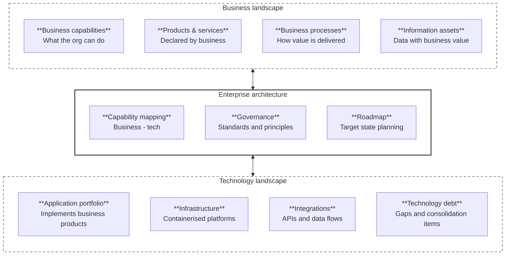

[← Knowledge Base](../index.md)

# Enterprise Full View — Business & Technology Landscape

> This is clickable diagram
{: .note}

---

## Overview

The model has three obligations.

**Business Landscape** declares intent — strategy, products, capabilities, and accountability. It must be internally consolidated: no duplicate ownership, no conflicting product definitions, no orphaned processes.

**Technology Landscape** implements what business declares — applications, data, infrastructure, and operations. It too must be internally consolidated: rationalised application portfolio, no redundant platforms, consistent standards.

**EA's role** sits between them with three specific duties: align, consolidate, and govern. Technology constraints inform what business can declare, and business change drives technology evolution.

> The key principle: *business declares the product, technology implements it*. EA ensures that chain is intact, traceable, and free of drift in both directions.
{: .important}

---

## Business Landscape

### Business capabilities {#business-capabilities}

A business capability is a stable expression of **what the organisation can do** — independent of how it is done or who does it. Capabilities change slowly; they survive organisational restructures and technology replacements.

EA uses capability maps as the primary bridge to the technology landscape. Each capability must be owned, funded, and traceable to at least one technology realisation. Gaps and overlaps in capability coverage are primary inputs to the roadmap.

> The [ICL Taxonomy](../../taxonomy.md) does not use the term "business capability" — it defines 16 structural Capability nodes (the named slots). A business capability, as used here, is an *organisational ability* that maps across one or more of those slots. The Taxonomy names the slots; the organisation's capability is how well those slots are filled.
{: .note}

> *Example: Order Management (Business Capability) spans `Conceptual > Business` (what is sold), `Conceptual > Information` (order data model), `Conceptual > Application` (OMS functions), and `Logical > Integration` (fulfilment APIs) — one capability, four Taxonomy nodes.*
{: note}

### Products & services {#products-and-services}

Products and services are **declared by business** — not by IT. The business states what it sells or delivers; technology implements that declaration. This is the core decoupling principle.

EA's role is to ensure every declared product has a traceable implementation in the application portfolio, and that no technology component exists without a corresponding business product or capability to justify it.

### Business processes {#business-processes}

Processes describe **how value is delivered** — the sequenced activities, decisions, and handoffs that turn a capability into an outcome. They sit between capabilities (what) and applications (how it is automated).

EA governs process at the level of integration points and handoffs — where processes cross system or organisational boundaries. Process sprawl and duplication are consolidation targets.

### Information assets {#information-assets}

Information assets are **data with recognised business value** — customer records, contracts, product catalogues, financial transactions. They are owned by the business, not by the systems that store them.

EA maintains a canonical data model that defines authoritative sources for each asset class. Duplication of authoritative data across systems is technology debt.

---

## Technology Landscape

### Application portfolio {#application-portfolio}

The application portfolio is the set of software systems that **implement business products and capabilities**. Each application must be justified by a business capability or product; applications without a business owner are consolidation candidates.

EA governs the portfolio by maintaining a current-state inventory, assessing fitness-for-purpose, identifying redundancy, and driving rationalisation. The target state is the smallest portfolio that fully covers declared business needs.

### Infrastructure {#infrastructure}

Infrastructure provides the **containerised platforms** on which applications run. The preference for containerisation decouples application deployment from underlying hardware and simplifies consolidation.

EA sets infrastructure standards — container orchestration, networking, storage, and cloud placement. Infrastructure decisions must be driven by application requirements, not by vendor relationships or historical inertia.

### Integrations {#integrations}

Integrations are **APIs and data flows** that connect applications to each other and to external parties. They are first-class architecture artefacts — not afterthoughts.

EA governs integration by enforcing API-first design, maintaining an integration catalogue, and preventing point-to-point sprawl. Every integration must have a defined contract, owner, and SLA.

### Technology debt {#technology-debt}

Technology debt records **gaps and consolidation items** — the delta between the current state and the target state. It includes unsupported platforms, redundant applications, undocumented integrations, missing security controls, and deferred standards adoption.

EA owns the technology debt register and ensures it is visible to business stakeholders. Debt items feed directly into the roadmap as prioritised remediation work.

---

## Enterprise Architecture Functions

### Capability mapping {#capability-mapping}

Capability mapping is the EA practice of **connecting business capabilities to technology components**. It makes the alignment between the two landscapes explicit and auditable.

A capability map answers: which applications support this capability? Which capabilities are unsupported or over-supported? Where does technology investment align with business priority, and where does it not?

### Governance {#governance}

EA governance establishes the **standards and principles** that both landscapes must conform to. It is not a committee — it is a set of enforceable decisions about technology choices, integration patterns, data ownership, and architectural style.

Governance outputs include architecture principles, technology standards, reference architectures, and decision records. Compliance is verified at project initiation and design review gates.

### Roadmap {#roadmap}

The EA roadmap is the **target state plan** — the sequenced programme of work that moves the organisation from its current architecture to its target architecture.

It is derived from three inputs: business strategy (where the business is going), technology debt (what needs fixing), and capability gaps (what is missing). The roadmap is the primary instrument by which EA translates alignment into funded delivery.

---

EA Navigates ™ / Subject to change&nbsp;© dbj@dbj.org , CC BY SA 4.0
