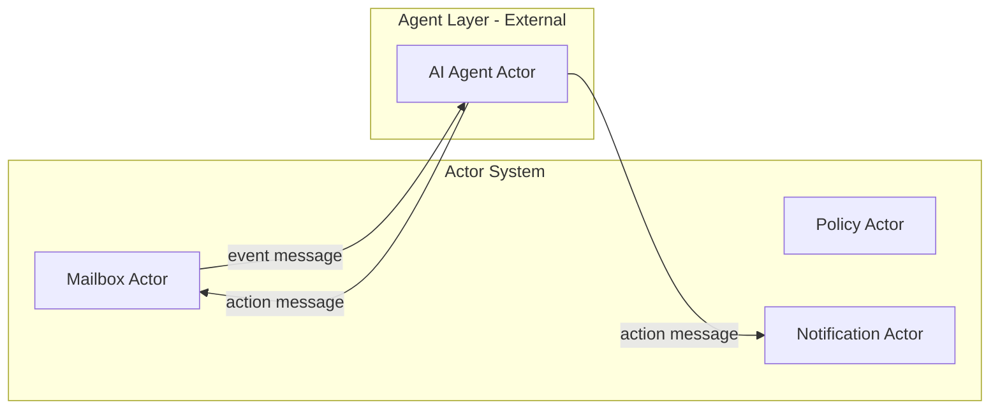
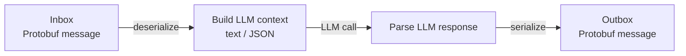

# Actor-Agent Architecture

This document explores how AI agents may be added externally to a system built on the [Actor Model Architecture](actor-model.md). It is a living document — added to as patterns emerge.

---

## Foundation First

The actor model with Protobuf binary messaging produces a sound, resilient distributed system on its own. Actors communicate through typed, schema-governed inbox contracts. State is fully encapsulated. The system is correct and operable without any AI component.

Agents are **not** the foundation. They are external additions that bring AI capabilities to specific, well-defined points in the system — where the structured, deterministic logic of actors reaches the boundary of what rules can cover.

This distinction matters. A system designed around agents as the core becomes fragile: behaviour is probabilistic, contracts are implicit, and failure modes are harder to reason about. A system designed around actors, with agents as optional bolt-ons, remains predictable at its core.

---

## Where Agents Fit

An agent enters the actor system through an inbox — exactly like any other actor. From the system's perspective, an agent is a specialised actor with one difference: its behavior is driven by a language model rather than deterministic logic.

The agent receives messages, processes them (using an LLM or other AI capability), and sends messages back into the system. It does not bypass the inbox. It does not reach into actor state directly. The Protobuf contract is the boundary — the agent must conform to it.

### The Agent as Translation Layer

LLMs operate on text. Protobuf is binary. The agent actor is the explicit translation layer between the two:

The LLM call — and everything text-based — happens entirely inside the agent. The actor system sees only typed Protobuf messages arriving and leaving. The agent is responsible for the fidelity of that translation: deserializing the inbound message into context the LLM can reason about, and mapping the LLM's response back into a valid, schema-governed outbound message.

This is why agent scope must be narrow. A wide-scope agent translating complex, multi-step context is harder to keep honest at the schema boundary. A narrow-scope agent — one job, one message type in, one message type out — keeps the translation surface small and testable.

---

## Candidate Integration Points

The following are candidate points in the [email use case](email-use-case.md) where an agent could add value. None are mandatory — each is a conscious choice to introduce probabilistic behaviour at a specific, bounded location.

| Integration point | Actor | What the agent does |
|---|---|---|
| Spam and content classification | Gateway Actor | Classifies inbound messages beyond rule-based policy |
| Smart folder suggestion | Mailbox Actor | Suggests folder placement based on message content and history |
| Search query understanding | Search Actor | Translates natural language queries to structured search parameters |
| Policy anomaly detection | Policy Actor | Flags unusual quota or usage patterns for admin review |
| Notification summarisation | Notification Actor | Summarises digest notifications rather than listing raw events |

---

## Constraints

When adding an agent to an actor system, the following constraints apply:

- **The agent communicates via inbox only.** No direct state access.
- **The agent's input and output are Protobuf-typed.** The `.proto` schema is the contract. The agent is a consumer and producer of schema-governed messages, not a free-form text processor at the system boundary.
- **Agent failure is isolated.** A crashed or unresponsive agent does not cascade. The actor system continues. The specific capability the agent provided degrades gracefully.
- **Agent scope is narrow.** Each agent has one job. It does not orchestrate other actors. Orchestration remains in deterministic actor logic.

---

*This document will grow as patterns are validated. See also: [Actor Model Architecture](actor-model.md) and [Email Use Case](email-use-case.md).*

---

<!-- KB footer -->
 
EA Navigates &trade;

Subject to chang&nbsp;&copy; dbj@dbj.org , CC BY SA 4.0

