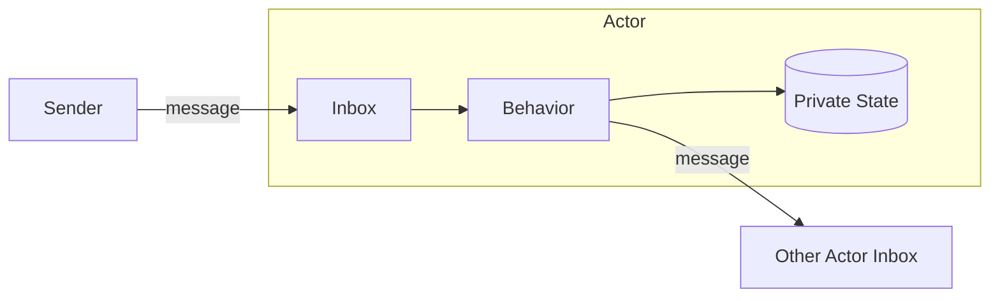
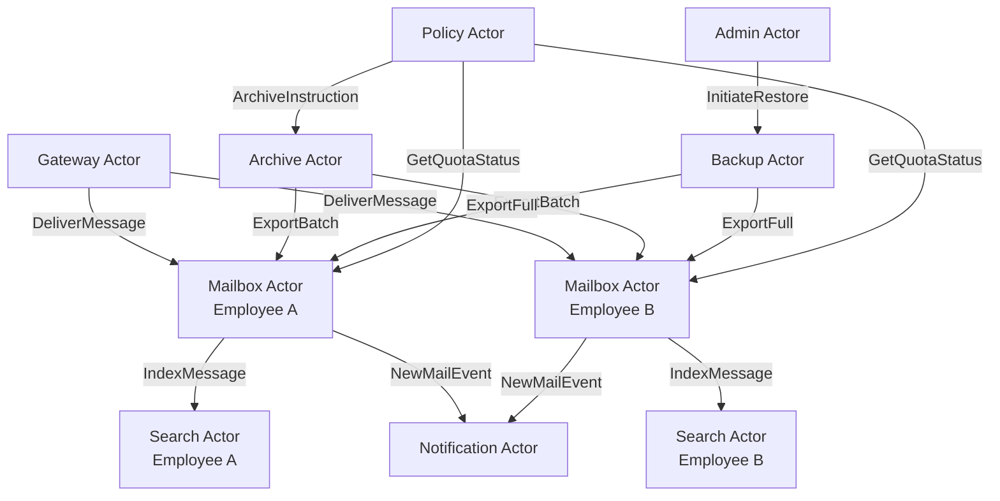
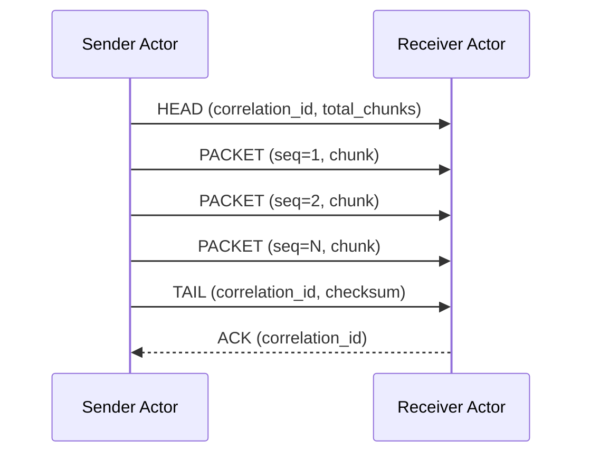
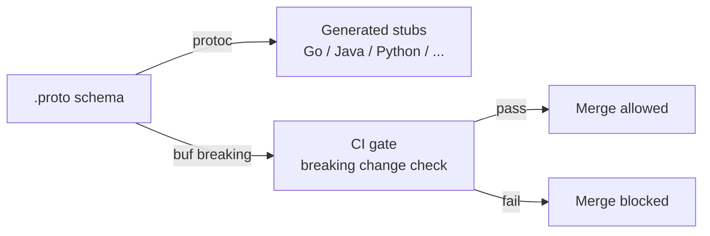

# Actor Model Architecture

The actor model is a computational model for distributed systems in which the **actor** is the fundamental unit of computation. This article covers the model across all four architecture categories: Conceptual, Logical, Physical, and Implementation.

---

## Conceptual

### What Is an Actor

An actor is an autonomous entity that encapsulates state and behavior. No external entity can read or mutate an actor's state directly. The only way to interact with an actor is by sending it a message.

This single constraint eliminates the entire class of shared-memory concurrency problems: race conditions, deadlocks, and mutex contention. There is nothing to lock because there is nothing shared.

An actor consists of three things and nothing more:

- **Private state** — data owned exclusively by the actor. No other actor can access it directly.
- **Behavior** — logic that determines how the actor responds to each message type it receives.
- **Inbox** — an ordered message queue. The actor's only communication surface with the outside world.

The actor processes messages from its inbox one at a time, sequentially. Upon processing a message it may update its own state, send messages to other actors' inboxes, or both. It never blocks waiting for a reply.



### The Inbox as the Only API

An actor has no API in the conventional sense — no method signatures, no HTTP endpoints, no function calls. The inbox is the API. The contract between actors is defined entirely by the shape of the messages they exchange.

This makes the interface inherently asynchronous by design. A sender deposits a message into a receiver's inbox and continues. There is no call stack crossing the actor boundary.

### Message Passing

All communication between actors is via message passing. Messages are immutable. A sender never shares a reference to mutable data — it sends a value. This is what makes actor systems safe to distribute across process and network boundaries.

**Fire-and-forget** is the default pattern: the sender does not wait for a reply. If a reply is needed, the receiver sends a new message back to the sender's inbox at some later point. There is no synchronous call-return between actors.

### No Shared State

The absence of shared state is not a limitation — it is the design. The state of the system is the aggregate of all actor states at any given moment. Each actor is the single source of truth for its own data.

When Actor B needs data held by Actor A, it sends a request message. Actor A processes the request and sends a reply message containing the data. At no point does Actor B hold a reference into Actor A's state.

### Why Binary Messaging

For production distributed systems, messages are encoded as binary using Protocol Buffers (Protobuf). The `.proto` schema file is the definitive contract definition for an actor's inbox.

Protobuf is preferred over JSON for actor messaging because:

- The schema is the contract — compiler-enforced, not convention-based.
- Backwards compatibility is structural: field numbers, not names, are the wire identity. Adding fields does not break existing consumers.
- Binary encoding is compact and fast. JSON parsing overhead at message volume is significant.
- The `protoc` compiler generates idiomatic code for any target language, supporting polyglot actor implementations without coupling.

The schema and encoding details are covered in the [Implementation](#implementation) section. For how agents may be layered on top of this foundation, see [Actor-Agent Architecture](actor-agent.md).

---

## Logical

This section covers actor system design. The concrete use case — an organisational email management system — is documented in full in [Email Use Case](email-use-case.md). The following covers the logical patterns that apply generally.

### Actor Topology

A production actor system consists of many specialised actors, each with a defined role, clear state ownership, and a documented inbox contract. No actor queries another actor's data store directly.



### State Ownership

Each actor is the single source of truth for its own data. The pattern is consistent across all actor types:

| Actor | Owns |
|---|---|
| Gateway Actor | Routing table, policy rules |
| Mailbox Actor | All email data for one employee |
| Search Actor | Search index for one employee |
| Archive Actor | Archive store, job registry |
| Backup Actor | Snapshot catalogue, backup store |
| Policy Actor | Organisational policy configuration |
| Admin Actor | Audit log, active restore jobs |
| Notification Actor | Notification preferences, channel registry |

No actor shares a data store with another actor. Cross-actor data access is exclusively via inbox messages.

### Large Payload Transport: The Train Pattern

For payloads too large to fit in a single message, actors use a chunked message protocol. A logical sequence of messages — a **train** — carries one large payload across multiple envelopes, using three packet types:

- **HEAD** — opens the train. The receiving actor allocates a reassembly buffer keyed by `correlation_id`.
- **PACKET** — carries a chunk of the payload. The receiving actor appends to the buffer and validates the sequence number for gap detection.
- **TAIL** — closes the train. The receiving actor verifies the checksum, hands the reassembled payload to business logic, and releases the buffer.

The `correlation_id` allows the receiving actor to demultiplex multiple concurrent trains arriving through the same inbox. It also serves as the tracing identifier for the entire train's journey across actors.



### No Global Message Broker by Default

A centralised async message broker (Kafka, RabbitMQ, SQS) is architecturally tempting. However, introducing a broker into the critical path of all actor communication creates a Single Point of Failure and concentrates operational risk.

The pragmatic position: use a broker selectively for genuinely async, high-volume, fan-out scenarios where durability and decoupling are explicit requirements. Keep direct actor-to-actor messaging for latency-sensitive conversations where broker overhead provides no benefit.

The broker is a conscious architectural choice for specific flows, not the default nervous system of the system.

---

## Physical

### Actor Placement

Actors are logical units. Their physical placement is a separate decision made at deployment time. Actors that communicate frequently and latency-sensitively are candidates for co-location on the same node. Actors that handle bulk, async, or scheduled work (Archive Actor, Backup Actor) can be placed on separate nodes without impacting interactive flows.

```mermaid
graph TD
    subgraph Node A — Interactive
        GW[Gateway Actor]
        MB[Mailbox Actors]
        SR[Search Actors]
        NT[Notification Actor]
    end

    subgraph Node B — Bulk Operations
        AR[Archive Actor]
        BK[Backup Actor]
        PL[Policy Actor]
    end

    subgraph Node C — Administration
        AD[Admin Actor]
    end

    subgraph Optional Broker
        BRK[(Message Broker\nKafka / RabbitMQ)]
    end

    GW <-->|direct| MB
    MB <-->|direct| SR
    MB <-->|direct| NT
    PL -->|via broker| AR
    PL -->|via broker| BK
    AD <-->|direct| BK
```

### Fault Domains

Each node is an independent fault domain. Failure of the bulk operations node does not affect interactive mail delivery. The Archive Actor and Backup Actor operate on scheduled cycles; a temporary outage delays a backup run but does not corrupt mailbox state.

Actors within a node are supervised. A crashed actor is restarted by its supervisor. The inbox persists across restarts — messages deposited before the crash are not lost, provided the inbox is backed by durable storage or an in-process queue with sufficient depth.

### Broker Placement

When a message broker is used for specific flows (e.g., Policy Actor → Archive Actor scheduling), the broker sits outside both nodes. It is not in the critical path of interactive operations. Its failure affects only the flows routed through it.

---

## Implementation

### Core Message Envelope

All actor communication is wrapped in a standard envelope:

```proto
message Envelope {
  string     correlation_id = 1;
  PacketType type           = 2;
  uint32     sequence       = 3;
  bytes      payload        = 4;
}
```

### Train Pattern Wire Protocol

The packet types used by the train pattern:

```proto
enum PacketType {
  HEAD   = 0;
  PACKET = 1;
  TAIL   = 2;
}
```

### Key Message Types

```proto
// Inbound message delivery
message DeliverMessage {
  string          message_id  = 1;
  string          from        = 2;
  repeated string to          = 3;
  string          subject     = 4;
  bytes           body        = 5;
  int64           received_at = 6;
}

// Search index instruction
message IndexMessage {
  string          message_id  = 1;
  string          employee_id = 2;
  string          subject     = 3;
  string          body_text   = 4;
  repeated string tags        = 5;
}

// Archive instruction from Policy Actor
message ArchiveInstruction {
  string employee_id    = 1;
  int64  before_epoch   = 2;
  string archive_job_id = 3;
}

// Backup snapshot metadata (carried in HEAD of backup train)
message BackupHead {
  string snapshot_id     = 1;
  string employee_id     = 2;
  string parent_snapshot = 3;
  uint32 total_chunks    = 4;
  bool   is_incremental  = 5;
}

// Quota status reply
message QuotaStatus {
  string employee_id   = 1;
  int64  used_bytes    = 2;
  int64  limit_bytes   = 3;
  float  usage_percent = 4;
}
```

### Schema Tooling and Governance



All schemas are maintained in a central repository. No actor owner may introduce a breaking change to a shared schema without review and sign-off from all consuming actor owners. The `buf breaking` tool enforces this at CI time.

Schema field numbers — not names — are the wire identity. Renaming a field is safe. Removing or reusing a field number is a breaking change and will be caught by `buf breaking`.

---

*See also: [Email Use Case](email-use-case.md) — full worked example applying this model to organisational email management. [Actor-Agent Architecture](actor-agent.md) — how AI agents may be added externally to this foundation.*

<!-- Standard Footer -->
<div style="clear: both;"></div>
<div style="float: center; margin: 1em; text-align: center;">
<br/>
<a href="https://ironcodelabs.ai">&copy; Iron Code Labs Ltd</a>
</div>
