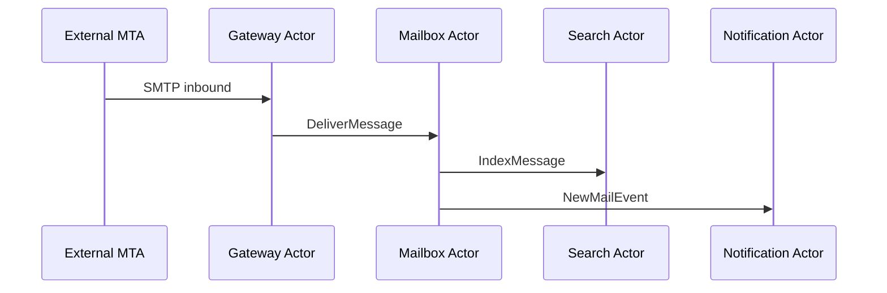
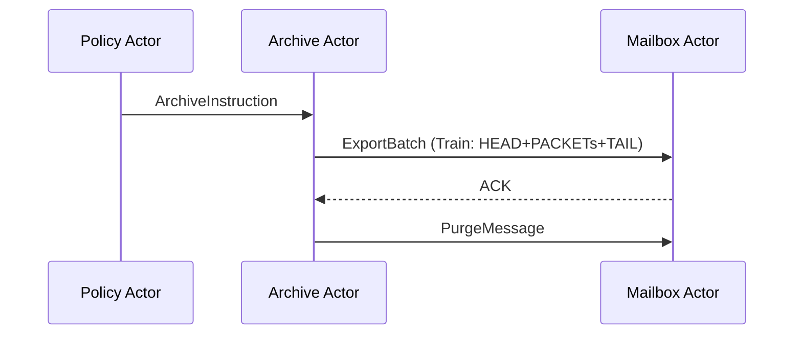
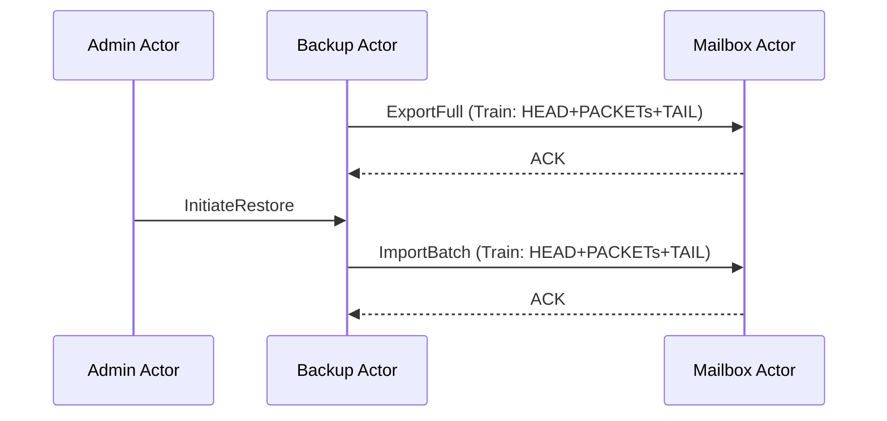

# Email Management System — Actor Model Use Case

This document applies the [Actor Model Architecture](actor-model.md) to a concrete business problem: organisational email management for a single organisation.

---

## Scope and Boundaries

The system manages all email activity for a defined organisation. It is not a public mail provider. It operates within a single organisational boundary, with a defined set of employee identities as the user population.

**In scope:**
- Send, receive, read, delete, and restore email for all employees
- Folder and label management per employee
- Full-text search across an employee's mailbox
- Scheduled archival of email beyond a retention threshold
- Backup of all mailbox data with point-in-time restore capability
- Administrative operations: account provisioning, quota management, policy enforcement

**Out of scope at this stage:**
- Physical deployment topology detail beyond what is covered in [Actor Model Architecture — Physical](actor-model.md#physical)
- Infrastructure provisioning
- External mail gateway integration detail

---

## Actor Inventory

Each actor owns its private state and exposes only its inbox. No actor queries another actor's data store directly.

### Gateway Actor

Receives all inbound SMTP messages from the external mail transfer layer. Validates envelope headers, performs basic spam and policy checks, and routes accepted messages to the appropriate Mailbox Actor inbox. Emits rejection notices back to the external layer for messages that fail policy.

**State:** routing table (employee address → Mailbox Actor reference), policy ruleset.

### Mailbox Actor *(one instance per employee)*

The central actor for each employee's email data. Owns the employee's complete mailbox state: inbox, sent, drafts, trash, and custom folders. Processes all CRUD operations on that mailbox.

**State:** message store, folder structure, unread counts, quota usage.

**Inbox messages accepted:**

| Message | Action |
|---|---|
| `DeliverMessage` | Inbound message from Gateway Actor |
| `SendMessage` | Outbound message initiated by employee |
| `ReadMessage` | Mark message as read, return body |
| `DeleteMessage` | Move to trash |
| `RestoreMessage` | Move from trash to origin folder |
| `PurgeMessage` | Permanent deletion |
| `CreateFolder` / `RenameFolder` / `DeleteFolder` | Folder management |
| `GetQuotaStatus` | Return current quota usage |

### Search Actor *(one instance per employee)*

Maintains a full-text search index for one employee's mailbox. Receives index update events from the Mailbox Actor whenever a message is delivered, deleted, or permanently purged. Responds to search queries with ranked message ID lists. The Mailbox Actor retrieves the actual message bodies.

**State:** inverted search index over message content and metadata.

### Archive Actor

Receives archival instructions from the Policy Actor on a scheduled basis. Requests message batches from Mailbox Actors via the Train Pattern for payloads exceeding the single-message threshold. Writes archived messages to the archive store. Issues `PurgeMessage` instructions back to the originating Mailbox Actor upon confirmed archive write.

**State:** archival job registry, archive store references, per-employee retention cursor.

### Backup Actor

Performs scheduled full and incremental backups of all Mailbox Actor state. Communicates with each Mailbox Actor via the Train Pattern for bulk export. Manages backup generation metadata and retention of backup snapshots. Exposes a restore interface consumed by the Admin Actor.

**State:** backup job registry, snapshot catalogue, restore-in-progress state.

### Policy Actor

Owns the organisational email policy configuration: retention periods, quota limits, acceptable use rules, archival schedules. Emits scheduled instructions to the Archive Actor and quota enforcement instructions to Mailbox Actors. Does not store email data.

**State:** policy ruleset, schedule state, per-employee policy overrides.

### Admin Actor

Processes administrative operations issued by system administrators. Provisions new Mailbox Actor instances for new employees. Instructs the Policy Actor on configuration changes. Initiates restore operations via the Backup Actor. Emits quota alerts by querying Mailbox Actors for quota status.

**State:** admin operation audit log, active restore jobs.

### Notification Actor

Receives notification events from Mailbox Actors (new message delivered, quota threshold reached) and from the Policy Actor (policy violation detected). Delivers notifications to employees via the appropriate channel. Does not store email content.

**State:** notification preferences per employee, delivery channel registry.

---

## Actor Conversation Map

### Primary Message Flows (summary)

| Flow | Sequence |
|---|---|
| Inbound mail delivery | Gateway → Mailbox (`DeliverMessage`) → Search (`IndexMessage`) → Notification (`NewMailEvent`) |
| Employee sends email | Mailbox → Gateway (`SubmitOutbound`) → Mailbox (`StoreSent`) |
| Employee reads email | Client → Mailbox (`ReadMessage`) → Client |
| Employee deletes email | Client → Mailbox (`DeleteMessage`) → Search (`DeIndexMessage`) |
| Scheduled archival | Policy → Archive (`ArchiveInstruction`) → Mailbox (`ExportBatch`) → Archive → Mailbox (`PurgeMessage`) |
| Backup | Backup → Mailbox (`ExportFull` / `ExportDelta`) → Backup (`WriteSnapshot`) |
| Restore | Admin → Backup (`InitiateRestore`) → Mailbox (`ImportBatch`) |
| Quota enforcement | Policy → Mailbox (`GetQuotaStatus`) → Policy → Admin (`QuotaAlert`) → Notification (`QuotaWarning`) |

---

## Large Payload Flows

Three flows in this system involve payloads that may exceed practical single-message size and use the [Train Pattern](actor-model.md#large-payload-transport-the-train-pattern):

**Archive export** — a Mailbox Actor may hold years of email for an employee. HEAD carries total chunk count and content type; PACKETs each contain a serialised batch of messages; TAIL carries a checksum for integrity verification.

**Backup export** — structurally identical to archive export. Full backups use a new `correlation_id` per employee per backup job. Incremental backups carry only the delta since the last snapshot, with the `correlation_id` referencing the parent snapshot for the Backup Actor's reconciliation logic.

**Restore import** — the reverse direction. The Backup Actor sends a train to the target Mailbox Actor. The Mailbox Actor reassembles and applies the payload, then sends an `ACK` carrying the `correlation_id` to confirm successful import.

In all three cases, the `correlation_id` is logged at every hop, giving the Admin Actor a complete audit trail for any bulk operation.

---

*See also: [Actor Model Architecture](actor-model.md) — the foundational model this use case applies. [Actor-Agent Architecture](actor-agent.md) — how AI agents may be added externally to this system.*

---

<!-- KB footer -->
 
EA Navigates &trade;

Subject to chang&nbsp;&copy; dbj@dbj.org , CC BY SA 4.0

