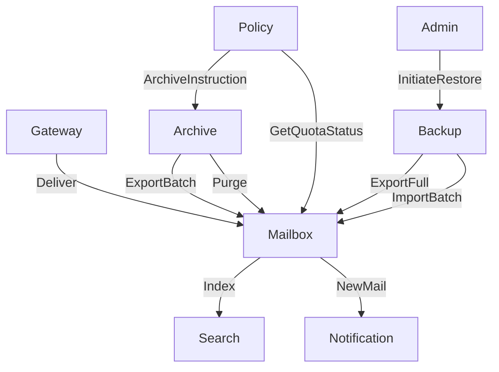
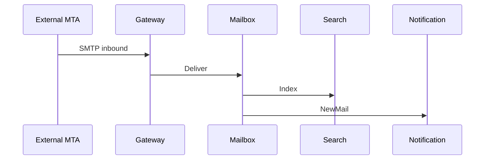
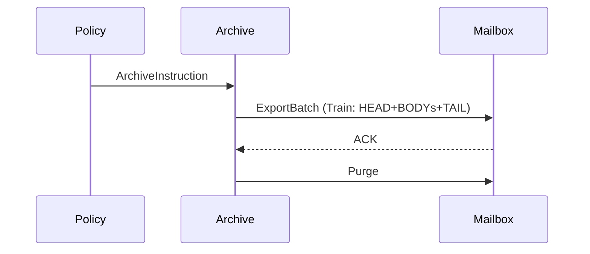
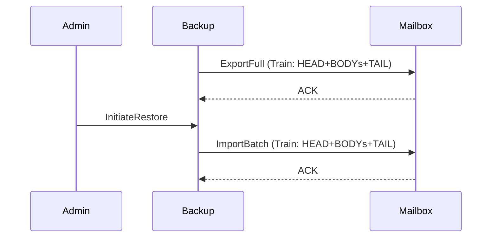

[← Knowledge Base](../index.md)

# Demo: Email Management System — AgentActor Use Case

This document applies the `AgentActor` unified concept to a concrete business problem: organisational email management for a single organisation. Every node in the system is an `AgentActor` — some deterministic, some optionally wired to an LLM or external capability.

---

## Scope and Boundaries

The system manages all email activity for a defined organisation. It is not a public mail provider. It operates within a single organisational boundary, with a defined set of employee identities as the user population.

**In scope:**
- Send, receive, read, delete, and restore email for all employees
- Folder and label management per employee
- Full-text search across an employee's mailbox
- Scheduled archival of email beyond a retention threshold
- Backup of all mailbox data with point-in-time restore capability
- Administrative operations: account provisioning, quota management, policy enforcement

**Out of scope at this stage:**
- Physical deployment topology
- Infrastructure provisioning
- External mail gateway integration detail

---

## AgentActor Inventory

Each `AgentActor` owns its private state and exposes only its inbox. No `AgentActor` queries another's data store directly.

### Gateway

Receives all inbound SMTP messages from the external mail transfer layer. Validates envelope headers, performs basic spam and policy checks, and routes accepted messages to the appropriate Mailbox inbox. Emits rejection notices back to the external layer for messages that fail policy. Routing decisions read only envelope fields — the message payload stays binary and is never unpacked.

**State:** routing table (employee address → Mailbox reference), policy ruleset.

### Mailbox

The central `AgentActor` for employee email data. Routes to the correct employee mailbox via the `eid` attribute on each message. Owns the complete mailbox state for that employee: inbox, sent, drafts, trash, and custom folders. Processes all CRUD operations on that mailbox.

**State:** message store, folder structure, unread counts, quota usage.

**Inbox messages accepted:**

| Message | Action |
|---|---|
| `Deliver` | Inbound message from Gateway |
| `Send` | Outbound message initiated by employee |
| `Read` | Mark message as read, return body |
| `Delete` | Move to trash |
| `Restore` | Move from trash to origin folder |
| `Purge` | Permanent deletion |
| `CreateFolder` / `RenameFolder` / `DeleteFolder` | Folder management |
| `GetQuotaStatus` | Return current quota usage |

### Search

Maintains a full-text search index for one employee's mailbox. Receives index update events from Mailbox whenever a message is delivered, deleted, or permanently purged. Responds to search queries with ranked message ID lists. Mailbox retrieves the actual message bodies. A candidate for LLM-wired behavior for natural language query understanding — the `AgentActor` model remains unchanged, only the behavior configuration differs.

**State:** inverted search index over message content and metadata.

### Archive

Receives archival instructions from Policy on a scheduled basis. Requests message batches from Mailbox via the Train Pattern for payloads exceeding the single-message threshold. Writes archived messages to the archive store. Issues `Purge` instructions back to the originating Mailbox upon confirmed archive write.

**State:** archival job registry, archive store references, per-employee retention cursor.

### Backup

Performs scheduled full and incremental backups of all Mailbox state. Communicates with each Mailbox via the Train Pattern for bulk export. Manages backup generation metadata and retention of backup snapshots. Exposes a restore interface consumed by Admin.

**State:** backup job registry, snapshot catalogue, restore-in-progress state.

### Policy

Owns the organisational email policy configuration: retention periods, quota limits, acceptable use rules, archival schedules. Emits scheduled instructions to Archive and quota enforcement instructions to Mailbox. Does not store email data. A candidate for LLM-wired anomaly detection — flagging unusual quota or usage patterns without changing the inbox contract.

**State:** policy ruleset, schedule state, per-employee policy overrides.

### Admin

Processes administrative operations issued by system administrators. Provisions new Mailbox instances for new employees. Instructs Policy on configuration changes. Initiates restore operations via Backup. Emits quota alerts by querying Mailbox for quota status.

**State:** admin operation audit log, active restore jobs.

### Notification

Receives notification events from Mailbox (new message delivered, quota threshold reached) and from Policy (policy violation detected). Delivers notifications to employees via the appropriate channel. Does not store email content. A candidate for LLM-wired summarisation — digest notifications summarised rather than listed raw.

**State:** notification preferences per employee, delivery channel registry.

---

## AgentActor Conversation Map

#### New Mail Sequence

#### Export Batch Sequence

#### Restore Backup Sequence

### Primary Message Flows (summary)

| Flow | Sequence |
|---|---|
| Inbound mail delivery | Gateway → Mailbox (`Deliver`) → Search (`Index`) → Notification (`NewMail`) |
| Employee sends email | Mailbox → Gateway (`SubmitOutbound`) → Mailbox (`StoreSent`) |
| Employee reads email | Client → Mailbox (`Read`) → Client |
| Employee deletes email | Client → Mailbox (`Delete`) → Search (`DeIndex`) |
| Scheduled archival | Policy → Archive (`ArchiveInstruction`) → Mailbox (`ExportBatch`) → Archive → Mailbox (`Purge`) |
| Backup | Backup → Mailbox (`ExportFull` / `ExportDelta`) → Backup (`WriteSnapshot`) |
| Restore | Admin → Backup (`InitiateRestore`) → Mailbox (`ImportBatch`) |
| Quota enforcement | Policy → Mailbox (`GetQuotaStatus`) → Policy → Admin (`QuotaAlert`) → Notification (`QuotaWarning`) |

---

## Large Payload Flows

Three flows in this system involve payloads that may exceed practical single-message size and use the Train Pattern:

**Archive export** — Mailbox may hold years of email for an employee. HEAD carries total chunk count and content type; BODYs each contain a serialised batch of messages; TAIL carries a checksum for integrity verification.

**Backup export** — structurally identical to archive export. Full backups use a new `correlation_id` per employee per backup job. Incremental backups carry only the delta since the last snapshot, with the `correlation_id` referencing the parent snapshot for Backup's reconciliation logic.

**Restore import** — the reverse direction. Backup sends a train to the target Mailbox. Mailbox reassembles and applies the payload, then sends an `ACK` carrying the `correlation_id` to confirm successful import.

In all three cases, the `correlation_id` is logged at every hop, giving Admin a complete audit trail for any bulk operation.

---

<!--

## Implementation

Protobuf schemas, envelope definition, train protocol, and message type definitions — see archived reference in `unused/actor-model.md`.

-->

---

*See also: [Agent-Actor Architecture](index.md) — the `AgentActor` unified concept at Conceptual and Logical levels.*

---

<!-- KB footer -->
 
EA Navigates &trade;

Subject to change&nbsp;&copy; dbj@dbj.org , CC BY SA 4.0

