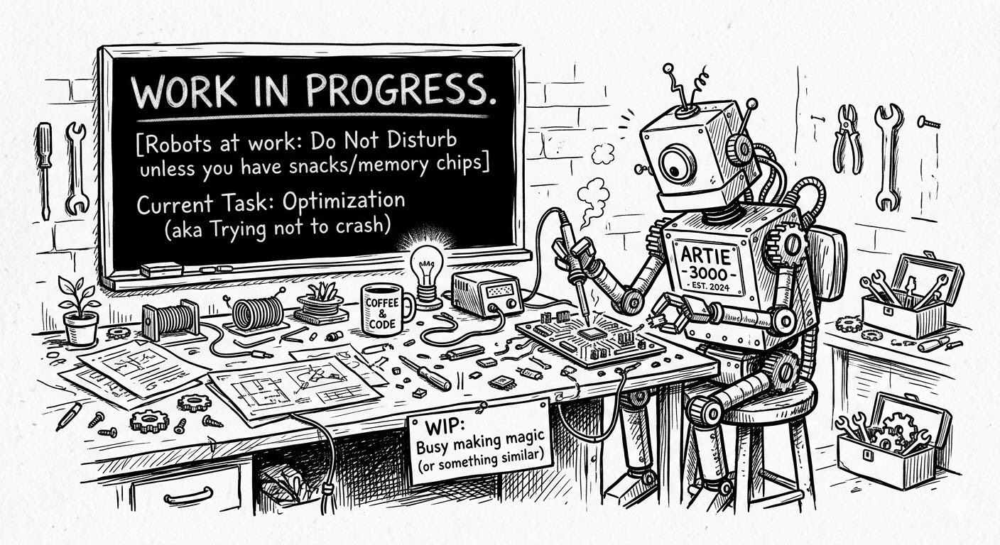
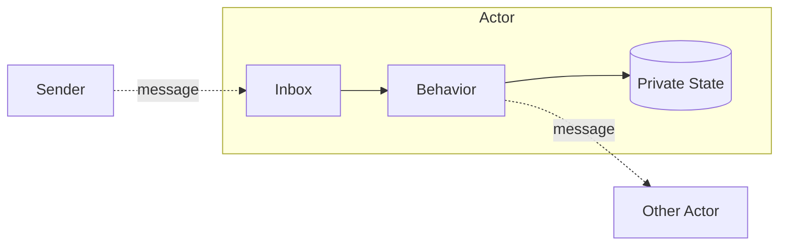
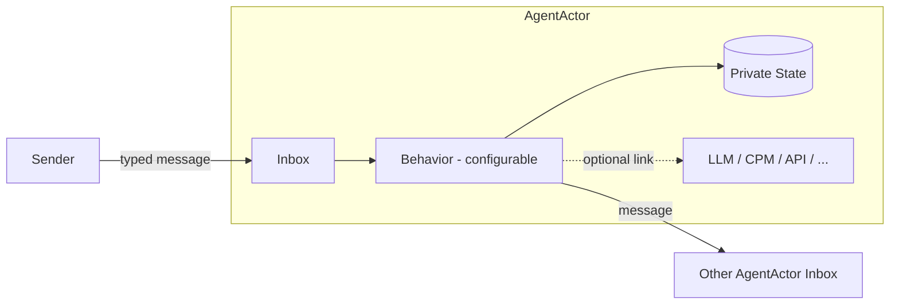
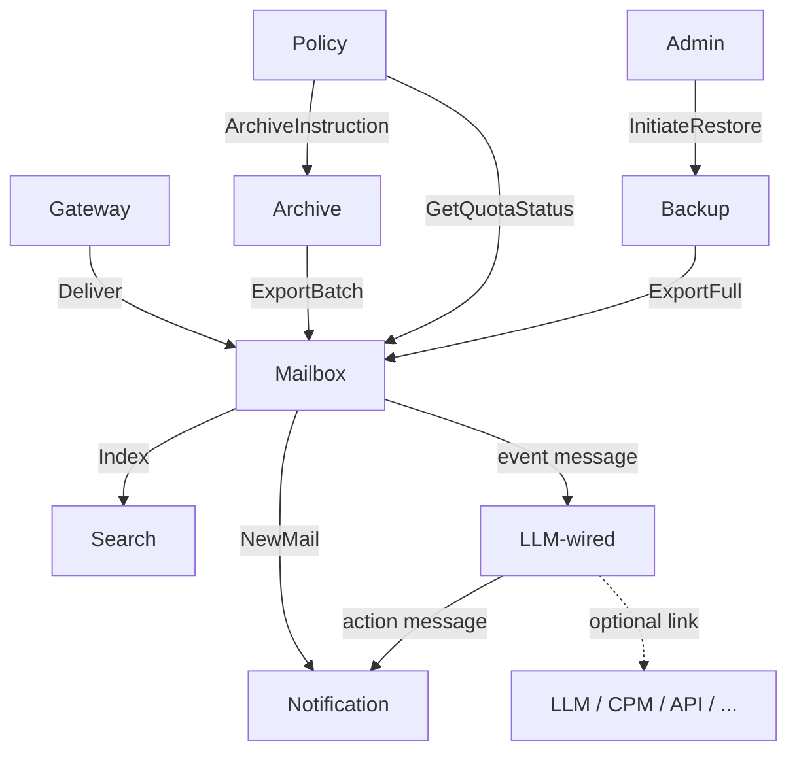

 

[← Knowledge Base](../index.md)

> "*I just deleted all my MCPs. Skills + CLI is all you need.*
>
> *MCPs were a solution for humans pretending to build for agents. But agents aren't humans. They're processes. And processes talk to the world through CLIs and APIs. Always have. Always will.*
>
> *GitHub's official MCP server: 54,000 tokens to load the spec. Fifty-four thousand. Before I even ask it to do anything.*
> *Meanwhile, `gh --help` costs 562 tokens. And the model already knows it from training data.*
>
> *MCP is a JSON bureaucracy pretending to be infrastructure. It's the enterprise middleware of AI, lots of ceremony, zero value add.*
>
> *Skills are 30-50 tokens until triggered. Progressive disclosure. They teach the agent how to think. CLIs are the what — battle-tested, version-controlled, debuggable without a spec document.*"
>
> — Mitko Vasilev CTO, [LinkedIn, 2026 Q1](https://www.linkedin.com/posts/ownyourai_i-just-deleted-all-my-mcps-skills-cli-activity-7437591826464677888-83u0?utm_source=share&utm_medium=member_desktop&rcm=ACoAAAAaxaMBp4-gq5wAJBgyOVUixCCWNdTQwQQ)

# Agent-Actor 

The [Actor model](https://en.wikipedia.org/wiki/Actor_model) has been the foundation for resilient distributed systems since Hewitt, 1973. The [AI Agent](https://en.wikipedia.org/wiki/Intelligent_agent) concept, now ubiquitous, is not a new idea layered on top — it is the same idea, recognised.

**An `AgentActor` is the unified concept — Actor and Agent are logically the same thing.**

This document shows why and how, at the Conceptual and Logical levels.

---

## Concept

### What Is an Actor

An Actor is an autonomous entity that encapsulates state and behavior. No external entity can read or mutate an Actor's state directly. The only way to interact with an Actor is by sending it a message.

An Actor consists of three things and nothing more:

- **Private state** — data owned exclusively by the Actor. No other Actor can access it directly.
- **Behavior** — the logic that determines how the Actor responds to each message type it receives. 
  - Please note the difference v.s. business logic induced behaviour
- **Inbox** — an ordered message queue. The Actor's only communication surface with the outside world.

The Actor processes messages from its inbox one at a time, sequentially. Upon processing a message it may update its own state, send messages to other Actors' inboxes, or both. It never blocks waiting for a reply.

### Messages

Messages are the only way Actors communicate. Three levels:

- **Type** — the named contract: what a message is and what data it carries. Defined once, sent many times. e.g. `Deliver`, `Index`, `NewMail`.
- **Instance** — a single occurrence of a type in flight.
- **Attribute** — a named field carried by every instance of a given type.

All communication is **fire-and-forget** by default. A sender deposits a message into a receiver's inbox and continues. There is no synchronous call-return between Actors.

### No Shared State

State is the Data AgentActor keeps privately. State is not public. Public state might be used by two or more AgentActors, 

The absence of shared state is not a limitation — it is the design. Each Actor is the single source of truth for its own data. When Actor B needs data held by Actor A, it sends a request message and receives a reply message. At no point does Actor B hold a reference into Actor A's state. State is never referenced.

### The AgentActor — Unified Concept

Actor behavior is **not** business logic. It is the logic of message processing, dispatching, and replying — as it has been since Hewitt, 1973. Business logic is what happens *inside* that processing step.

> `Act on message -->| Act on message contenct |--> Act on the outcome`

An `AgentActor` is the unified concept: the same autonomous entity with an inbox, private state, and a behavior function — where that behavior function is configurable. A deterministic `AgentActor` has fixed rules and fixed responses. A non-deterministic `AgentActor` wires its behavior to an LLM (introducing non-determinism), or a CPM, or a rules engine, or an external API, or any combination. What it connects to determines what it does. The model does not change.

The inbox contract, state isolation, fire-and-forget messaging, and failure containment are all unchanged regardless of what the behavior connects to. There is no "Agent layer" — it is a behavior configuration choice at the `AgentActor` level.

### Binary Messaging and Selective Deserialisation

Classical Actors use binary messaging — typed, schema-governed, compact. AI Agents as they exist today operate on text — LLM in, text out, no schema enforcement. This is the critical difference the `AgentActor` resolves.

All messages in an `AgentActor` system are binary. The message type is parsed and known before the payload is touched. The `AgentActor` deserialises only what its behavior requires for that specific message type:

- **Dispatch only** — the `AgentActor` reads envelope fields (message type, routing attributes) and forwards the message as binary. The payload is never unpacked. No JSON parsing, no text extraction — just binary routing at full speed.
- **Property access** — the `AgentActor` reads specific fields from the binary structure directly. Individual properties are accessed without deserialising the full payload or any nested sub-structures inside it.
- **Call required** — only for message types where the behavior demands it does the `AgentActor` deserialise the payload and construct a text prompt. This is the exception, not the rule.

The cost of unpacking is paid only when the behavior demands it. For the majority of messages — routing, indexing, scheduling, quota checks — the payload stays binary throughout. This is a fundamental performance advantage over text-native agent systems where every message is parsed unconditionally. JSON parsing is not free operation.

---

## Logical Architecture

### AgentActor Topology

A production system consists of many/few specialised `AgentActor` instances, each with a defined role, clear state ownership, and a documented inbox contract. Or a single inbox contract for the whole systems. 

No `AgentActor` queries another's data store directly. Some have deterministic behavior; others are wired to an LLM or other external capability. From the system's perspective they are all the same thing.

As an illustration — an organisational email system — the topology looks like this:

Each node is an `AgentActor`. Each arrow is a typed message. No shared state. No direct data access between `AgentActor` instances.

### State Ownership

Each `AgentActor` is the single source of truth for its own data aka State:

| AgentActor | Owns |
|---|---|
| Gateway | Routing table, policy rules |
| Mailbox | All email data for one employee |
| Search | Search index for one employee |
| Archive | Archive store, job registry |
| Backup | Snapshot catalogue, backup store |
| Policy | Organisational policy configuration |
| Admin | Audit log, active restore jobs |
| Notification | Notification preferences, channel registry |

### Detour: Large Payload Transport: The Train Pattern

For payloads too large for a single message, `AgentActor` instances use a chunked protocol — we caall: **Train**. A train carries one large payload across multiple packets:

- **HEAD** — opens the sequence; the receiving `AgentActor` allocates a reassembly buffer.
- **BODY** — carries a chunk of the payload; the receiving `AgentActor` appends to the buffer.
- **TAIL** — closes the sequence; the receiving `AgentActor` verifies integrity and hands the reassembled payload to its logic.

Every packet carries a `correlation_id` — the trace handle that ties the sequence together across `AgentActor` hops.

### No Global Message Broker by Design

A centralised broker (Kafka, RabbitMQ, SQS) is not the default design. It is a conscious architectural choice for specific high-volume, fan-out flows. Direct `AgentActor`-to-`AgentActor` messaging is the default for latency-sensitive conversations. Introducing a broker into the critical path creates a Single Point of Failure with no benefit.

### Scope and Failure Isolation

A non-deterministic `AgentActor`'s scope must be narrow: one job, one message type in, one message type out. The wider the scope, the harder it is to keep the message contract honest. Orchestration remains in deterministic `AgentActor` logic.

Failure is isolated. A crashed or unresponsive `AgentActor` does not cascade. The system continues. The specific capability degrades gracefully.

---

<!--
## Physical

Actor placement, fault domains, node topology, and broker placement strategy are covered in [Actor Model Architecture — Physical](actor-model.md#physical-architecture).

## Implementation

Protobuf schemas, the Train Protocol wire format, and schema governance tooling are covered in [Email Use Case — Implementation](email-use-case.md#implementation).
-->

---

**Knowledge base** — deeper reference documents for this section:

- [Email Management System — Use Case](email-use-case.md) — a worked example applying the `AgentActor` model to organisational email management

---

|  | &nbsp; |
|---|---|
| CC BY SA 4.0 | &copy; dbj@dbj.org |
