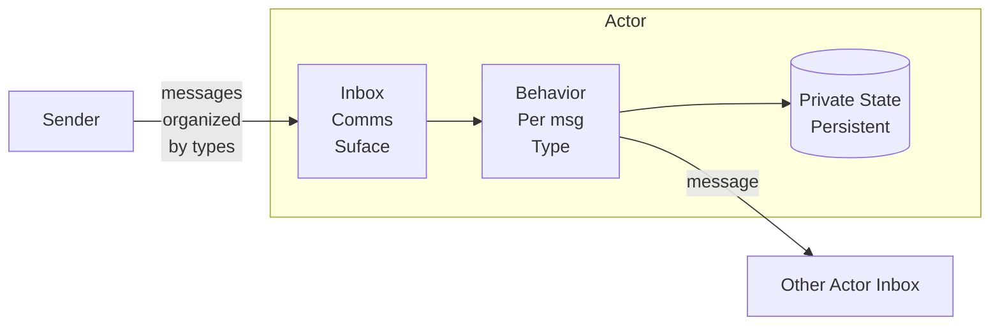
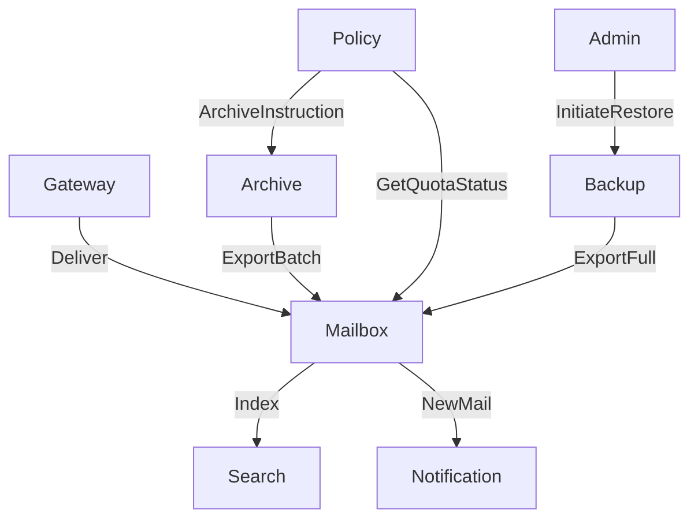
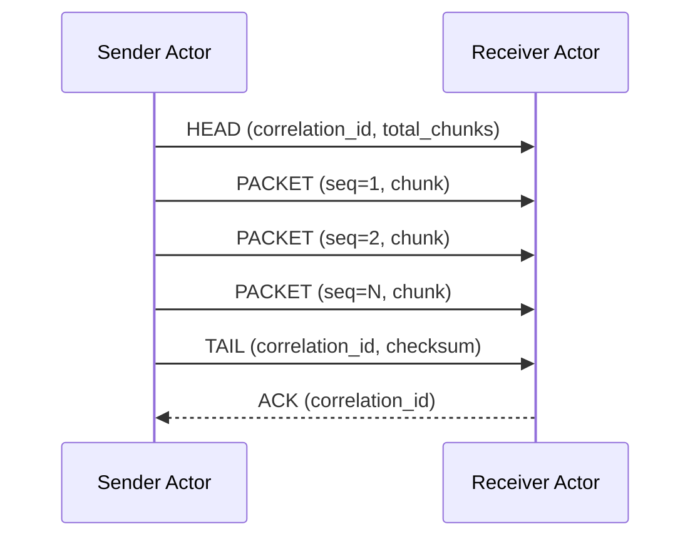
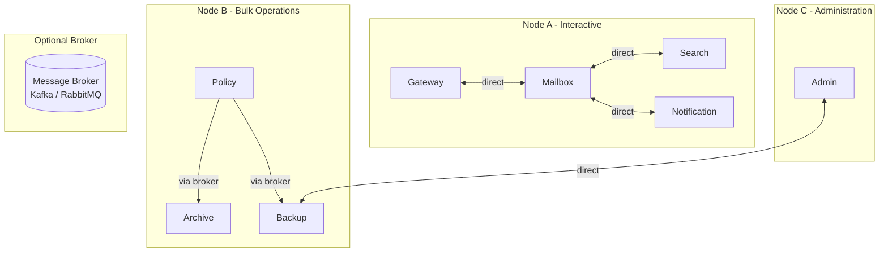

# Actor Model Architecture

The Actor model is a computational model for distributed systems in which the **Actor** is the fundamental unit of computation. It was introduced by [Carl Hewitt](https://en.wikipedia.org/wiki/Carl_Hewitt) at MIT in 1973. This article covers the model across all four architecture categories: Conceptual, Logical, Physical, and Implementation.

---

## Conceptual

### What Is an Actor

An Actor is an autonomous entity that encapsulates state and behavior. No external entity can read or mutate an Actor's state directly. The only way to interact with an Actor is by sending it a message.

This single constraint eliminates the entire class of shared-memory concurrency problems: race conditions, deadlocks, and mutex contention. There is nothing to lock because there is nothing shared.

An Actor consists of three things and nothing more:

- **Private state** — data owned exclusively by the Actor. No other Actor can access it directly.
- **Behavior** — logic that determines how the Actor responds to each message type it receives.
- **Inbox** — an ordered message queue. The Actor's only communication surface with the outside world.

The Actor processes messages from its inbox one at a time, sequentially. Upon processing a message it may update its own state, send messages to other Actors' inboxes, or both. It never blocks waiting for a reply.

### The Inbox as the API

The name is intentional. An inbox in the Actor model is exactly what it is in email: a place where typed messages arrive, queue, and wait to be processed one at a time. The analogy is not decorative — it reflects the same underlying model. This is also why the [email management use case](email-use-case.md) maps so naturally onto the Actor model.

An **Actor** has no API in the conventional sense — no method signatures, no HTTP endpoints, no function calls. The inbox is the API. The contract between Actors is defined entirely by the shape of the messages they exchange.

This makes the communication inherently asynchronous by design. A sender deposits a message into a receiver's inbox and continues. There is no call stack crossing the Actor boundary.

### Messages Concept

Messages are logical structures defined as "types". In use as "instances" being sent/received to/from Actors.

A **message type** is the definition — the named contract that describes what a message is and what data it carries. `Deliver`, `Index`, and `NewMail` are message types examples. A message type is defined once, but its instance is a structure that may be sent many times.

A **message instance** is a single occurrence of a message type in flight. When the Actor `Gateway` sends the message `Deliver` to the Actor `Mailbox`, that is one instance. A thousand emails in a day are a thousand instances of the same type.

A **message attribute** is a named field carried by a message instance structure. Every instance of a given type carries the same set of attributes, each with a specific value. For example, a `Deliver` nessage instance carries attributes such as the employee identifier, the sender address, and the message body. Attributes are the data; the type is the contract.

This three-level distinction — type, instance, attribute — is what makes Actor communication precise and verifiable. The inbox contract specifies which types an Actor accepts. The schema for each type specifies which attributes it must carry.

> Good analogy is Email. Email is a logical structure defintion; a Type. It has attributes like: `to`,`from`,`body`. And there is thousands or emails instances, "in flight" at any give moment in time. So, email systems has one message type: `Email`, having attributes as part of that definition. And instances of that one type flying between email servers Actors.
{: .tip}

### Message Passing

All communication between Actors is via message passing. Messages are immutable. A sender never shares a reference to mutable data — it sends a value. This is what makes Actor systems safe to distribute across process and network boundaries.

**Fire-and-forget** is the default communication pattern: the sender does not wait for a reply. If a reply is needed, the receiver sends a new message back to the sender's inbox at some later point. There is no synchronous call-return between Actors.

> Actors are not interlocutors. Actors are not part of classical human-like conversations. Actors send a message and never wait for a reply.
{: .tip}

### No Shared State

**State** is the data an Actor remembers between messages.

The absence of shared state is not a limitation — it is the design. The state of the system is the aggregate of all Actor states at any given moment. Each Actor is the single source of truth for its own data.

When Actor B needs data held by Actor A, it sends a request message. Actor A processes the request and sends a reply message containing the data. At no point does Actor B hold a reference into Actor A's state.

### Why Binary Messaging

Messages between Actors must have a defined contract — a schema that both sender and receiver agree on. In resilient and safe production distributed systems this contract is expressed as a binary encoding. Binary messaging is compact, fast, and schema-enforced by the toolchain rather than by convention.

The specific encoding format and schema tooling are covered in the [Implementation](#implementation) section. For how Agents may be layered on top of this foundation, see [Actor-Agent Architecture](actor-agent.md).

---

## Logical Architecture

This section covers Actor system design. The concrete use case — an organisational email management system — is documented in full in [Email Use Case](email-use-case.md). The following covers the logical patterns that apply generally.

### Actor Topology

A production Actor system consists of many specialised Actors, each with a defined role, clear state ownership, and a documented inbox contract. No Actor queries another Actor's data store directly.

### State Ownership

Each Actor is the single source of truth for its own data. The pattern is consistent across all Actor types:

| Actor | Owns |
|---|
| Gateway | Routing table, policy rules |
| Mailbox | All email data for one employee |
| Search | Search index for one employee |
| Archive | Archive store, job registry |
| Backup | Snapshot catalogue, backup store |
| Policy | Organisational policy configuration |
| Admin | Audit log, active restore jobs |
| Notification | Notification preferences, channel registry |

No Actor shares a data store with another Actor. Cross-Actor data access is exclusively via inbox messages.

### Large Payload Transport: The Train Pattern

A **packet** is a message type used exclusively for transport mechanics — it carries a fragment of a larger payload, not a business event. A packet has no meaning on its own; it is only meaningful as part of a sequence. This distinguishes it from a message type like `Deliver` or `Index`, which carries a complete, self-contained business intent.

For payloads too large to fit in a single message, Actors use a chunked message protocol. A logical sequence of packets we call a **train** — carries one large payload across multiple envelopes, using three packet types:

- **HEAD** — heads the train. The receiving Actor allocates a reassembly buffer keyed by `correlation_id`.
- **PACKET** — carries a chunk of the payload. The receiving Actor appends to the buffer and validates the sequence number for gap detection.
- **TAIL** — closes the train sequence of packets. The receiving Actor verifies the checksum, hands the reassembled payload to business logic, and releases the buffer.

Each train carries a `correlation_id` — a unique identifier stamped on every packet in the sequence. Because an inbox receives packets from many senders, the receiving Actor uses the `correlation_id` to know which packets belong together and reassemble them in the right order. The same identifier also acts as a trace handle: if something goes wrong, you can follow the `correlation_id` across every Actor that touched the train. Simple example:

### No Global Message Broker by Design

A centralised async message broker (Kafka, RabbitMQ, SQS) is architecturally tempting. However, introducing a broker into the critical path of all Actor communication creates a potential Single Point of Failure and concentrates operational risk.

The pragmatic position: use a broker selectively for genuinely async, high-volume, fan-out scenarios where durability and decoupling are explicit requirements. Keep direct Actor-to-Actor messaging for latency-sensitive conversations where broker overhead provides no benefit.

The single message broker is a conscious architectural choice for specific flows, not the default nervous system of the system.

---

<!--

## Physical Architecture

### Actor Placement

Actors are the implementation of logical architecture and software design. Their physical shape and placement is a separate decision made at development and deployment time. Actors that communicate frequently and latency-sensitively are candidates for co-location on the same computing node (aka Server). Actors that handle bulk, async, or scheduled work (Archive Actor, Backup Actor) can be placed on separate nodes without impacting interactive flows.

### Fault Domains

A **fault domain** is a boundary within which a failure is contained — what breaks together, stays together, and what is outside the boundary keeps running.

> Sometimes called `blast radius`
{: .tip}

Each node (aka computer) is an independent fault domain. Failure of the bulk operations node does not affect interactive message delivery. The Archive Actor and Backup Actor operate on scheduled cycles; a temporary outage delays a backup run but does not corrupt Actors' inbox state.

Actors within a node are supervised (monitored). A crashed Actor is restarted by its supervisor. The inbox persists across restarts — messages deposited before the crash are not lost, provided the inbox is backed by durable storage or an in-process queue with sufficient depth.

> The supervisor is a fitting model for a **supervisor AI Agent** — an Agent whose sole, narrow purpose is to monitor other Agents and restart them on failure. It does not do business work. It watches, detects failure, and acts. This is a single-purpose Agent by design, which is exactly what makes it reliable.
{: .tip}

### Broker Placement

If and When a message broker is used for specific flows (e.g., Policy Actor → Archive Actor scheduling), the broker sits outside both nodes. It is not in the critical path of interactive operations. Its failure affects only the flows routed through it.

---

## Implementation

The Protobuf schemas, envelope definition, train protocol, and message type definitions are documented in the [Email Use Case — Implementation](email-use-case.md#implementation) section, where they are grounded in a concrete system.

-->

---

*See also: [Email Use Case](email-use-case.md) — full worked example applying this model to organisational email management. [Actor-Agent Architecture](actor-agent.md) — how AI Agents may be added externally to this foundation.*

---

|  
|---|
| &copy; dbj@dbj.org \| CC BY SA 4.0 
