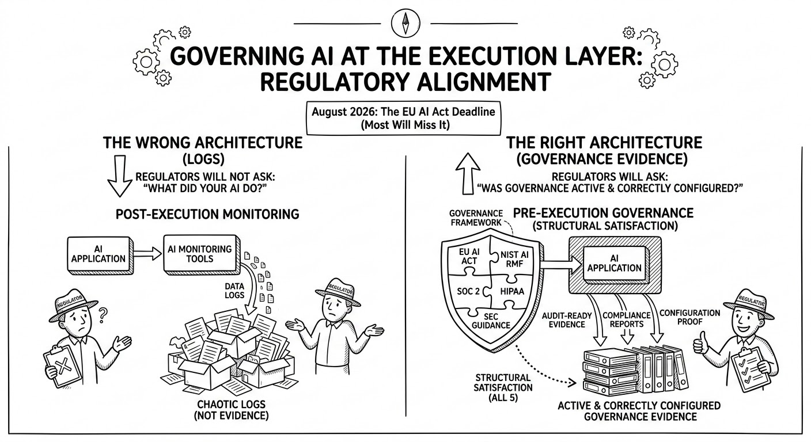

# The EU AI Compliance Act

>**NOTE**
"*AI is a corporate risk. Non compliant AI is unmanageable corporate risk*" - &copy; Dusan Jovanovic 2026
{: note}

### The EU AI Act compliance deadline for high-risk AI systems is August 2026.

<!-- https://www.linkedin.com/posts/qstackfield_pdf-governing-ai-at-the-execution-layer-activity-7434373803176005632-ICOI?utm_source=share&utm_medium=member_desktop&rcm=ACoAAAAaxaMBp4-gq5wAJBgyOVUixCCWNdTQwQQ -->

Most will miss it because because their AI monitoring tools produce logs, not governance evidence. 

Regulators won’t ask what your AI did. 
They will ask whether governance was active & correctly configured.
Those are architecturally different questions requiring architecturally different systems.

What exactly what each framework requires:

- EU AI Act
- NIST AI RMF
- SOC2
- HIPAA
- SEC guidance 

At Iron Code Labs, we recommend closed-loop, pre-execution and runtime-integrated governance framework

>**NOTE**
> Governing AI at the Execution Layer: Regulatory Alignment
> 
> (pobably not a lucid ans succinct text: https://lnkd.in/egw4eCC2)
{: note}
