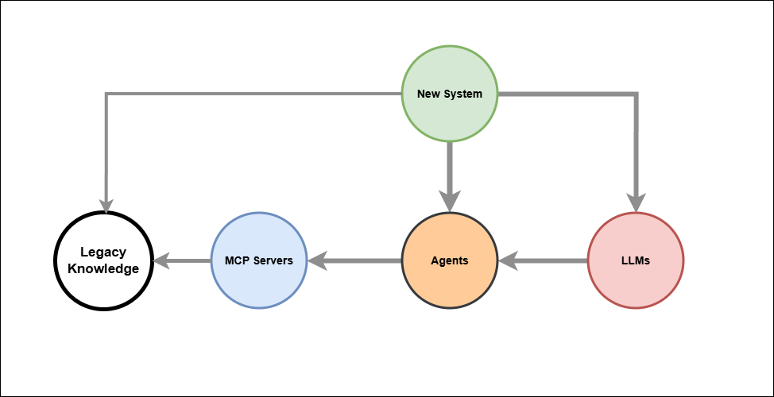

[← Knowledge Base](../index.md)

# Legacy Knowledge LLM Integration Architecture




## Pattern: New System → Agents → MCP Servers → Legacy Knowledge

The diagram describes a clean integration architecture for connecting new AI-enabled systems to existing enterprise knowledge.

**Agents** are the central orchestration node. The **New System** may reach them directly — for deterministic, rule-based, or high-volume operations — or via **LLMs**, where natural language interpretation or dynamic reasoning is required. The choice of path is made by the New System, not by the LLM.

**LLMs** are a peer input to Agents, not the architectural gateway. They handle ambiguous intent, natural language from human actors, and dynamic tool selection. For scheduled, transactional, or audit-critical operations, the New System bypasses the LLM entirely and calls Agents directly.

**MCP Servers** are the integration boundary. They expose legacy capabilities as typed, named tools, translating Agent requests into API or database calls against the **Legacy Knowledge** store. The knowledge never moves — it remains authoritative in its source system.

A direct path from New System to Legacy Knowledge is preserved for operations that must bypass both LLM and Agent layers entirely.

## Key Principles

- Agents own orchestration — independently callable, containerised, API-exposed
- LLM is one consumer of Agent capability, not its owner
- New System chooses the appropriate path based on operation type
- Legacy Knowledge stays in place — single source of truth
- Security and audit boundaries apply at every entry point to Agents and MCP Servers
- Agents are independently testable without an LLM in the loop


## The reality of any enterprise legacy landscape.

"Legacy Knowledge" as a single cylinder is a simplification. In practice it is:
```
Relational DBs (Oracle, SQL Server, MySQL)
Document stores (SharePoint, file shares, email archives)
Flat files (CSV, XML, EDI, mainframe VSAM)
ERP/CRM internal DBs (SAP, Dynamics — opaque schemas)
Data warehouses / data marts
Message queues / event logs
Paper-scanned PDFs (OCR territory)
```
### The architectural implication:
MCP Servers must handle this incoherence. Each MCP Server is effectively an adapter — one per data source type or system, normalising access behind a consistent tool interface.
```
Agent → MCP Server (SAP adapter)     → SAP DB
Agent → MCP Server (SQL adapter)     → RDBMS
Agent → MCP Server (document search) → SharePoint / file store
Agent → MCP Server (OCR/RAG)         → Scanned docs / PDFs
```
This is why MCP Servers are plural in the diagram — and why that matters.
The Agent does not need to know the physical storage topology. It calls named tools. MCP Servers carry the adapter complexity.

### MCP Servers are a critical decoupling 

##### That is the precise EA statement

MCP Servers decouple:
```
FromToAgent (consumer)     vs Physical storage topology
Tool interface (stable)    vs Adapter implementation (volatile)
Business capability        vs Data source technology
```
This is the classic Anti-Corruption Layer from DDD, or the Translation Layer in TOGAF terms — applied at the data access boundary.

The consumer (Agent) is shielded from:

- Storage heterogeneity
- Schema changes
- System migrations
- Legacy system replacement

**Practical consequence**: You can replace an Oracle DB with a document store behind an MCP Server and the Agent never knows. The tool contract is the only interface that matters.

This also means MCP Servers are where **data governance**, **access control**, and **audit logging** are enforced — consistently, regardless of what sits behind them.
---

> © dbj@dbj.org , CC BY SA 4.0