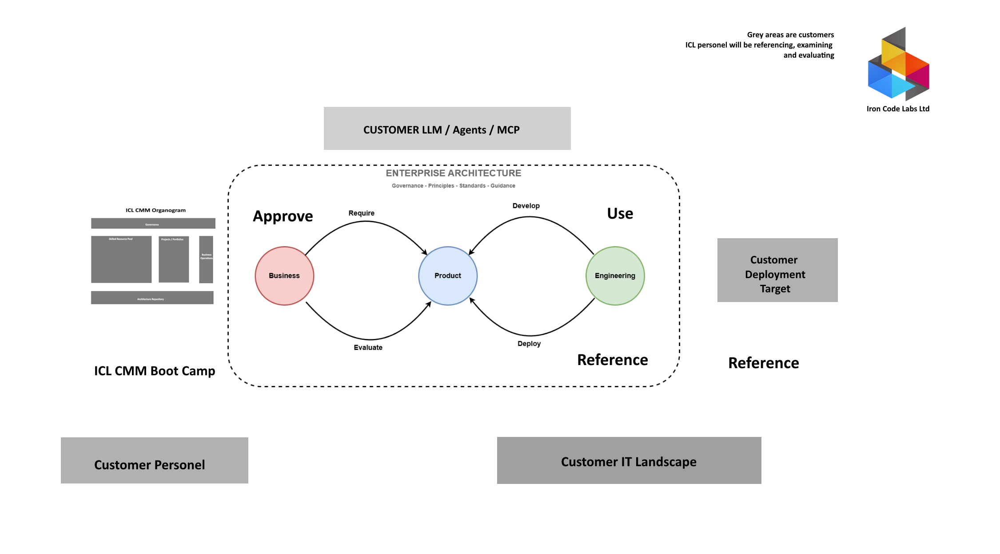

[← Knowledge Base](../index.md)

##   How does this method enable AI ROI 

> Every organization not operating on the simple and usable methodology has struggled to deliver ROI even before AI arrived. AI arrival has amplified the dysfunction. The BPT method is feasible; addresses the legacy operational problems first. ROI follows naturally and AI induced ROI follows from that, not the other way around.
{: .note} 

# DBJ.ORG Engagement Architecture

- [DBJ.ORG Engagement Architecture](#dbjorg-engagement-architecture)
  - [Taxonomy First](#taxonomy-first)
  - [The Purpose](#the-purpose)
  - [Entry Point — DBJ ADM Boot Camp](#entry-point--dbj-adm-boot-camp)
  - [The Engagement Workflow](#the-engagement-workflow)
  - [Customer AI Layer — LLM / Agents / MCP](#customer-ai-layer--llm--agents--mcp)
  - [Customer IT Landscape](#customer-it-landscape)
  - [Output — Customer Deployment Target](#output--customer-deployment-target)

## Taxonomy First

- Common, shared and simple [Taxonomy](https://ea.ironcodelabs.com/taxonomy.html) is the underlying essential mesh holding the Organisation universe together.
- It gives both the structure and naming of structure elements.
- It is the essential common language of the organization

## The Purpose

This document describes how DBJ structures customer engagements — from initial onboarding through to a deployable product. It is intended for DBJ personnel preparing to engage a new customer, or to orient a new DBJ team member.

## Entry Point — DBJ ADM Boot Camp

- Every engagement begins with the DBJ ADM Boot Camp. Customer personnel — typically a cross-functional team representing all roles — attend to establish a shared working method.
  - The Boot Camp grounds the team in the DBJ ACMM and the Common Taxonomy before any architecture work begins.
- References: [ACMM](https://ea.ironcodelabs.com/cmm.html)

## The Engagement Workflow

All architecture work occurs within an Enterprise Architecture boundary governed by DBJ's Governance, Principles, Standards, and Guidance. The three [BPT segments](../Business_Product_Technology/index.md) — Business, Product, and Technology — interact within this boundary. Segments do not hand off to each other directly; each monitors its own repository for ADM deliverables. See [BPT Repository Model](../Business_Product_Technology/index.md#the-bpt-repository-model) for the decoupling mechanism.

**Business** stakeholders approve the direction of the work and specify what capabilities the product must incorporate. Their input drives scope. Work occurs in one or more ADM Wheels — one wheel per domain or capability cluster is common in larger engagements. See [One wheel or many](../icl-adm/index.md#one-or-many). Roles present: Stakeholders, Product Owners. Outcome category: Conceptual.

**Product** is the central artifact. It is decomposed and modularized through workflow analysis, developed iteratively, evaluated against the customer's context, and deployed to UAT before final handoff. Roles: Business Analyst, Product Owners, Quality Assurance, Engineering Executives. Outcome categories: Logical and Physical.

**Technology** — the Engineering roles (Engineers, DevOps) — implement what Product defines. They reference the Product repository and the customer IT landscape throughout, ensuring the architecture reflects operational reality. "Engineering" describes the roles inside the Technology segment; Technology is the BPT segment name. Categories: Physical and Implementation.

All requirements produced across all steps are tracked and traced. Every ADM deliverable references the REQs it satisfies; every REQ references what it requires. See [Requirements Management](../icl-adm/index.md#requirements-management) and [Requirement hierarchy and traceability](../icl-adm/index.md#requirement-hierarchy).

The flow is cyclical: Business requires, Technology develops, the product is evaluated, refined, and redeployed until it meets the agreed standard.

## Customer AI Layer — LLM / Agents / MCP

The customer's AI tooling (LLM platforms, agents, MCP integrations) sits above the EA boundary. Upon initial engagements, DBJ personnel reference, examine, and evaluate this layer as an input to the architecture — it is customer-owned and customer-operated. DBJ does not govern it directly but must account for it in the conceptual and logical architecture deliverables.

Reference: Architecture Guided [LLM Adoption](../llm-adoption/llm-adoption.md)

## Customer IT Landscape

The customer's existing IT environment is analyzed as a baseline throughout the engagement. Analysis spans all four abstraction levels — Conceptual, Logical, Physical, and Implementation — to ensure the architecture product is grounded in what the customer actually operates.

That is a feasible approach, simply because at upper levels of abstraction anomalies, deficiencies and technical debt are observed.

> No need to dive into the code if design is wrong.

## Output — Customer Deployment Target

The engagement produces a structured architecture product scoped to the customer's specific deployment target. It is the result of the iterative workflow above: approved by Business, built by Engineering, validated through UAT, and traceable back to the Product work and all the way back to the Business ADM-centric architecture.

---

|  
|---|
| &copy; dbj@dbj.org \| CC BY SA 4.0 
