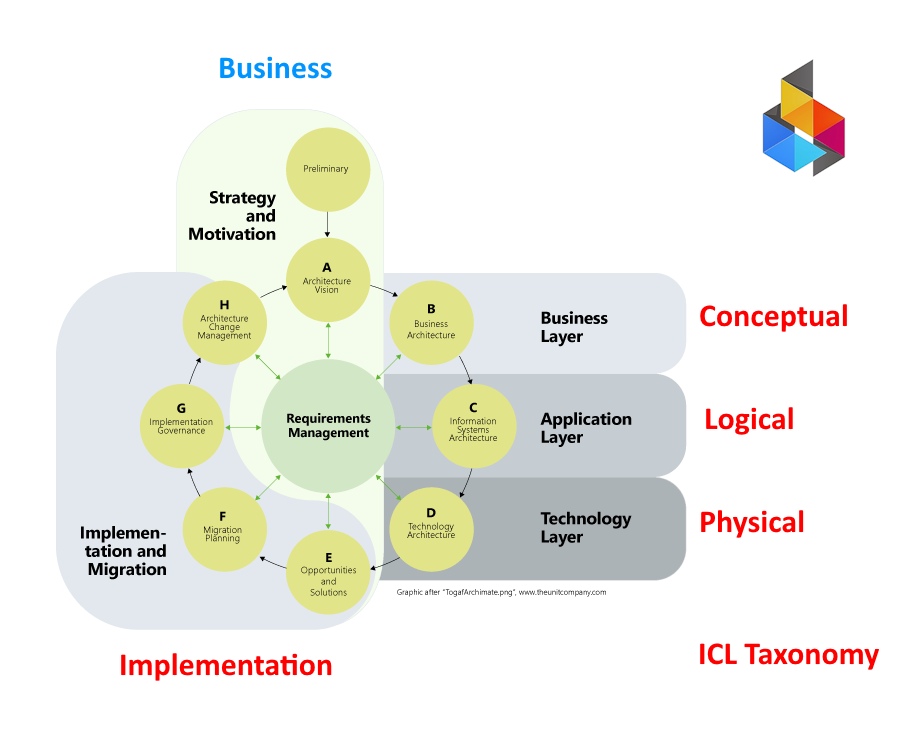

[← Knowledge Base](../index.md)

# ICL ADM

The ICL ADM is a simplified version of the [TOGAF ADM](https://en.wikipedia.org/wiki/The_Open_Group_Architecture_Framework) adapted for use within the ICL Method. It retains the wheel metaphor — a repeating cycle of governed architecture work — while reducing the step count to what a real organization can sustain without a dedicated architecture team.

This document describes the structural logic of any ICL ADM wheel. Specific " wheels" aka "adm projects", follow this structure and reference it.

---

## The role of the ICL Taxonomy

The [ICL Taxonomy](https://ea.ironcodelabs.com/taxonomy.html) is the organization-wide classification system — the single source of truth for naming, organizing, and locating architectural concerns. It defines four categories (Conceptual, Logical, Physical, Implementation), each with four capabilities.

The taxonomy is what makes the ADM mapping possible. Without it, ADM steps are just a sequence of activities with no structural home in the organization's information space. With it, every ADM step has a precise categorical address — and every architectural decision produced by the wheel can be filed, retrieved, and governed consistently.

---

## ADM Steps to ICL Taxonomy Categories mapping

TOGAF ADM steps map directly to ICL taxonomy categories:

| ADM step(s) | ICL category |
|---|---|
| Preliminary, A | Conceptual |
| B | Conceptual (Business layer) |
| C | Logical |
| D | Physical |
| E, F, G, H | Implementation |

The wheel spans all four categories. Its outputs are always architectural — decisions, principles, constraints, blueprints. Never deployed systems or running code. Delivery is what the wheel authorizes; it is never what the wheel does.

---

## The ICL steps to ADM steps

The ICL ADM reduces the nine ADM steps to five. Each step produces at least one written artifact. The Architecture Board reviews artifacts, not conversations.

| ICL Step | TOGAF ADM Step | ICL category |
|---|---|---|
| **0 — Principles** | Preliminary | Conceptual |
| **1 — Vision** | Step A | Conceptual |
| **2 — Architecture** | Steps B, C, D | Conceptual → Logical → Physical |
| **3 — Decision** | Steps E, F | Implementation |
| **4 — Governance** | Steps G, H | Implementation |

## What are ADM deliverables — and why do they matter?

Every step of the ADM is expected to produce **deliverables**: formal documents, diagrams, or catalogs that record decisions and evidence for review. They are not bureaucracy for its own sake. They exist because verbal agreements disappear — written artifacts persist, can be audited, and can be handed to the next team or the next review cycle.

**Why deliverables?** Without them, governance has no object to review. The Architecture Board cannot approve or reject a verbal description. Deliverables are what the board reads.

**What kinds of deliverables exist?** TOGAF names many: Principles Catalogs, Capability Maps, Application Portfolio Catalogs, Interface Catalogs, Technology Standards Catalogs, Roadmaps, and more. Each is a structured document that captures a specific slice of the architecture.

**Which deliverables are required?** Not all of them, for every engagement. The rule is: produce what is needed to answer the governance questions at that step. Each ICL ADM wheel calls out the minimum required artifact at each step.

**Who produces them?** The project team — architects, tech leads, product owners, and engineers — depending on the artifact. The Architecture Board reviews them but does not produce them.

## ICL Project Deliverables

| ICL Step & Deliverable | ADM step deliverable | Comment |
|---|---|---|
| **Principles document** | Architecture Principles (Preliminary) | Constraints and non-negotiables that govern the entire wheel |
| **Architecture Vision** | Architecture Vision (Step A) | Business case, scope, and stakeholder sign-off |
| **Architecture definition** | Business, Information Systems, Technology Architecture documents (Steps B, C, D) | Full cross-category architecture covering Conceptual through Physical |
| **Decision record** | Architecture Roadmap, Migration Plan (Steps E, F) | Approved path forward with sequencing and cost |
| **Governance report** | Implementation Governance, Architecture Change Management (Steps G, H) | Compliance verification and loop closure |

---

## Applicability

This framework applies to any ICL ADM wheel. Examples:

- **LLM Adoption wheel** — [authorizes or rejects LLM introduction into a capability](../llm-adoption/llm-adoption.md)
- **Cloud Migration wheel** — authorizes transition from on-premise to cloud hosting
- **Data Governance wheel** — establishes data ownership, classification, and retention rules

Each wheel runs the same five-step structure. Each wheel's artifacts are specific to its topic.

---

<!-- KB footer -->
 
EA Navigates &trade;

Subject to change&nbsp;&copy; dbj@dbj.org , CC BY SA 4.0

