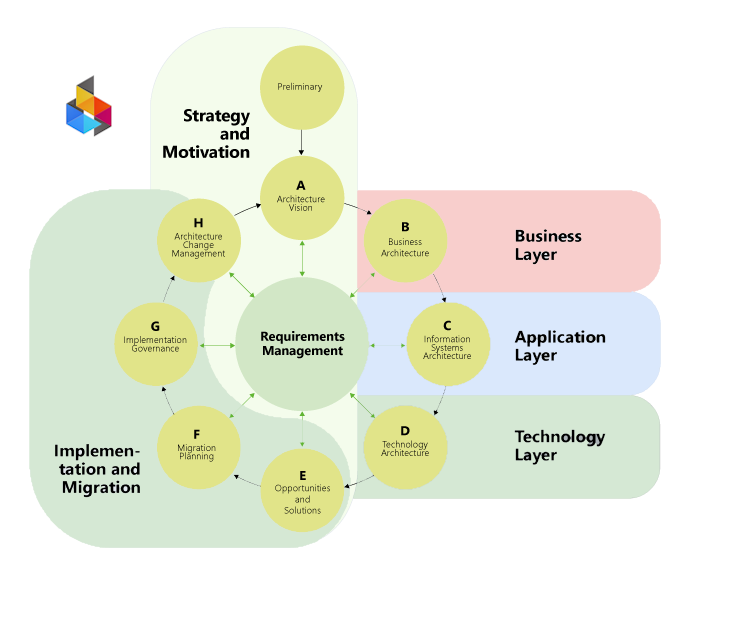

[← Knowledge Base](../index.md)

> The **TOGAF** ADM wheel produces architecture artifacts — documented decisions, not deployed systems.
>
> Specifically: principles, vision, architecture definitions (business, information systems, technology), roadmaps, migration plans, and governance reports.
> 
> The wheel authorizes delivery. It never delivers.
{: .important}

# ICL ADM

The ICL ADM is a simplified version of the [TOGAF ADM](https://en.wikipedia.org/wiki/The_Open_Group_Architecture_Framework) adapted for use within the ICL Method. It retains the wheel metaphor — a repeating cycle of governed architecture work — while reducing the step count to what a real organization can sustain without a dedicated architecture team.

This document describes the structural logic of any ICL ADM wheel. Specific " wheels" aka "adm projects", follow this structure and reference it.

---

## The role of the ICL Taxonomy

The [ICL Taxonomy](https://ea.ironcodelabs.com/taxonomy.html) is the organization-wide classification system — the single source of truth for naming, organizing, and locating architectural concerns. It defines four categories (Conceptual, Logical, Physical, Implementation), each with four capabilities.

The taxonomy is what makes the ADM mapping possible. Without it, ADM steps are just a sequence of activities with no structural home in the organization's information space. With it, every ADM step has a precise categorical address — and every architectural decision produced by the wheel can be filed, retrieved, and governed consistently.

---

## ICL ADM Steps to ICL Taxonomy Categories mapping

> The **ICL** ADM wheel produces much destilled architecture artifacts v.s. TOGAF — **and** additionally maps each to an ICL Taxonomy Category. The wheel authorizes delivery; it never delivers.
{: .important}

ICL ADM steps map directly to ICL taxonomy categories:

| ADM step(s) | ICL category |
|---|---|
| Preliminary, A | Conceptual |
| B | Conceptual (Business layer) |
| C | Logical |
| D | Physical |
| E, F, G, H | Implementation |

The wheel spans all four ICL Taxonomy categories. Its outputs are always architectural — decisions, principles, constraints, blueprints. Never deployed systems or running code. Delivery is what the wheel authorizes; it is never what the wheel does.

---

## Requirements Management {#requirements-management}

**Requirements Management** is the central entity of the TOGAF ADM wheel — visible in the diagram as the hub all steps connect to. It is not a step; it is a persistent store that runs continuously throughout the wheel's life.

Every step begins by reading what Requirements Management currently holds. Every step may add to it — concerns, constraints, and open questions that cannot be resolved at the current Taxonomy Category are logged there rather than deferred informally or dropped. The next step picks them up.

This is what gives the wheel continuity across Categories. A Technology concern raised during the Business Architecture step is not lost — it is logged in Requirements Management and resolved at the Physical or Implementation step where it belongs. Nothing falls through the gap between steps.

### Requirement hierarchy and traceability {#requirement-hierarchy}

Requirements are hierarchical. Each ADM deliverable references the REQs it satisfies. Each REQ may in turn require other REQs. This forms a dependency graph across the entire wheel — the traceability chain of the process.

Example: Step A produces REQ-001 *"the solution must use modular, domain-driven decomposition"*. Step C produces REQ-012 *"implement as a modular monolith"*, which references REQ-001 as its origin. The chain is auditable at any point: follow the REQ references from any deliverable back to the Conceptual declaration that justified it.

A deliverable with REQs that reference nothing is a governance signal — either a gap in the Conceptual architecture or an undeclared assumption that needs to be made explicit.

This is the mechanism behind CMM Level 5: the process is measurable and self-improving because every decision traces to a requirement and every requirement to its origin. Gaps become visible; the process closes them systematically.

> ICL recommends REQ identifiers and requirement-to-requirement traceability as the minimum governance practice. If an organisation already has an established requirements management practice and tooling, that practice takes precedence — the ICL ADM integrates with it rather than replacing it. What must be preserved regardless of tooling is the traceability: every requirement must reference what it satisfies or requires.
{: .note}

---

## The ICL steps to ADM steps

The ICL ADM reduces the nine TOGAF ADM steps to five. Each step produces at least one written artifact. The Busness Architecture Board reviews artifacts, not conversations.

| ICL Step | TOGAF ADM Step | ICL category |
|---|---|---|
| **0 — Principles** | Preliminary | Conceptual |
| **1 — Vision** | Step A | Conceptual |
| **2 — Architecture** | Steps B, C, D | Conceptual → Logical → Physical |
| **3 — Decision** | Steps E, F | Implementation |
| **4 — Governance** | Steps G, H | Implementation |

## What are ICL ADM deliverables — and why do they matter?

> The ICL ADM wheel operates in the EA governance layer — above the BPT segments, not inside any of them. It is the project container that spans the full Taxonomy. Business, Product, and Technology consume its artifacts according to their jurisdiction: Business takes the Conceptual outputs, Product the Logical/Physical, Technology the Physical/Implementation. The wheel keeps them coherent as one governed project.
{: .important}

The mechanism is the **BPT repository**. The wheel does not hand deliverables to people — it places them in the persistent repository of the segment whose Taxonomy Category matches the deliverable. Conceptual deliverables go to the Business repository. Logical and Physical deliverables go to the Product repository. Physical and Implementation deliverables go to the Technology repository. Roles watch their repository; they never watch the wheel directly. This is what keeps the wheel and the segments decoupled.

Every step of the ICL ADM is expected to produce **deliverables**: formal documents, diagrams, or catalogs that record decisions and evidence for review. They are not bureaucracy for its own sake. They exist because verbal agreements disappear — written artifacts persist, can be audited, and can be handed to the next team or the next review cycle.

**Why deliverables?** Without them, governance has no object to review. The Architecture Board cannot approve or reject a verbal description. Deliverables are what the board reads.

**What kinds of deliverables exist?** TOGAF names many: Principles Catalogs, Capability Maps, Application Portfolio Catalogs, Interface Catalogs, Technology Standards Catalogs, Roadmaps, and more. Each is a structured document that captures a specific slice of the architecture.

**Which deliverables are required?** Not all of them, for every engagement. The rule is: produce what is needed to answer the governance questions at that step. Each ICL ADM wheel calls out the minimum required artifact at each step.

**Who produces them?** The project team — architects, tech leads, product owners, and engineers — depending on the artifact. The Architecture Board reviews them but does not produce them.

## ICL Project Deliverables {#icl-project-deliverables}

| ICL Step & Deliverable | ADM step deliverable | Comment |
|---|---|---|
| **Principles document** | Architecture Principles (Preliminary) | Constraints and non-negotiables that govern the entire wheel |
| **Architecture Vision** | Architecture Vision (Step A) | Business case, scope, and stakeholder sign-off |
| **Architecture definition** | Business, Information Systems, Technology Architecture documents (Steps B, C, D) | Full cross-category architecture covering Conceptual through Physical |
| **Decision record** | Architecture Roadmap, Migration Plan (Steps E, F) | Approved path forward with sequencing and cost |
| **Governance report** | Implementation Governance, Architecture Change Management (Steps G, H) | Compliance verification and loop closure |

---

## One wheel or many {#one-or-many}

The ICL ADM is designed to scale — from a single wheel covering an entire small organisation, to many concurrent wheels each scoped to a domain, programme, or capability cluster in a large enterprise. The concept is flexible by design; it does not impose full TOGAF rigour on organisations that cannot sustain it.

**A single wheel** is appropriate when the organisation is small, the IT landscape is simple, or the engagement is narrowly scoped. One wheel, one set of deliverables, one governed cycle.

**Multiple concurrent wheels** arise naturally in larger organisations or complex engagements. Each wheel is independently scoped and governed. They may overlap in time. EA coordinates them — ensuring their Conceptual outputs are coherent with each other and that no two wheels produce conflicting Principles or Architecture Visions.

**Not every wheel triggers the full BPT loop.** A wheel scoped to a purely Conceptual outcome — a capability assessment, a standards review, a compliance audit — produces deliverables that land only in the Business repository. No Product segment is triggered, no Technology segment acts. The wheel closes when its governance artifacts are accepted. This is a complete and valid outcome.

**What does not scale** is the structure. Regardless of how many wheels run, or how small the organisation:

- Every wheel follows the five-step structure
- Every wheel uses Requirements Management and REQ traceability
- Every wheel's deliverables land in the correct BPT repository by Taxonomy Category
- EA governs all wheels — even if EA is one person

The ICL ADM does not replace an organisation's existing governance practice. If a mature practice exists, the wheel integrates with it. What the wheel provides is the minimum viable structure for organisations that have none.

---

## Applicability

This framework applies to any ICL ADM wheel. Examples:

- **LLM Adoption wheel** — [authorizes or rejects LLM introduction into a capability](../llm-adoption/llm-adoption.md)
- **Cloud Migration wheel** — authorizes transition from on-premise to cloud hosting
- **Data Governance wheel** — establishes data ownership, classification, and retention rules

Each wheel runs the same five-step structure. Each wheel's artifacts are specific to its topic.

---

> © dbj@dbj.org , CC BY SA 4.0