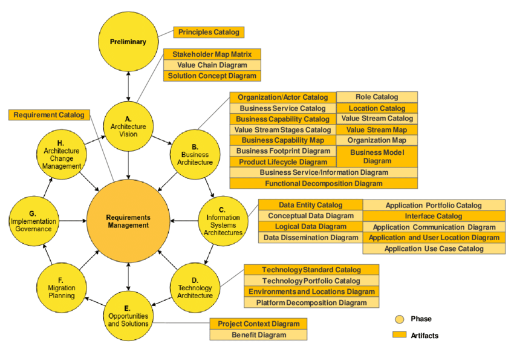

[← Knowledge Base](../index.md)

## TOGAF ADM 

Togaf ADM and a subset of its deliverables

> The [TOGAF ADM](https://en.wikipedia.org/wiki/The_Open_Group_Architecture_Framework#Architecture_Development_Method) driven project (we also call it "wheel", as in steering wheel) produces architecture artifacts — documented decisions, not deployed systems. It is one of the central parts of the TOGAF. It is intended as a tool for Enterprise Architecture teams producing the numerous carefully classified deliverables: diagrams, lists, tables, documents. All unified with common non trivial templates. Color coordinated and graphically synchronised.
>
> Specifically subset of most important deliverables is classified as: principles, vision, architecture definitions (business, information systems, technology), roadmaps, migration plans, and governance reports.
> 
> The ADM wheel authorizes delivery. It never deploys.
{: .note}

# DBJ ADM

The DBJ ADM is a simplified version of the [TOGAF ADM](https://en.wikipedia.org/wiki/The_Open_Group_Architecture_Framework) adapted for business use following the DBJ Method. It retains the wheel metaphor — a repeating cycle of governed architecture work — while reducing the step count to what a real organization can sustain without a dedicated architecture team.

But with the organization at the CMM [Level 3](../../cmm.md#maturity-levels) or above, ensuring the organization capability to "steer the ADM wheel".

This document describes the structural logic of an DBJ ADM wheel. Specific "wheels" aka "adm projects", follow this document and reference it.

> The **DBJ** ADM wheel produces much distilled architecture artifacts v.s. TOGAF. The wheel authorizes delivery; it never delivers.
{: .note}

### Five DBJ ADM steps

The DBJ ADM reduces the nine [TOGAF ADM](../togaf-cmm/togaf-cmm.md) steps to **five**. Each step produces at least one written artifact. The Business Architecture Board reviews artifacts, not conversations.

| DBJ Step | DBJ category |
|---|---|
| **1 — Principles** | [Conceptual](../../taxonomy.md#conceptual) |
| **2 — Vision** | [Conceptual](../../taxonomy.md#conceptual) |
| **3 — Architecture** | [Conceptual](../../taxonomy.md#conceptual) → [Logical](../../taxonomy.md#logical) → [Physical](../../taxonomy.md#physical) |
| **4 — Decision** | [Implementation](../../taxonomy.md#implementation) |
| **5 — Governance** | [Implementation](../../taxonomy.md#implementation) |

<!-- >DBJ ADM steps map directly to DBJ taxonomy categories:
{: .note}

| [TOGAF ADM step(s)](#togaf-adm) | DBJ Levels of Abstraction |
|---|---|
| Preliminary, A | [Conceptual](../../taxonomy.md#conceptual) |
| B | [Conceptual](../../taxonomy.md#conceptual) (Business layer) |
| C | [Logical](../../taxonomy.md#logical) |
| D | [Physical](../../taxonomy.md#physical) |
| E, F, G, H | [Implementation](../../taxonomy.md#implementation) | -->

The DBJ ADM outputs are always architectural — decisions, principles, constraints, blueprints. Never deployed systems or running code. Delivery is what the wheel authorizes; it is never what the wheel does.

## DBJ ADM deliverables 

Every step of the DBJ ADM is expected to produce **deliverables**: formal documents, diagrams, or catalogs that record decisions and evidence for review. They are not bureaucracy for its own sake. They exist because verbal agreements disappear — written artifacts persist, can be audited, and can be handed to the next team or the next review cycle.

**Why deliverables?** Without them, governance has no object to review. The Architecture & Business Board cannot approve or reject a verbal description. Deliverables are what the board reads.

**What kinds of deliverables exist?** TOGAF names many: Principles Catalogs, Capability Maps, Application Portfolio Catalogs, Interface Catalogs, Technology Standards Catalogs, Roadmaps, and more. Each is a structured document that captures a specific slice of the architecture. Only [five are mandatory](#five-icl-adm-steps) as presented in that table above. Others are optional.

**Which deliverables are required?** The rule is: produce what is needed to answer the business questions at that step. Each DBJ ADM wheel calls out the minimum required artifact at each step.

**Who produces them?** The project team — architects, tech leads, product owners, and engineers — depending on the artifact. The Architecture Board reviews them but does not produce them.

 

### DBJ ADM Deliverables 

| DBJ ADM Deliverable | Comment |
|---|---|
| **1. Principles document** | Constraints and non-negotiables that govern the entire wheel |
| **2. Architecture Vision** | Business case, scope, and stakeholder sign-off |
| **3. Architecture definition** | Full cross-category architecture covering Conceptual through Physical |
| **4. Decision record** | Approved path forward with sequencing and cost |
| **5. Governance report** | Compliance verification and loop closure |

 

## Requirements Management 

**Requirements Management** is the central entity of the TOGAF ADM wheel — visible in the diagram as the hub all wheel spokes connect to. It is not a step; it is a central persistent store that runs continuously throughout the wheel's life.

>Requirements store is usually maintained on the organizational level, not one-per-project.
>Requirements on the higher level of abstractions: Conceptual or Logical have wider blast radius. Across projects.
{: .note}

Every ADM step begins by reading what Requirements Management currently holds, associated with that step in that project. Current step may add to it — concerns, constraints, and open questions that cannot be resolved at the current level of abstraction ([Taxonomy Category](../../taxonomy.md), are logged there rather than just deferred informally or dropped. The next step picks them up.

This is what gives the continuity. As an example. A Technology concern raised during the Business Architecture step is not lost — it is logged in Requirements Management and resolved at the ADM Physical or Implementation step where it belongs. Nothing falls through the gap between steps.

 

### Requirement hierarchy and traceability

Requirements are hierarchical. Each ADM deliverable references the REQs it satisfies. Each REQ may in turn reference other REQs. This forms a dependency graph across the entire wheel — the traceability chain of the process.

Example: Step A produces REQ-001 *"the solution must use modular, domain-driven decomposition"*. Step C produces REQ-012 *"implement as a modular monolith"*, which references REQ-001 as its origin. The chain is auditable at any point: follow the REQ references from any deliverable back to the Conceptual declaration that justified it.

A deliverable references REQuirement as a governance signal — either in the Conceptual architecture or an assumption that needs to be made explicit.

This is the mechanism behind [CMM Level 5](../../cmm#maturity-levels): the process is measurable and self-improving because every decision traces to a requirement and every requirement to its origin. Gaps become visible; the process closes them systematically.

> DBJ recommends REQ identifiers and requirement-to-requirement traceability as the minimum governance practice. If an organisation already has an established requirements management practice and tooling, that practice takes precedence — the DBJ ADM integrates with it rather than replacing it. What must be preserved regardless of tooling is the traceability: every requirement must reference what it satisfies or requires.
{: .note}

## One wheel or many wheels{#one-or-many}

The DBJ ADM is designed to scale — from a single wheel covering an entire small organisation, to many concurrent wheels each scoped to a domain, programme, or capability cluster in a large enterprise. The concept is flexible by design; it does not impose full TOGAF rigour on organisations that cannot sustain it.

**A single wheel** is appropriate when the organisation is small, the IT landscape is simple, or the engagement is narrowly scoped. One wheel, one set of deliverables, one governed cycle.

**Multiple concurrent wheels** arise naturally in larger organisations or complex engagements. Each wheel is independently scoped and governed. They may overlap in time. EA coordinates them — ensuring their Conceptual outputs are coherent with each other and that no two wheels produce conflicting Principles or Architecture Visions.

**Not every wheel triggers the full BPT response** A wheel scoped to a purely Conceptual outcome — a capability assessment, a standards review, a compliance audit — produces deliverables that land only in the Business repository. No Product segment is triggered, no Technology segment acts. The wheel closes when its governance artifacts are accepted. This is a complete and valid outcome. 

> Conceptual deliverables are stored in the "Business Repository" and are applicable across several domains. (Example: "We will host on a public cloud")
{: .note}

**What does not change** is the structure. Regardless of how many wheels run, or how small the organisation:

- Every wheel follows the DBJ ADM structure
- Every wheel uses Requirements Management and REQ traceability
- Every wheel's deliverables land in the correct BPT repository
- EA role is clear: It governs all wheels — even if EA is one person

The DBJ ADM does not replace an organisation's existing governance practice. If a mature practice exists, the wheel integrates with it. What the wheel provides is the minimum viable structure for organisations that have none.

---

## Applicability

This concept applies to any project, driven by underlying DBJ ADM wheel. Examples:

- Wheel 1: **LLM Adoption wheel** — [authorizes or rejects LLM introduction into a capability](../llm-adoption/llm-adoption.md)
- Wheel 2: **Cloud Migration wheel** — authorizes transition from on-premise to cloud hosting
- Wheel 3: **Data Governance wheel** — establishes data ownership, classification, and retention rules

Each wheel is the same structure. Each wheel's artifacts are specific to its topic.

---

|  | &nbsp; |
|---|---|
| CC BY SA 4.0 | &copy; dbj@dbj.org |