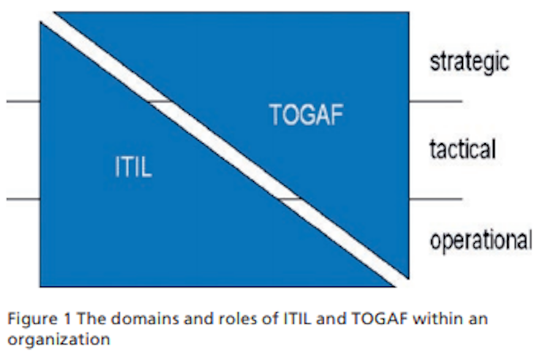

[← Knowledge Base](../index.md)

# ITIL and TOGAF

**Audience:** Enterprise Architecture Practice  
**Purpose:** Establish ITIL as the benchmarking and standards measurement framework for IT operations; clarify its boundary with TOGAF

---

## Framework Boundary Clarification

| Concern | Framework | Scope |
|---|---|---|
| Architecture design and transformation | TOGAF / [ADM](../icl-adm/icl_adm.md) | *How to change* |
| IT service quality and operational benchmarking | ITIL | *How well you run* |

> TOGAF governs the *state transition*.  ITIL measures *operational fitness* of the current and target states. They are complementary, not competing. EA practice retains TOGAF for architecture governance; ITIL is adopted for IT landscape standards auditing and benchmarking.
{: .important}

---

## What ITIL Provides

ITIL (IT Infrastructure Library) is a globally recognised framework for IT Service Management (ITSM). The current version, **[ITIL 4](https://www.axelos.com/certifications/itil-service-management/itil-4-foundation)**, is structured around the **Service Value System (SVS)** — a model that ensures all components of an organisation work together to create value through IT-enabled services.

Key constructs relevant to benchmarking:

**Service Value Chain (SVC)** — six activities `(Plan, Improve, Engage, Design & Transition, Obtain/Build, Deliver & Support)` that map IT activities to business value delivery. Each activity is a measurement point.

**Four Dimensions** — People & Organisation, Information & Technology, Partners & Suppliers, Value Streams & Processes. These are the lens through which IT landscape health is assessed, directly aligned to EA concerns around capability and dependency mapping.

**34 Management Practices** — grouped into General, Service, and Technical practices. The most operationally critical for benchmarking are:

- Incident Management — MTTR, incident volume, SLA breach rate
- Problem Management — recurring incident rate, known error backlog
- Change Enablement — change success rate, failed change ratio, emergency change frequency
- Service Level Management — SLA/OLA compliance, service availability
- Availability Management — uptime percentage, MTBF, MTRS
- Capacity & Performance Management — resource utilisation vs. demand forecast
- Continual Improvement — improvement initiative throughput, backlog age

---

## Key Benchmarking Metrics by Domain

### Service Reliability
- Availability: target ≥ 99.5% for Tier 1 services
- MTBF (Mean Time Between Failures): trending upward = improving
- MTRS (Mean Time to Restore Service): target aligned to business RTO

### Change Quality
- Change success rate: industry benchmark ≥ 95%
- Emergency change ratio: should be < 5% of total changes
- Failed changes causing incidents: target < 2%

### Incident & Problem
- P1/P2 incident frequency: absolute volume and trend
- Repeat incidents (no permanent fix): indicator of problem management debt
- SLA breach rate: per service tier

### Service Desk
- First Contact Resolution (FCR): benchmark 70–80%
- Ticket backlog age: no ticket > agreed SLA breach threshold

### Continual Improvement
- Open improvement items vs. closed per quarter
- Time-to-implement approved improvements

---

## Integration with EA Practice

The EA team might use ITIL metrics as **input signals** to the [Architecture Development Method (ADM)](../icl-adm/icl_adm.md):

- **Phase A (Architecture Vision):** ITIL baseline metrics define current-state pain points
- **Phase B/C/D (Business/IS/Technology Architecture):** SLA and availability targets inform NFRs in target architecture
- **Phase E/F (Migration Planning):** Change success rate and MTRS inform sequencing and risk assessment
- **Phase G (Implementation Governance):** ITIL change enablement gates align with architecture compliance checkpoints
- **Phase H (Change Management):** Continual improvement metrics feed architecture refresh triggers

---

## Maturity Baseline (ITIL CMM Alignment)

ITIL 4 does not prescribe a formal maturity model, but the EA practice should adopt a 5-level maturity scale against each management practice:

| Level | Description |
|---|---|
| 1 — Initial | Ad hoc; no defined process |
| 2 — Managed | Process defined but inconsistently applied |
| 3 — Defined | Standardised, documented, measured |
| 4 — Quantitatively Managed | Metrics-driven; SLAs enforced |
| 5 — Optimising | Continual improvement embedded; predictive capability |

Target for consolidated IT landscape: **Level 3 minimum** across all Tier 1 service practices before any significant architecture transformation is initiated. Level 4 for Incident, Change, and Availability management.

---

## Potential Next Steps

1. Conduct ITIL practice maturity assessment against current IT landscape
2. Define service tiers (Tier 1/2/3) aligned to business criticality — EA input required
3. Establish baseline metrics for the 7 priority practices listed above
4. Set target benchmarks per tier; publish as EA-governed IT Standards Register
5. Integrate ITIL reporting cadence into Architecture Review Board agenda

---

*Document owner: Enterprise Architecture Practice*  
*Framework references: [ITIL 4 Foundation](https://www.axelos.com/certifications/itil-service-management/itil-4-foundation) (AXELOS), [TOGAF 10](https://www.opengroup.org/togaf) (The Open Group), [ICL ADM](../icl-adm/icl_adm.md)*

---

<!-- KB footer -->
 
> EA Navigator ™ /  © dbj@dbj.org , CC BY SA 4.0

Subject to change&nbsp;&copy; dbj@dbj.org , CC BY SA 4.0

