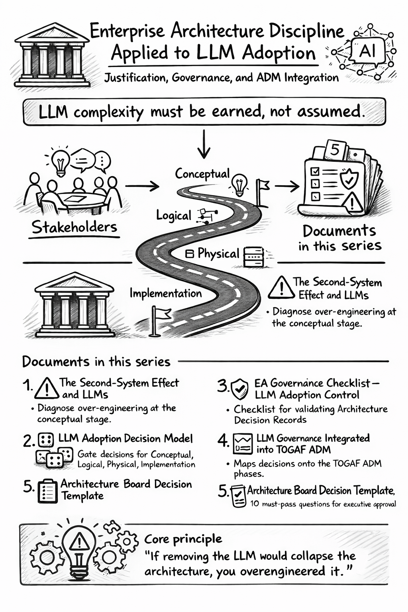

# W.I.P.

# LLM is not mandatory



> Enterprise architecture discipline applied to Large Language Model adoption — a structured framework covering capability justification, governance, and [ICL ADM integration](../icl-adm/icl_adm.md).
{: .note}

This is the root document for the LLM Adoption framework. It explains the overall approach and points to the five documents that together form a complete governance framework for introducing Large Language Models into an organization.

> **The central argument:** LLM complexity must be earned, not > assumed. 
> 
> Each document applies the  [ICL ADM integration](../icl-adm/icl_adm.md) to keep LLM adoption under architectural control.

## What business issue does this framework solve?

Organizations adopt LLMs in two ways. 
- The first is disciplined architecture baced: a specific business problem is identified, alternatives are evaluated, the LLM is scoped tightly, and governance ensures it stays that way. 
- The second is accidental: a team adds an LLM because it seems useful, it grows, other teams copy the pattern, and within a year the organization is running an AI platform it never designed and cannot explain.

This series is a framework for doing it the first way.

Prerequsities is the knowledge on two foundations:

- **[ICL Enterprise Taxonomy](https://ea.ironcodelabs.com/taxonomy.html)** — a four-level hierarchy (Conceptual, Logical, Physical, Implementation) that structures every architectural decision in the organization.
- **[TOGAF ADM](https://en.wikipedia.org/wiki/The_Open_Group_Architecture_Framework)** — the standard architecture lifecycle that defines how decisions are governed across phases of a project.

The framework does not invent a `special AI process`. LLMs adoption go through the same gates as any other "ADM centric" architecture — with additional checks for their specific failure modes.

## Start a new EA project

>[!IMPORTANT]LLM approval is a single separate ADM centric EA project. As other ICL prescribed project it requires a business "buy in", role from the business and before anything: Organization on the ACMM level 3.

>[!NOTE]Remember: ICL ADM project cycling is simplified vs full TOGAF ADM. See [ICL ADM](../icl-adm/icl_adm.md) for the structural foundation that all ICL ADM wheels follow.

---

## How to work through this lesson

This is a five-step lesson. Each step is a separate document. Work through them in order — each one builds on the previous.

---

### Step 1 — Understand the risk before touching anything else

**[The Second-System Effect — Why LLM Adoption Fails](second-system-effect.md)**

Before evaluating any specific LLM proposal, you need to understand *why* well-intentioned teams end up with overengineered AI systems. This document explains a well-documented failure pattern — teams start with one AI feature, add orchestration, then a vector database, then guardrails, and within months they are operating an AI platform nobody designed and nobody can explain.

Read this first. It will change how you look at every AI proposal you encounter.

---

### Step 2 — Learn the four questions every LLM proposal must answer

**[LLM Adoption Decision Model — The 4-Level Test](decision-model.md)**

Not every business needs an LLM. This document gives you four concrete questions — one for each architectural level — to determine whether an LLM is genuinely justified or just convenient.

All four questions must have a "yes" answer. One "no" means the LLM does not belong in that context.

| Level | The question |
|---|---|
| Business | Does the problem actually require language reasoning? |
| Service design | Is the LLM a contained service — not a central coordinator? |
| Operations | Are cost, response time, and failure behavior defined? |
| Implementation | Can the LLM be removed or swapped without rewriting the system? |

---

### Step 3 — Fill out the checklist before presenting to the business

**[EA Governance Checklist — LLM Adoption Control](governance-checklist.md)**

The decision model tells you *what* to ask. This checklist is the document a team actually fills out. Sixteen binary checks across the same four levels. Every item must be "yes." Any failed gate means the proposal must be redesigned — it cannot proceed to the Architecture Board.

This is the evidence that the four questions were applied in practice, not just discussed in a meeting.

---

### Step 4 — See where each check fits into the project lifecycle

**[LLM Governance Integrated into the ADM](llm-adm.md)**

Real projects have phases — planning, design, delivery, review. This document shows exactly where each governance check belongs across those phases, from early scoping through ongoing maintenance. Nothing is invented on top of the standard process; the LLM checks slot in at the points where they naturally belong.

If you are new to formal architecture lifecycles, this document also explains what deliverables are, why they exist, and which ones are required at each stage.

---

### Step 5 — Formal approval

**[(Architecture Board) Decision Template — LLM Approval](board-decision-template.md)**

The last step is a formal "gate". The team presents ten yes/no questions to the Architecture Board. All ten must be "yes" for approval. Any "no" requires redesign before resubmission — there is no partial approval.

This document also lists the written evidence the team must bring to the meeting: a written justification, a named business KPI, a cost model, operational targets, and an architecture diagram showing the LLM as a bounded service.

---

## The flow at a glance

```
Step 1 — Second-System Effect
         understand WHY governance matters

Step 2 — 4-Level Decision Model
         learn WHAT questions to ask

Step 3 — EA Governance Checklist
         HOW a team applies the model before presenting

Step 4 — ADM Integration
         WHERE each control fits in the project lifecycle

Step 5 — Architecture Board Template
         the formal record of the board's decision
```

A team tasked to approve the introduction of an LLM works through these in order: `understand the risk → apply the decision model → complete the checklist → present at the right project phase → receive board approval`.

---

>[!TIP]If removing the LLM would collapse the architecture, you overengineered it.
>
> In plain terms: the LLM should be one replaceable part of the system — like a subcontractor you can swap out. If the whole system is built around the LLM, structured to serve it, or impossible to change without it, then the LLM became the architecture itself. That is the problem. The AI LLM should serve the system, not be the system.
>
> Do not make LLM a "[Single Point of Failure](https://en.wikipedia.org/wiki/Single_point_of_failure)"

*Reference: [Fred Brooks — Second-System Effect](https://en.wikipedia.org/wiki/Second-system_effect)*

---

<div style="float: center; margin: 1em; text-align: center;">
<!-- KB footer -->
<br/>
EA Navigates &trade;
<hr/>
Subject to chang&nbsp;&copy; dbj@dbj.org , CC BY SA 4.0
</div>
<div style="clear: both;"></div>