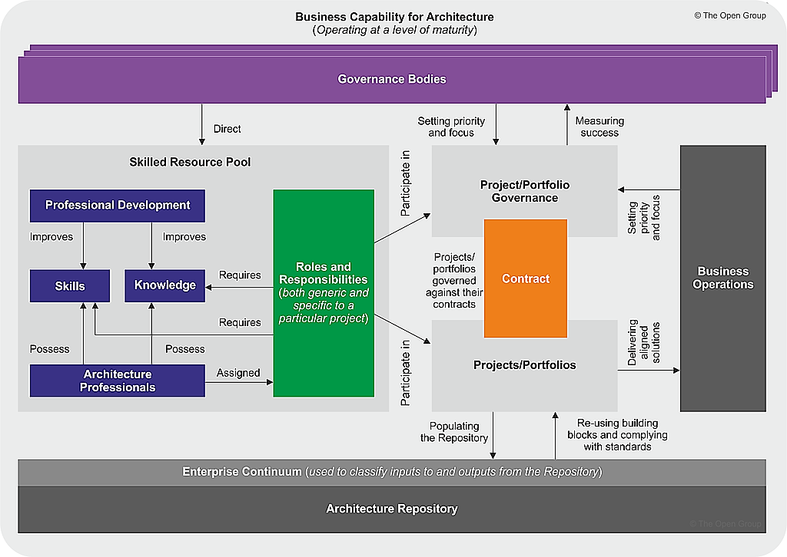

[← Knowledge Base](../index.md)

# Capability Maturity Model (CMM)

> Formal foundations: [TOGAF Architecture Maturity Models](https://pubs.opengroup.org/togaf-standard/architecture-maturity-models/)
{: .note}

The TOGAF Architecture Capability Maturity Model (ACMM) is the foundation from which the [ICL CMM](../../cmm.md) is derived. Where the ICL CMM applies to the whole organization, the TOGAF CMM focuses specifically on the EA practice and its nine characteristics.

## CMM Variants

TOGAF's Architecture Capability Framework draws on several CMM variants:

- **CMMI** — Capability Maturity Model Integration
- **SA-CMM** — Software Acquisition CMM
- **SE-CMM** — Systems Engineering CMM
- **P-CMM** — People CMM
- **ACMM** — [Enterprise Architecture Capabilities Maturity Model](https://pubs.opengroup.org/togaf-standard/architecture-maturity-models/)

## Components of the ACMM

1. **Architecture Maturity Model** — defines six maturity levels (M0–M5) across nine key architecture characteristics
2. **Architecture Characteristics at Different Maturity Levels** — comprehensive organisational capability assessment across all nine dimensions
3. **ACMM Scorecard** — monitoring and assessment tool for evaluating current maturity level per characteristic

## Maturity Levels

| Level | Name | Description |
|-------|------|-------------|
| M0 | None | No architecture capability |
| M1 | Initial | Ad-hoc, unorganised |
| M2 | Under Development | Processes being defined |
| M3 | Defined | Documented and standardised |
| M4 | Managed | Measured and controlled |
| M5 | Optimising | Continuous improvement |

## Nine ACMM Characteristics

Each characteristic is assessed independently across M0–M5, giving a multi-dimensional view rather than a single score.

1. **Architecture Process** — how architecture work is performed
2. **Architecture Development** — maturity of producing architecture artefacts and deliverables
3. **Business Linkage** — alignment between architecture and business strategy
4. **Senior Management Involvement** — executive sponsorship and engagement with EA
5. **Operating Unit Participation** — involvement of business units in architecture processes
6. **Architecture Communication** — how architecture is communicated across the organisation
7. **IT Security** — integration of security into architecture practice
8. **Architecture Governance** — controls, compliance, decision-making structures
9. **IT Investment and Acquisition Strategy** — how architecture informs technology investment decisions

> Practical use: the CMM "meter" identifies specific capability gaps rather than blanket immaturity statements — useful for targeted improvement roadmaps.

## ADM Prerequisite

The [ICL ADM](../icl-adm/icl_adm.md) requires the client organisation to be at ACMM maturity level M3 or above across all nine characteristics. Effective ADM execution is capability-gated.

| Level | Implication |
|-------|-------------|
| M0–M1 | EA becomes ineffective without foundational structures |
| M2 | Minimum viable governance emerging |
| M3+ | EA can function with documented standards and executive support |

## History

Capability Maturity Models were developed by the [Software Engineering Institute (SEI)](https://en.wikipedia.org/wiki/Software_Engineering_Institute) at Carnegie Mellon University in 1987 to assess and improve software development processes. Originally created to help the U.S. Department of Defense evaluate contractor capabilities, CMM has since evolved into CMMI, covering broader business areas.

---

*Reference: [TOGAF Architecture Maturity Models](https://pubs.opengroup.org/togaf-standard/architecture-maturity-models/)*

---

<!-- KB footer -->
 
EA Navigates &trade;

Subject to change&nbsp;&copy; dbj@dbj.org , CC BY SA 4.0

