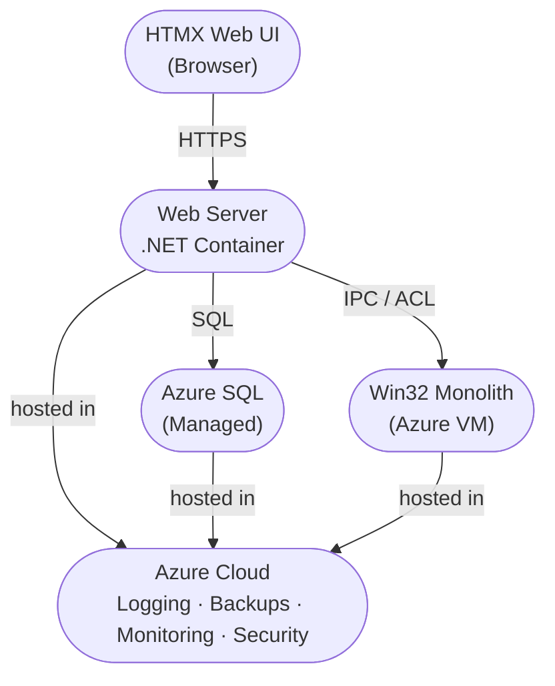
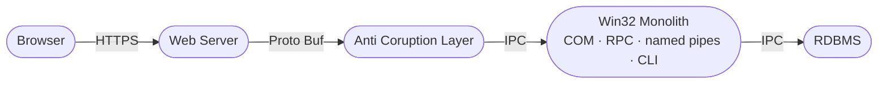
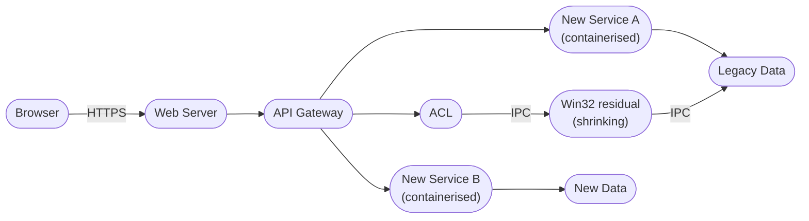
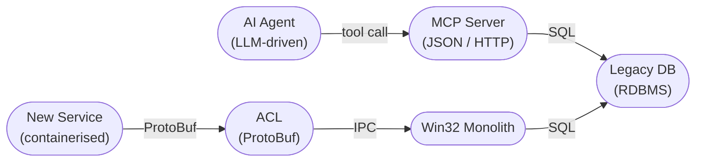
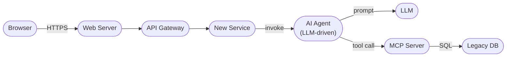

*MERMAID_MINIMAL_JEKYLL*

# Legacy Monolith WIN32 desktop GUI; System Modernization.

### Web front end to be added
### Mobile apps to be developed?

## 1. Vision

### Platform

- Target: Azure Cloud 
  - Azure VM's can host any kind of WIN legacy systems
  - Full complement of distribution and security features
  - Loggin, Backups, Monitoring -- all is in the Box
  

### Data Layer

- Target: Azure SQL (important: this is NOT Server)
  - fully managed 
  - Critical detail: what is the current DB? 

### Application Layer
  
- Target: Web Server in a container (.NET C#, because it can integrate with all win32 legacy in the back, it is fylly supported and is a native Cloud citizen)
  - Why container?
    - It is easy to deploy 
    - It  can be horizontaly scaled for resilience and scalability

### WEB UI: HTMX

  - much simpler than any other html front end
  - mature and proven
  - does not require specialized JavaScript/Type Script resources
  - Mobile interface is possible but nat native mobile gui

>**Important**
Native Mobile UI requirement will basically explode the complexity

## 2. Application/System Architecture Concepts

Classic **Strangler Fig** pattern applies here. The web front end becomes the entry point; the Win32 monolith is progressively hollowed out from behind it.

>**Important**
**Key architectural decision:** Do NOT attempt to expose the Win32 GUI directly. Treat the existing monolith as a black box with a new service boundary cut in front of it.
{: important}

---

## Phase 1 — Anti-Corruption Layer (ACL)

Introduce a thin backend service (the ACL) that is a "Facade" to the Win32 monolith:

- ACL runs as containerised .NET/Node processes (plural) on the same host
  - Windows Service only if absolutely necessary
- Communication to Win32 via whatever IPC the monolith already exposes 
  - COM automation, named pipes, CLI invocation, or DB-level if nothing else
- ACL owns the `ProtoBuf` contract; the monolith sees no changes

>**Important**
Aim for JSON Free architecture. That leads to much faster and much safer system.
{: important}

---

## Phase 2 — Strangler Fig extraction

Once the ACL is in place, each functional domain can be extracted one at a time:

Extract modules in order of: highest business value first, lowest coupling second.

>**Important**
Modularization is diffuclt technicaly. Also logicalt because it has to be business driven. One business function =~ One module
{: important}

## 3 AI Integration — MCP Server as Anti-Corruption Layer

- **MCP Server** is for the AI Agent only — it speaks JSON over HTTP/SSE, which is acceptable because LLM inference latency dwarfs wire overhead
- **New Services** must NOT use the MCP Server — use the ACL (ProtoBuf) instead; JSON overhead is not acceptable on a hot service path
- MCP Server does not call the LLM — it is deterministic in its own behaviour

## 4 AI Agent — Call Chain

The AI Agent is a backend component. It is never exposed directly to the browser. A New Service invokes it when it needs AI reasoning (e.g. summarise customer history, suggest next action). The Agent fetches legacy data (if it needs legacy data) via the MCP Server and returns a result to the calling service.

- The Agent is an internal capability of the service layer — not a gateway endpoint
- The New Service decides when to invoke the Agent; the browser never calls it directly
- The Agent's response is returned to the New Service, which responds to the Gateway as normal

---

## 5 Constraints to validate before starting

| Question | Why it matters |
|---|---|
| Does the Win32 monolith have any existing IPC surface? | Determines ACL integration cost |
| Is state held in a DB or in-process? | In-process state = harder extraction |
| Is the GUI tightly coupled to business logic? | Likely yes — plan for logic duplication during transition |
| Who owns the Win32 source? | Rewrite risk vs. wrap risk |

---

**Recommended stack for ACL** (pragmatic, containerisable):

- .NET  minimal API — native Win32 interop, Dockerisable on Windows containers
- Or Node.js if the monolith exposes a DB or file interface only

**Web frontend** — decouple completely from day one. SPA (React/Vue) or server-rendered — that decision is independent of the modernisation path.

---

>**Important**
The guiding principle: **the monolith shrinks, it does not get rewritten in one shot.** The ACL protects the new system from the old system's semantics until extraction is complete.

**QUESTION**: What is the Win32 monolith's existing IPC surface, if any?

<!-- Standard Footer -->

 
<a href="https://ironcodelabs.ai">&copy; Iron Code Labs Ltd</a>

