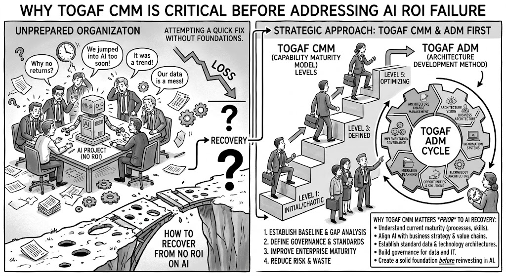

[← Back](Section%2001%20The%20DBJ%20Method.md) \| [Next →](Section%2003%20The%20Three%20Method%20Domains.md)

# Section 02 — Capability Maturity Model

[DBJ CMM](../cmm.md) is TOGAF CMM tailored for a small to medium sized businesses. 

DBJ CMM defines five levels of organisational maturity. The DBJ Method uses this scale to measure and grow your Enterprise Architecture practice.

| Level | Name | Description | Milestone |
|---|---|---|---|
| 1 | **Initial** | Processes are ad hoc and chaotic. Success depends on individual effort. No repeatable practices exist for EA planning or execution. | Starting point |
| 2 | **Repeatable** | Basic project management processes are in place. Similar projects can be executed with similar results, but practices are not formalised across domains. | Pre-training |
| 3 | **Defined** | Processes are documented, standardised, and integrated into a defined EA framework. The whole organisation operates from a shared architecture playbook. Domains are clearly identified and aligned. | Target |
| 4 | **Managed** | Processes are measured and controlled using quantitative data. EA decisions are evidence-based. Quality and performance are predictable. | Phase 2 |
| 5 | **Optimising** | Continuous process improvement is embedded. Innovation and automation — including AI — are systematically applied to refine and evolve architecture capabilities. | Destination |

---

|  
|---|
| &copy; dbj@dbj.org \| CC BY SA 4.0
