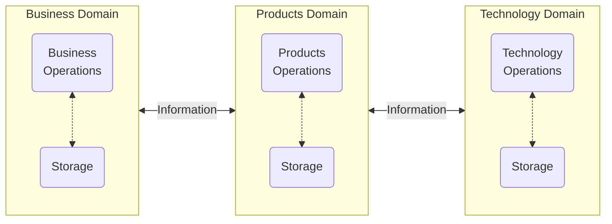
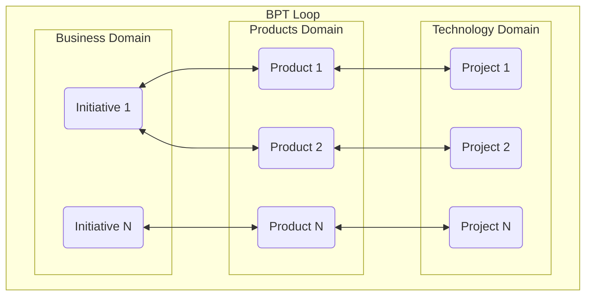

[← Back](Section%2003%20The%20Three%20Method%20Domains.md) \| [Next →](Section%2005%20Bridge%20to%20AI.md)

# Section 04 — The B→P→T

## DBJ Method Domains

**Each Method Domain maintains it private peristent storage of deliverables.**

**DBJ Method Domain is a kind-of-a-service**

Business Domain is where stake-holders answer the question: WHY? The question that Enterprise Architecture asks.("Why are we in this boat?")

> Key Realisation: Method Domains are operationaly decoupled. They live and operate independently of each other. They can be START-ed STOP-ed as a result of information arriving from the adjacent Domain
{: .note}

That seems much more complex in definition then in implementation. For example "Business Domain" might keep a simple folder/files structure (as ever befrore) for initiatives/projects/deliverables.

Stay with the DBJ Method: Keep the Method Domains decoupled. Exchange information with other domains but keep the domain storage private.

**Method Domains are organizational units**

Method Domains (B,P,T) are implemented as independent organizationl units. With internal roles, management and procedures in tune with their reason of existence.

### Business Domain forms the Business Initiatives

Business manages 1..N Initiatives. Each Initiative produces 1..N Products. Each Product maps to one Technology project.

**One BPT Loop guides one Product from Inception to Deployment.**

Complexity multiplies inside domains — not in the loop. The loop is always the same structure. Architecture oversees all initiatives and keeps them aligned.

## Two Cycles 
**DBJ Method Loop is made of Two Cycles chaining the B, P and T**

The core operating rhythm of the DBJ Method. BPT is composed of two sequential and decoupled cycles:

- **Cycle 1: B ↔ P** — Business commissions; Products translates and returns for acceptance.
- **Cycle 2: P ↔ T** — Products specifies; Technology builds and returns for verification.

Every business initiative completes both cycles in order before it can be closed. There are as many cycle-pairs running concurrently as there are active Products — one per Product, all identical in structure.

* A single product is either in one of the two Cycles: B--P Cycle or P--T Cycle
* Cycles are ordered
* Business can change the inititative for the product existence, after the second cycle has started. In that scenario Product executes the second cycle STOP until the first cycle is finished and Technology can restart the Product with new set of requirements

## Cycle 1: B ↔ P

| Method Domain | Phase | Description | Output |
|---|---|---|---|
| Business | **Strategy & Commission** | Business defines the strategic outcome: what problem to solve, what value to create, what constraints apply. Sets acceptance criteria — the conditions under which UAT will pass. | Initiative brief · Outcome criteria · Domain mandate |
| Products | **Translation & Design** | Products receives the Business mandate and translates it into architecture-ready requirements. Designs the solution logic and shape, owns the backlog, defines what Technology must build. Returns to Business for mandate confirmation. | Requirements spec · Solution design · Delivery backlog |

## Cycle 2: P ↔ T

| Method Domain | Phase | Description | Output |
|---|---|---|---|
| Technology | **Build & Integrate** | Technology executes against the Products specification. Engineering, integration, and technical governance happen here. Delivers a testable increment back to Products for verification. | Working increment · Integration artefacts · Technical sign-off |
| Products | **Verify & Stage for UAT** | Products verifies the built increment against requirements and prepares it for Business acceptance. Coordinates UAT logistics so Business can evaluate meaningfully. | UAT package · Verification report · UAT schedule |

## UAT Loop is made of both cycles

**One UAT Loop, for one Product**

>On the organization landscape (at any givne point in time) there can be 1..N Products in different phases of development
{: .note}

### Deployment

> Technology method domain does the product release deployment to the organization IT Landscape
{: .important}

### Continuation

Next BPT loop begins from the Business again — for the existing Product, always informed by the previous loop artifacts. Or for the new Product. 
* Business manages the reason of existence of 1 ... N Products
* Product manages the reason of existence of the P <--> T Cycles, one for each product

---

|  
|---|
| &copy; dbj@dbj.org \| CC BY SA 4.0
