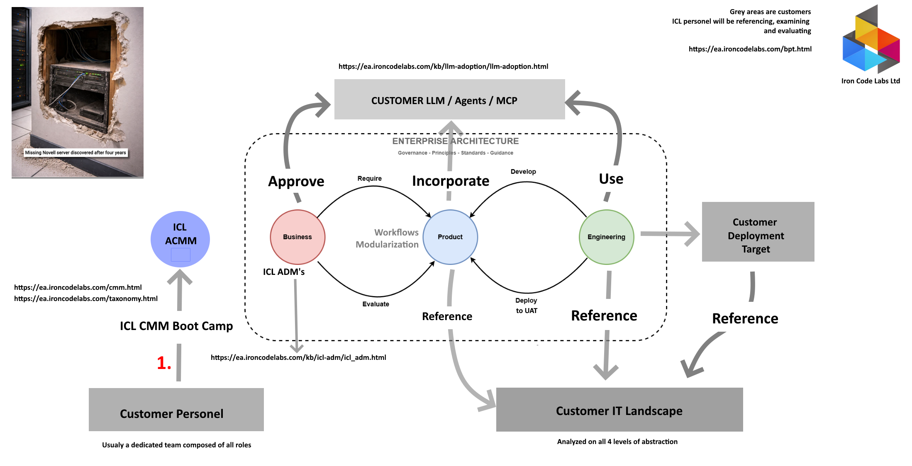

# Engagement Architecture

### Taxonomy

- Common, shared and simple [Taxonomy](https://ea.ironcodelabs.com/taxonomy.html) is the underlying essential mesh holding the Organisation universe together.  
- It gives both the structure and naming of structure elements. 
- It is the essential comon langugage of the organization

## Purpose

This document describes how ICL structures customer engagements — from initial onboarding through to a deployable product. It is intended for ICL personnel preparing to engage a new customer. Or orient a new ICL team member.

## Entry Point — ICL ADM Boot Camp

- Every engagement begins with the ICL ADM Boot Camp. Customer personnel — typically a cross-functional team representing all roles — attend to establish a shared working method. 
  - The Boot Camp grounds the team in the ICL ACMM and the Common Taxonomy before any architecture work begins. 
- References: [ACMM](https://ea.ironcodelabs.com/cmm.html) 
- ### More [detail and the logic](icl-cmm-boot-camp/icl-cmm-boot-camp.md)

## The Engagement Workflow

All architecture work occurs within an Enterprise Architecture boundary governed by ICL's Governance, Principles, Standards, and Guidance. Three parties interact within this boundary.

**Business** stakeholders approve the direction of the work and specify what capabilities the product must incorporate. Their input drives scope. Work occurs in one or more "ADM Wheels". Notice the roles present (Stakeholders, Product Owners) and the "Conceptual" nature of the outcomes.

  - Mor than 1, ICL ADMs facilitate the Business Domain and remain the primary point of business contact throughout the engagement.
  - [ICL ADM](https://ea.ironcodelabs.com/kb/icl-adm/icl_adm.html)

**The Product** is the central artifact. It is decomposed and modularized through workflow analysis, developed iteratively, evaluated against the customer's context, and deployed to UAT before final handoff. Roles; Business Aanalyst, Product Owners, Quality Assurance, Engineering Executives. Outcomes categories: "Logical" and "Physical"

**Engineering** develop the product and will ultimately use it. They reference the product and the customer IT landscape throughout, ensuring the architecture reflects operational reality. Categoies: "Physicall" and "Implementation". Roles: Engineering and DevOPS.

The flow is cyclical: Business requires, Engineering develops, the product is evaluated, refined, and redeployed until it meets the agreed standard.

## Customer AI Layer — LLM / Agents / MCP

The customer's AI tooling (`LLM platforms, agents, MCP integrations`) sits above the EA boundary. Upon initial engagments, ICL personnel reference, examine, and evaluate this layer as an input to the architecture — it is customer-owned and customer-operated. ICL does not govern it directly but must account for it in the conceptual and logical architecture deliverables.

Reference: Architecure Guided [LLM Adoption](https://ea.ironcodelabs.com/kb/llm-adoption/llm-adoption.html)

## Customer IT Landscape

The customer's existing IT environment is analyzed as a baseline throughout the engagement. Analysis spans all four abstraction levels — Conceptual, Logical, Physical, and Implementation — to ensure the architecture product is grounded in what the customer actually operates.

That is a feasible approach, simply because on upper levels of abstractions anomalies, deficiences and technical debt are observed. 

> No need to dive into the code if design is wrong.

## Output — Customer Deployment Target

The engagement produces a structured architecture product scoped to the customer's specific deployment target. It is the result of the iterative workflow above: approved by Business, built by Engineering, validated through UAT, and traceable back to the Product Work and all the way back to the Business ADM Centric Architecture. )

