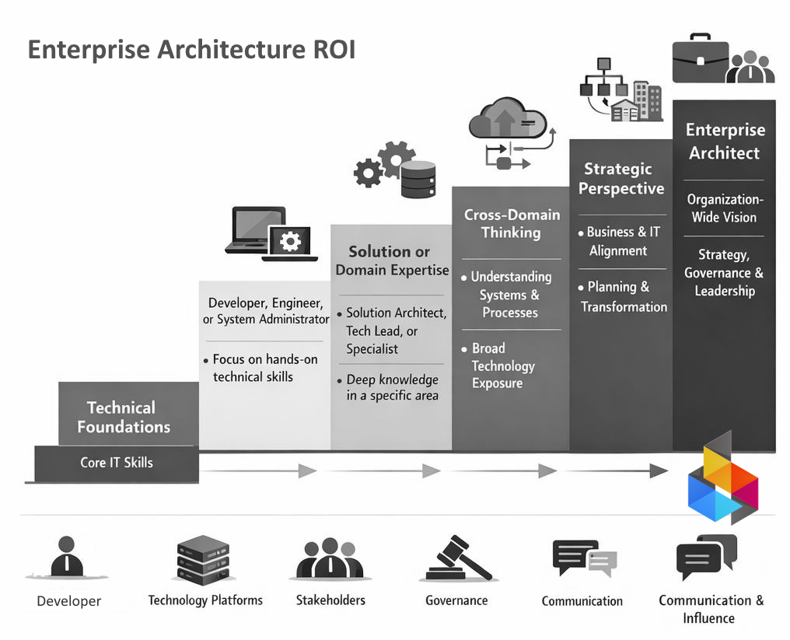
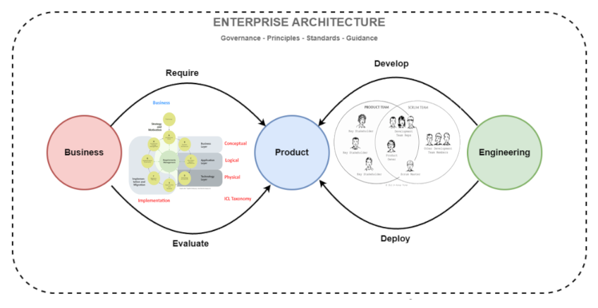
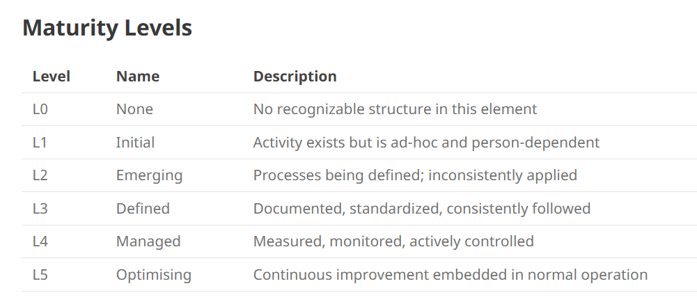
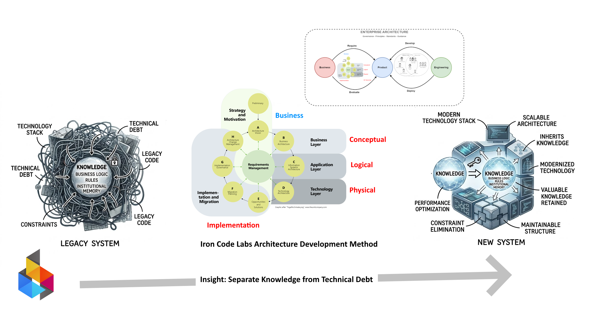

 
<a href="https://ironcodelabs.ai">&copy; Iron Code Labs Ltd</a>

>[!NOTE]This appears to be internal document

- [Meeting One: Talking Points](#meeting-one-talking-points)
  - [How is Enterprise Architecture profitable activity?](#how-is-enterprise-architecture-profitable-activity)
    - [Enterprise Architecture is not marketing](#enterprise-architecture-is-not-marketing)
  - [Iron Core Labs Method in a nutshell](#iron-core-labs-method-in-a-nutshell)
      - [The Entry is not Free it is called ACMM](#the-entry-is-not-free-it-is-called-acmm)
    - [**Architecture Capability Modeling**](#architecture-capability-modeling)
    - [Structure of Enterprise Architecture Capable Organization](#structure-of-enterprise-architecture-capable-organization)
  - [The Legacy Systems Insights](#the-legacy-systems-insights)
      - [The Core Message](#the-core-message)
  - [The ICL Method Unique Selling Point](#the-icl-method-unique-selling-point)
  - [Questions for the Client](#questions-for-the-client)
  - [The Handoff](#the-handoff)

# Meeting One: Talking Points

>[!NOTE]This is the initial meeting with a prospective client. The conversation is **business-first**. Lead with value, not methodology.

## How is Enterprise Architecture profitable activity?

### Enterprise Architecture is not marketing

## Iron Core Labs Method in a nutshell

#### The Entry is not Free it is called ACMM

### **Architecture Capability Modeling**

> [!TIP] ACMM maps what architectural capabilities an organization actually has 
> So business knows where to invest, where to stop guessing, and where AI can deliver real ROI.

> [!TIP] ACMM unlocks the process. 
> Levels 3–5 achieved, mean the organization has the repeatable discipline to actually run [ICL ADM](https://ea.ironcodelabs.com/kb/icl-adm/icl_adm.html) cycles that produce consistent, governed outcomes — not just one-off architecture documents that gather dust.

### Structure of Enterprise Architecture Capable Organization

>[!IMPORTANT]
> "Level 3" applies to the **whole organization** — not to an EA team, not to individual employees, not to a single department.
>
> The ICL CMM assesses maturity across five structural elements present in every organization: 
> - Governance
> - Skilled Resource Pool
> - Projects/Portfolios
> - Business Operations
> - Architecture Repository. 
> 
> Each is scored independently. The organization's level is the lowest score across all five.
>
> What matters is that each of these five elements operates with defined, repeatable processes — so that when architecture work begins, the organizational structures needed to support it are already in place.

> This structure is operational only once the organization has reached **ICL CMM Level 3 across all five elements**. Below that threshold, one or more structural elements lack the repeatable processes needed to sustain it — introducing the structure earlier creates overhead without the discipline to make it work.

## The Legacy Systems Insights

#### The Core Message

>[!IMPORTANT] **AI has amplified the business core problem**
>
>"Most organisations don't have a technology problem. They have a **knowledge problem** — and they don't know it yet."

Every legacy system has two parts:

- **Technology** — the stack, the debt, the constraints
- **Knowledge** — the business logic, rules, and institutional memory accumulated over decades

The business value is almost entirely in the **knowledge**. But that knowledge is imprisoned by the technical debt surrounding it.

Most blind AI modernisation efforts fail because they treat the two as one. They replace the technology and lose the knowledge — or they preserve the knowledge and can't escape the iceberg of technical debt.

**Iron Code Labs (ICL) method decouples the two.**

The new system inherits the legacy knowledge. The old technology is replaced. Nothing valuable is lost.

---

## The ICL Method Unique Selling Point

Structured approach  from the start:

1. **Separates legacy knowledge from legacy technology** — so the business keeps what it has built over years, while shedding what holds it back.
2. **Uses Enterprise Architecture as a business tool, not an marketing tool** — architecture drives outcomes, not diagrams.
3. **Delivers measurable ROI at every stage** — not at the end of a multi-year programme. Measured AI usage leads to measurable deployment steps.

The pitch in one line:

> **EA AI ROI** — we make AI pay for itself.

---

## Questions for the Client

- "When you think about your legacy systems, what worries you more — the cost to maintain them, or the risk of losing what's inside them?"
- "If you could keep all the business logic and rules your systems have accumulated, but run them on modern infrastructure — what would that be worth?"
- "How much of your current modernisation effort is focused on capturing knowledge, versus replacing technology?"

---

## The Handoff

If the conversation goes well, the next step is the **ICL CMM Boot Camp** — where we assess the organization against the [ICL CMM](https://ea.ironcodelabs.com/kb/icl-cmm/icl-cmm.html) and establish the architecture foundations needed to execute the programme.

> "We don't start with a big bang. We start with a shared baseline — so every decision from day one is traceable, governed, and defensible."

 
<a href="https://ironcodelabs.ai">&copy; Iron Code Labs Ltd</a>

