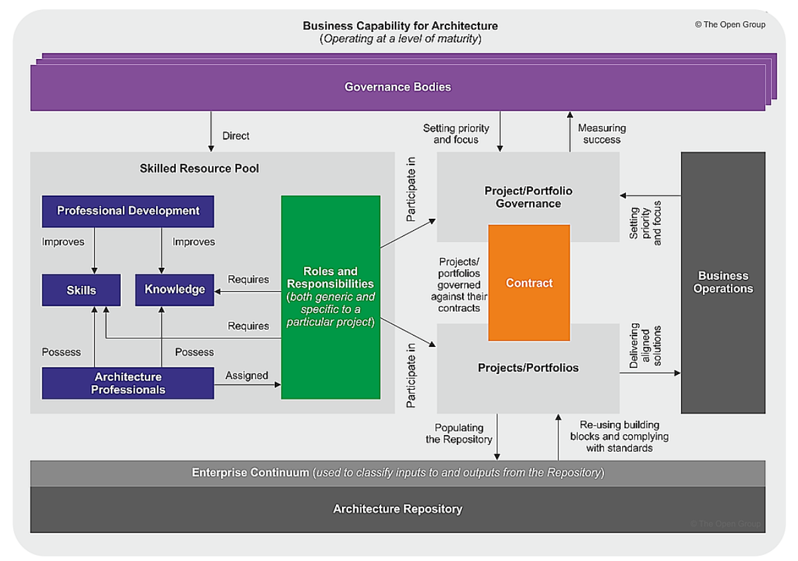

---
The Structure
- Core message — frames it as a knowledge problem, not a technology problem
- The legacy insight — technology vs. knowledge, and how ICL decouples them
- USP — three differentiators, ending with the EA AI ROI tagline
- Client questions — to surface the pain and reframe their thinking
- Handoff — bridge to the Boot Camp
---

 
<a href="https://ironcodelabs.ai">&copy; Iron Code Labs Ltd</a>

>[!NOTE]This appears to be internal document

- [Meeting One: Talking Points](#meeting-one-talking-points)
  - [How is Enterprise Architecture profitable activity?](#how-is-enterprise-architecture-profitable-activity)
  - [Iron Core Labs Method in a nutshell](#iron-core-labs-method-in-a-nutshell)
    - [The Entry is not Free](#the-entry-is-not-free)
    - [ACMM](#acmm)
  - [The Legacy Systems Insight](#the-legacy-systems-insight)
      - [The Core Message](#the-core-message)
  - [The Unique Selling Point](#the-unique-selling-point)
  - [Questions for the Client](#questions-for-the-client)
  - [The Handoff](#the-handoff)

# Meeting One: Talking Points

This is the initial meeting with a prospective client. The conversation is **business-first**. Lead with value, not methodology.

## How is Enterprise Architecture profitable activity?

## Iron Core Labs Method in a nutshell

### The Entry is not Free

### ACMM

**Architecture Capability Modeling**

**Enterprise Architecture Capable Organization **

## The Legacy Systems Insight

#### The Core Message

>[!IMPORTANT] **AI has amplified the business core problem**
>
>"Most organisations don't have a technology problem. They have a **knowledge problem** — and they don't know it yet."

Every legacy system has two parts:

- **Technology** — the stack, the debt, the constraints
- **Knowledge** — the business logic, rules, and institutional memory accumulated over decades

The business value is almost entirely in the **knowledge**. But that knowledge is imprisoned by the technical debt surrounding it.

Most blind AI modernisation efforts fail because they treat the two as one. They replace the technology and lose the knowledge — or they preserve the knowledge and can't escape the iceberg of technical debt.

**Iron Code Labs (ICL) method decouples the two.**

The new system inherits the legacy knowledge. The old technology is replaced. Nothing valuable is lost.

---

## The Unique Selling Point

Structured approach that from the start:

1. **Separates legacy knowledge from legacy technology** — so the business keeps what it has built over years, while shedding what holds it back.
2. **Uses Enterprise Architecture as a business tool, not an marketing tool** — architecture drives outcomes, not diagrams.
3. **Delivers measurable ROI at every stage** — not at the end of a multi-year programme. Measured AI usage leads to measurable deployment steps.

The pitch in one line:

> **EA AI ROI** — we make AI pay for itself.

---

## Questions for the Client

- "When you think about your legacy systems, what worries you more — the cost to maintain them, or the risk of losing what's inside them?"
- "If you could keep all the business logic and rules your systems have accumulated, but run them on modern infrastructure — what would that be worth?"
- "How much of your current modernisation effort is focused on capturing knowledge, versus replacing technology?"

---

## The Handoff

If the conversation goes well, the next step is the **ICL CMM Boot Camp** — where we establish the architecture foundations needed to execute the programme.

> "We don't start with a big bang. We start with a shared baseline — so every decision from day one is traceable, governed, and defensible."

 
<a href="https://ironcodelabs.ai">&copy; Iron Code Labs Ltd</a>

