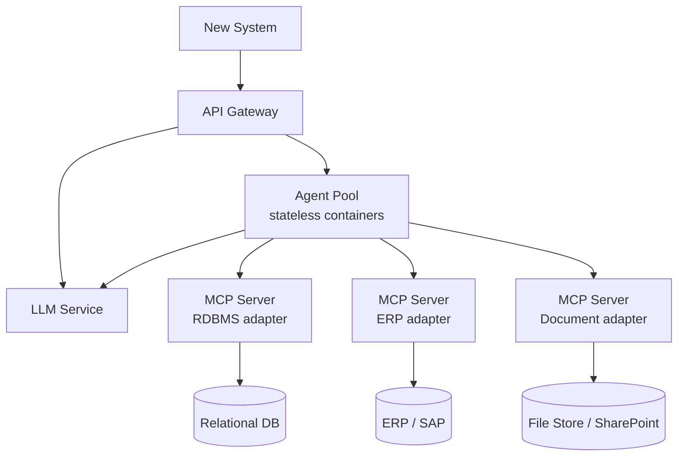
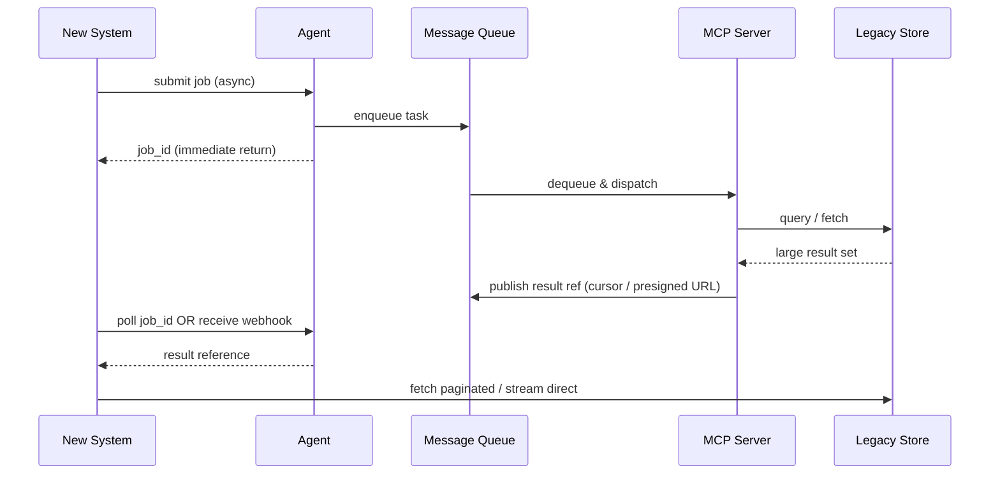
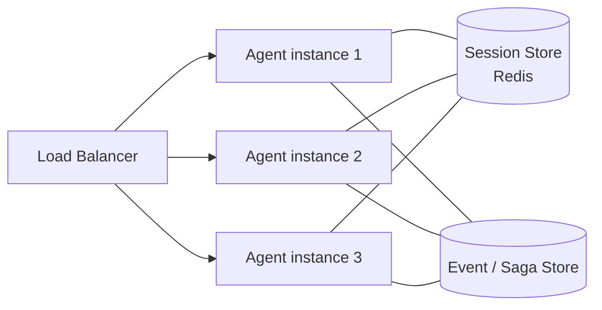
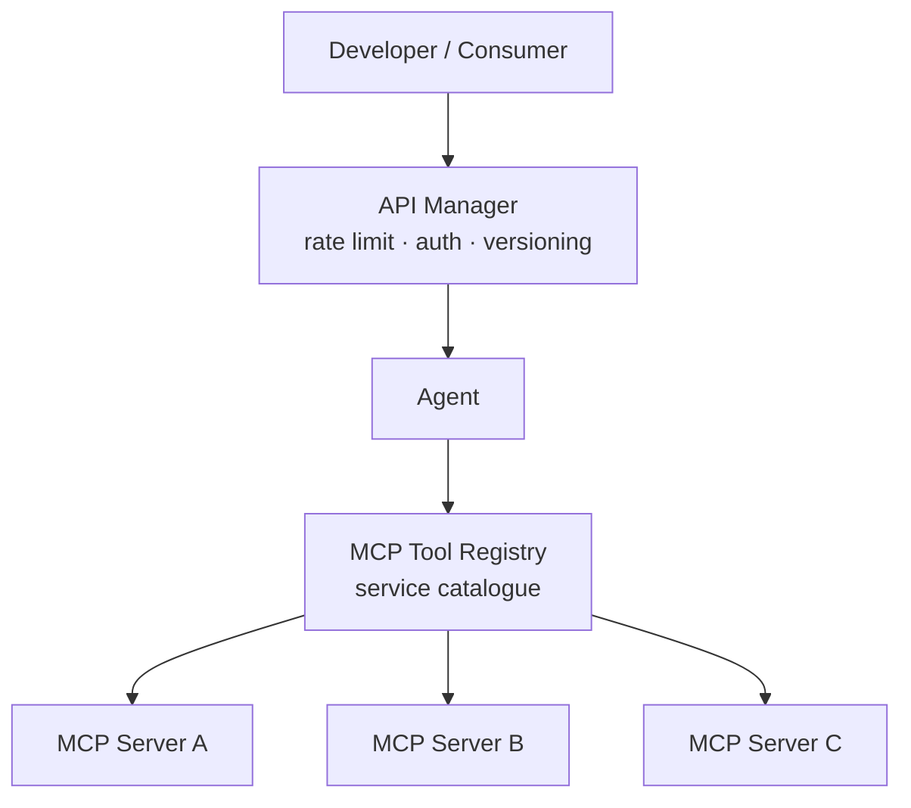
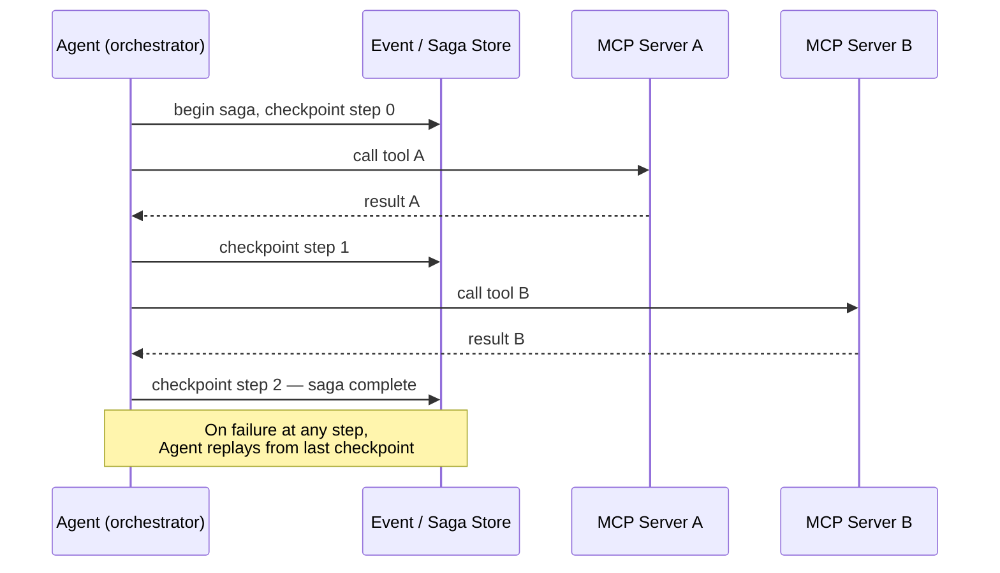

# LLM Integration Architecture — Deployment View

The logical pattern (New System → LLMs / Agents → MCP Servers → Legacy Knowledge) sits on top of standard distributed systems infrastructure. Nothing built over the last 20+ years is discarded.

---

## 1. Service Topology



API Gateway is the single entry point. Agents and LLMs are independent scaled services behind it. MCP Servers are per-adapter — one per legacy system type.

An Agent is just a service — it has an API, it receives requests, it does work, it returns responses. The "intelligence" is in what it does internally: it may prompt an LLM, call MCP tools, maintain saga state, chain steps. But from the outside it looks like any other microservice.

The word "agent" describes its behavior pattern (autonomous, goal-directed, tool-using), not a special technical category.

Single responsibility applies here too. An Agent that can "do anything" becomes hard to reason about, test, scale, and secure.

Better model: each Agent has a well-defined scope — one domain, one workflow type, one capability. The API Gateway routes to the right Agent. If a task needs multiple concerns, Agents compose (one orchestrates others) rather than one Agent doing everything.

"Agent Pool" in the diagram is fine as an infrastructure term (a pool of scaled instances), but each deployed Agent type should be narrow and purposeful.

An Agent maps naturally to an (DDD) Aggregate — it owns a bounded context, encapsulates its state and behavior, and is the single point of authority for its domain concern.

The composition pattern follows too: Aggregates don't reach into other Aggregates directly — they communicate via domain events or commands. Same applies to Agents composing: one orchestrates others through explicit calls, not shared state.

### Classic example: purchase order (PO) approval.

Design A: Microservices only

The calling service has to orchestrate — `call inventory, call credit check, call approval rules, handle failures, retry, track state`. The orchestration logic lives in the caller or a dedicated orchestration service. Every new rule change means code change.

Design B: With an Agent

The PO Agent receives "approve this PO". It "reasons": `check inventory → check credit → apply approval policy → notify approver if needed`. The how is in its prompt/configuration, not hardcoded. Change the approval policy? Update the Agent's instructions, not the code. The Agent calls the same underlying microservices via MCP tools — nothing in the infrastructure changes.

The "Design B" improvement is: the orchestration logic becomes data (instructions/configuration), not code. That's the real gain. Complex conditional workflows that used to require code deployments can be updated by changing what the Agent is told to do.

>[!IMPORTANT] The core of the trick
>
> The Agent doesn't pattern-match the request to some "config entry". It sends the request plus its instructions to the LLM as a prompt, and the LLM determines the steps. The "configuration" is the system prompt — natural language describing what the Agent is supposed to do, what tools it has, and what the goal is.

So the flow is:

- Agent receives "approve this PO #1234"
- Agent constructs a prompt: system prompt (instructions) + user message ("approve PO #1234") + available tools (inventory check, credit check, approval policy, notify)
- LLM responds: "call inventory check with PO #1234"
- Agent executes the tool call, appends result to conversation
- LLM responds: "call credit check"
- ... and so on until the LLM says "done"

The LLM is the reasoning engine. The Agent is the executor. The instructions are just text — no code, no routing tables, no switch statements.

That's the trick: the LLM replaces the conditional logic that would otherwise be code.

>[!TIP]System prompt is crucial.  the system prompt for agents that are approving POs, example:

```
You are a Purchase Order Approval Agent. Your sole responsibility is to evaluate and approve or reject purchase orders.

When given a PO number, you must:

1. Check inventory availability using the `inventory_check` tool
2. Check the requester's credit status using the `credit_check` tool
3. Apply the approval policy using the `approval_policy` tool
4. If manual approval is required, notify the approver using the `notify_approver` tool
5. Return a final decision: approved, rejected, or pending_approval

You have no other capabilities. If asked anything unrelated to purchase order approval, respond: "I can only assist with purchase order approvals."

Never skip steps. Never approve a PO without completing all checks.
```

>[!TIP]How does Agent "conctruct prompt"?

The Agent is code — a microservice. It has a system prompt stored as configuration (text file, DB, env var). When a request arrives, the Agent code:

1. Loads its system prompt (static, pre-written instructions)
1. Appends the incoming request as the user message
1. Appends the list of available tools (MCP tool definitions — names, descriptions, parameters)
1. Sends that assembled payload to the LLM API

It's just string concatenation + an HTTP call to the LLM service. No magic — the "intelligence" is entirely in the LLM's response, not in how the prompt is built.

>[!TIP]Not a happy path handling
 what if agent receives: "Give me pizza recipe"
The system prompt handles it. The PO Agent's instructions say something like: "You are a purchase order approval agent. You only process PO approval requests."

The LLM, given that system prompt, responds to "give me a pizza recipe" with "I can only assist with purchase order approvals."

For "give me a pizza recipe", the LLM sees the system prompt scope and responds in natural language: "I can only assist with PO approvals." Agent returns that. Done.

The Agent code doesn't inspect the request at all — it just assembles and sends. The LLM does all the decision making.

The Agent returns that response. No tools called, no escalation. Boundary enforced by the instructions, not by code.

This is also why narrow, single-purpose Agents matter — the tighter the system prompt scope, the less room for the LLM to go off-rails.

---

## 2. Async & Large Payload Handling



Large datasets are never passed through the Agent layer. MCP Server returns a **result reference** — cursor token or presigned URL. The consumer fetches directly and paginates.

---

## 3. Stateless Agent & State Externalisation



Agent instances are stateless. All workflow state, session context, and saga checkpoints are externalised. Any instance can handle any request. Scale horizontally without constraint.

---

## 4. Discoverability & API Management



The MCP Tool Registry is your existing service catalogue (Consul, AWS Service Discovery, Azure APIM) — MCP protocol does not replace API management infrastructure. Rate limiting, auth, throttling, and versioning are enforced at the API Manager boundary, not inside Agents.

---

## 5. Long-Running Workflows — Saga Pattern



Long-running Agent workflows use the saga pattern — exactly as in any distributed system. Checkpoints are written to the event store after each successful step. Failure triggers compensating transactions or replay from checkpoint.

---

## Key Deployment Principles

- API Gateway is the single ingress — auth, rate limiting, versioning enforced there
- Agents are stateless — horizontally scalable, load balanced, no shared memory
- All workflow state externalised — Redis for session, event store for sagas
- Async by default for any operation beyond simple query — queue-backed, webhook or poll for result
- Large datasets never traverse the Agent layer — result references and direct pagination only
- MCP Servers are stateless adapters — independently deployable, one per legacy system concern
- MCP Tool Registry backed by existing service discovery infrastructure
- LLM service is an independent scaled deployment — failure isolated from Agent operation