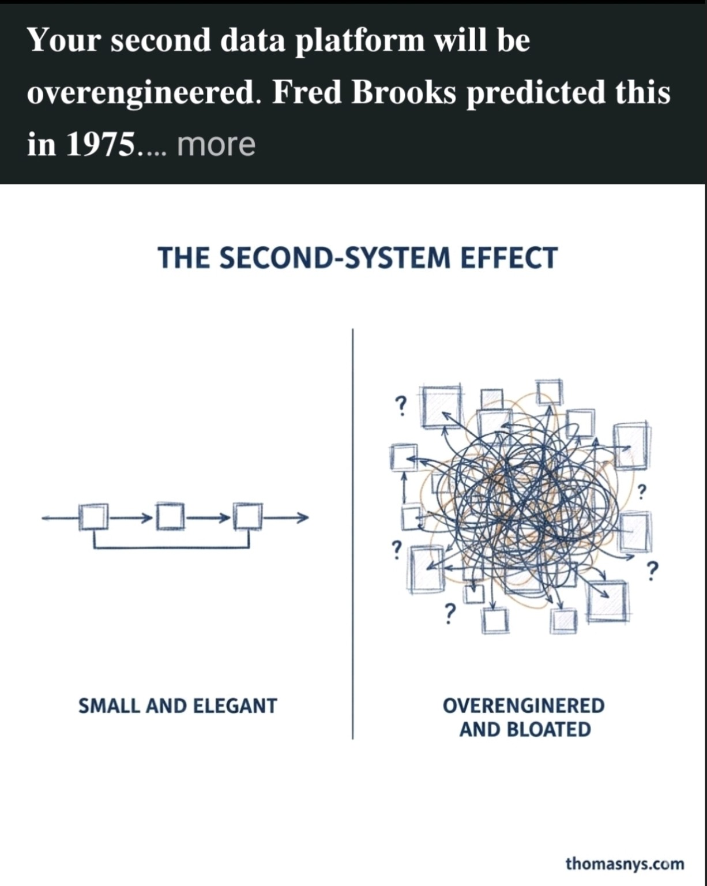

You are pointing at the classic **[Second-System Effect](https://en.wikipedia.org/wiki/Second-system_effect)**.

This concept was articulated by Fred Brooks in *The Mythical Man-Month* (1975):

> The second system a designer builds is the most dangerous.

### What it means

* **First system** → constrained, pragmatic, minimal.
* **Second system** → “now we know better” → feature accumulation → abstraction layers → generalization → complexity explosion.

The image captures that perfectly:

* Left: pipeline, bounded, coherent.
* Right: graph-theory nightmare.

---

## Now to your point: *LLMs are complex and resource-heavy. Should that be avoided from the start?*

Let’s analyze precisely.

### 1. Complexity source

LLMs are inherently:

* O(N²) attention scaling (in standard transformer form)
* GPU-bound
* Latency-sensitive
* Memory-intensive
* Operationally non-deterministic

This is not accidental complexity. It is **essential complexity** of the model class.

So the question is not:

> “Are LLMs complex?”

They are.

The question is:

> “Is the problem space complex enough to justify that complexity?”

---

## Architectural Framing

In EA / ADM terms (since you operate there):

* **Conceptual level** → What capability is required?
* **Logical level** → What service pattern fulfills it?
* **Physical level** → What infrastructure hosts it?
* **Implementation level** → What concrete model / vendor?

If the required capability is:

* deterministic workflow
* structured data transformation
* rule evaluation
* search and retrieval

Then introducing an LLM is likely **second-system overreach**.

If the required capability is:

* semantic inference
* unstructured reasoning
* language abstraction
* fuzzy decision support

Then LLM complexity may be justified.

---

## The Real Risk

The second-system effect with LLMs usually looks like:

1. You add an LLM “just in case.”
2. You build orchestration around it.
3. You add vector DB.
4. You add RAG.
5. You add prompt management.
6. You add evaluation pipelines.
7. You add guardrails.
8. Now you own a research lab.

That is the right side of the image.

---

## A Discipline to Avoid Overengineering

If you want to avoid second-system syndrome with AI:

1. **Start with deterministic systems.**
2. Introduce LLM only for a single bounded capability.
3. Keep it behind a narrow interface (anti-corruption layer).
4. Measure actual business delta.
5. Do not build AI platform before proven need.

In other words:

> LLM should be a capability injection, not a platform foundation — unless the product itself is AI-native.

---

## Strategic View

You are working in a mature organization fighting legacy.

Introducing LLM too early can:

* destabilize governance
* bypass architecture discipline
* create shadow IT
* inflate infrastructure cost

That is exactly how second systems are born.

---

## Bottom Line

LLM complexity should not be avoided **by dogma**.
It should be avoided **until justified by capability gap**.

The mistake is not using LLMs.

The mistake is:

> Building the second system before validating the first one.

<!-- If you want, we can map this directly onto your 4-level architecture taxonomy and define a decision criterion for when LLM is architecturally legitimate. -->
