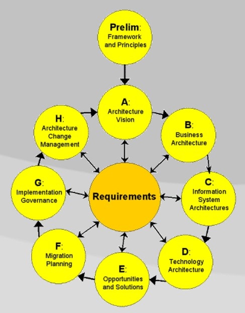

>[!TIP]
Below is this same LLM control model, now mapped explicitly to **[TOGAF ADM](https://en.wikipedia.org/wiki/The_Open_Group_Architecture_Framework)** so it can be embedded into CLI customers governance and Architecture Board checkpoints.

---



# LLM Governance Integrated into [TOGAF ADM](https://en.wikipedia.org/wiki/The_Open_Group_Architecture_Framework)

Reference framework: The Open Group
Method: TOGAF

---

# Preliminary Phase — Architecture Principles

### Objective

Prevent uncontrolled AI proliferation.

### Required Artifacts

Add explicit AI principles:

1. **AI Justification Principle**
   AI must be introduced only where deterministic solutions are insufficient.

2. **AI Containment Principle**
   AI components must be architecturally bounded services.

3. **AI Replaceability Principle**
   No business-critical logic may be irreversibly embedded in prompts or model behavior.

Architecture Board approval required before any AI-related ADR enters ADM cycle.

---

# Phase A — Architecture Vision

### Gate: Capability Legitimacy Test

Before including LLM in Vision:

* Identify the business capability.
* Classify it as:

  * Deterministic
  * Hybrid
  * Semantic/Probabilistic

If not clearly semantic → LLM removed from scope.

Deliverable addition:

* “AI Necessity Statement” (one page maximum)
* Business KPI tied to LLM usage

No KPI → no AI.

---

# Phase B — Business Architecture

### Control Focus

LLM must not redefine business process ownership.

Checklist:

* Does LLM make binding decisions?
* Does it override business rules?
* Is accountability clearly human-owned?

If LLM becomes policy authority → reject.

---

# Phase C — Information Systems Architecture

### Logical Architecture Gate

LLM must appear as:

* A bounded application service
* With defined contract
* With measurable outputs

Must NOT appear as:

* Central orchestrator
* Cross-domain inference hub
* Shared enterprise reasoning engine

Add required artifact:

* AI Service Contract Specification
* Evaluation metric definition

---

# Phase D — Technology Architecture

### Physical Validation Gate

Mandatory documentation:

* Cost model (compute, tokens, scaling curve)
* Latency targets
* SLA definition
* Monitoring plan
* Fallback mechanism

If fallback path not defined → architecture non-compliant.

---

# Phase E — Opportunities & Solutions

### Containment Review

Ensure:

* Minimal initial deployment (pilot scope)
* No enterprise-wide AI platform unless justified
* No premature vector DB / RAG ecosystem build

If platform-first approach detected → Second-System risk → redesign required.

---

# Phase F — Migration Planning

### Risk Mitigation Controls

* Explicit rollback plan
* Budget impact tracking
* Operational ownership defined
* Exit strategy (model replacement or removal)

If removal not feasible → architectural lock-in violation.

---

# Phase G — Implementation Governance

### Runtime Compliance Checks

Architecture Board verifies:

* Prompts do not encode hidden business rules
* Domain logic exists outside LLM
* Model is swappable
* KPIs are monitored

If LLM becomes implicit decision engine → governance breach.

---

# Phase H — Architecture Change Management

### Drift Control

Quarterly review:

* Is LLM still required?
* Has deterministic alternative become viable?
* Has scope expanded beyond original capability?

If scope expanded without ADM cycle → enforce re-architecture.

---

# Executive Control Summary (Board Level)

LLM allowed only if:

```
Business capability requires semantic reasoning
+
Architecturally bounded as replaceable service
+
Operationally measurable and cost-contained
+
Governed through full ADM lifecycle
```

Otherwise:

You are not introducing AI.

You are building your second system.

---

<!-- If you wish, I can now compress this into a 10-line Architecture Board decision template suitable for immediate executive use. -->
