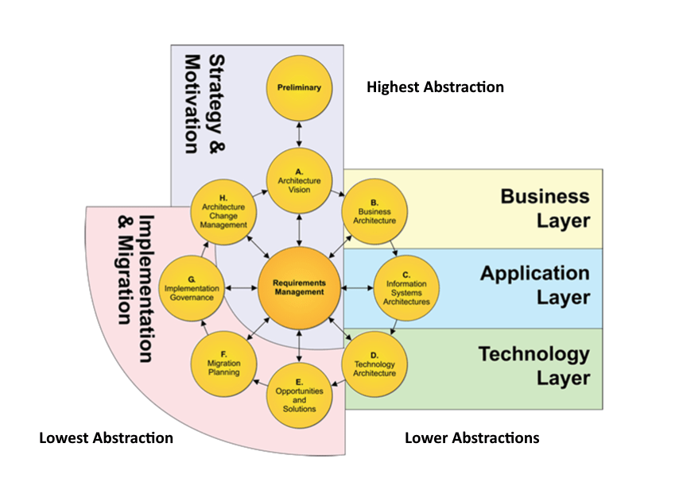

# Architecture of LLM Adoption

Enterprise architecture discipline applied to Large Language Model adoption — a structured series covering capability justification, governance, and ADM integration.

The central argument across all documents: **LLM complexity must be earned, not assumed.** Each document applies the four-level taxonomy (Conceptual → Logical → Physical → Implementation) to keep AI adoption under architectural control.

---

## Documents in this series

### [1. The Second-System Effect and LLMs](1%20of%20N%20second-system-effect.md)

The starting point. Fred Brooks' Second-System Effect as a diagnostic lens for LLM over-engineering. Explains why adding an LLM "just in case" is the same mistake engineers have always made — only with a larger blast radius.

> LLM should be a capability injection, not a platform foundation — unless the product itself is AI-native.

---

### [2. LLM Adoption Decision Model](2%20of%20N%20llm%20adoption%20decision%20model.md)

Four decision rules, one per architectural level. A concise gate model that tells you whether LLM is justified at each level — Conceptual, Logical, Physical, Implementation — before any commitment is made.

---

### [3. EA Governance Checklist — LLM Adoption Control](3%20of%20N%20EA%20Governance%20Checklist%20%E2%80%94%20LLM%20Adoption%20Control.md)

A one-page checklist for Architecture Decision Record (ADR) validation. Sixteen binary checks across all four levels. Any failure = ADR rejected.

---

### [4. LLM Governance Integrated into TOGAF ADM](4%20of%20N%20LLM%20Governance%20Integrated%20into%20TOGAF%20ADM.md)

Maps the governance model onto TOGAF ADM phases — from Preliminary through Architecture Change Management. Defines what artifacts and gate decisions are required at each phase before an LLM is allowed into the architecture.

---

### [5. Architecture Board Decision Template](5%20of%20N%20LLM%20approval%20Architecture%20Board%20Decision%20Template)

A 10-question executive template for Architecture Board approval. Approval requires 10/10 affirmative answers. Any "No" triggers a redesign.

---

## Core principle

> If removing the LLM would collapse the architecture, you overengineered it.
